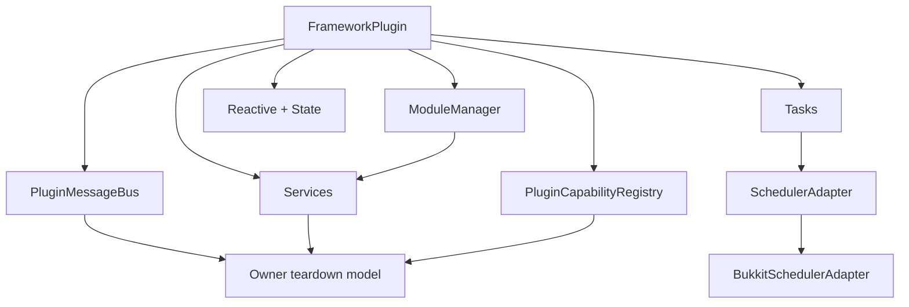

# BSLib API Documentation

## Overview
BSLib is a reusable Java framework API for Minecraft plugin development that standardizes lifecycle, services, tasks, modules, state/reactive flows, and UX abstractions. It is designed so plugin teams build features instead of repeatedly implementing framework plumbing.

Core philosophy:
- **Additive framework surface**: provide composable APIs instead of forcing one monolithic pattern.
- **Operational safety**: owner-aware registries, deterministic lifecycle hooks, and explicit cleanup contracts.
- **Developer ergonomics**: fluent APIs for tasks, messages, configs, menu and command integration points.
- **Scalable ecosystem use**: support multi-plugin environments where cross-plugin interactions must be explicit and auditable.

Main developer benefits:
- Shared service registry and capability contracts.
- Lifecycle-safe module orchestration.
- Scheduler abstraction with framework task handles.
- Reactive and state APIs for reducing imperative glue code.

---

## Architecture Overview


Runtime ownership model: registrations are expected to be scoped to a plugin owner and explicitly torn down during disable/reload. This protects large servers from cross-plugin leaks and stale references.

---

## Package Documentation
### Package: `io.github.fragmer2.bslib.api`
Purpose: expose focused API contracts for this domain.
Responsibilities: define stable types, configuration points, and lifecycle expectations for plugin code.
When to use: import this package when your plugin needs the capability represented by its types.

### Package: `io.github.fragmer2.bslib.api.animation`
Purpose: expose focused API contracts for this domain.
Responsibilities: define stable types, configuration points, and lifecycle expectations for plugin code.
When to use: import this package when your plugin needs the capability represented by its types.

### Package: `io.github.fragmer2.bslib.api.annotation`
Purpose: expose focused API contracts for this domain.
Responsibilities: define stable types, configuration points, and lifecycle expectations for plugin code.
When to use: import this package when your plugin needs the capability represented by its types.

### Package: `io.github.fragmer2.bslib.api.button`
Purpose: expose focused API contracts for this domain.
Responsibilities: define stable types, configuration points, and lifecycle expectations for plugin code.
When to use: import this package when your plugin needs the capability represented by its types.

### Package: `io.github.fragmer2.bslib.api.capability`
Purpose: expose focused API contracts for this domain.
Responsibilities: define stable types, configuration points, and lifecycle expectations for plugin code.
When to use: import this package when your plugin needs the capability represented by its types.

### Package: `io.github.fragmer2.bslib.api.command`
Purpose: expose focused API contracts for this domain.
Responsibilities: define stable types, configuration points, and lifecycle expectations for plugin code.
When to use: import this package when your plugin needs the capability represented by its types.

### Package: `io.github.fragmer2.bslib.api.config`
Purpose: expose focused API contracts for this domain.
Responsibilities: define stable types, configuration points, and lifecycle expectations for plugin code.
When to use: import this package when your plugin needs the capability represented by its types.

### Package: `io.github.fragmer2.bslib.api.cooldown`
Purpose: expose focused API contracts for this domain.
Responsibilities: define stable types, configuration points, and lifecycle expectations for plugin code.
When to use: import this package when your plugin needs the capability represented by its types.

### Package: `io.github.fragmer2.bslib.api.debug`
Purpose: expose focused API contracts for this domain.
Responsibilities: define stable types, configuration points, and lifecycle expectations for plugin code.
When to use: import this package when your plugin needs the capability represented by its types.

### Package: `io.github.fragmer2.bslib.api.di`
Purpose: expose focused API contracts for this domain.
Responsibilities: define stable types, configuration points, and lifecycle expectations for plugin code.
When to use: import this package when your plugin needs the capability represented by its types.

### Package: `io.github.fragmer2.bslib.api.event`
Purpose: expose focused API contracts for this domain.
Responsibilities: define stable types, configuration points, and lifecycle expectations for plugin code.
When to use: import this package when your plugin needs the capability represented by its types.

### Package: `io.github.fragmer2.bslib.api.feature`
Purpose: expose focused API contracts for this domain.
Responsibilities: define stable types, configuration points, and lifecycle expectations for plugin code.
When to use: import this package when your plugin needs the capability represented by its types.

### Package: `io.github.fragmer2.bslib.api.interaction`
Purpose: expose focused API contracts for this domain.
Responsibilities: define stable types, configuration points, and lifecycle expectations for plugin code.
When to use: import this package when your plugin needs the capability represented by its types.

### Package: `io.github.fragmer2.bslib.api.item`
Purpose: expose focused API contracts for this domain.
Responsibilities: define stable types, configuration points, and lifecycle expectations for plugin code.
When to use: import this package when your plugin needs the capability represented by its types.

### Package: `io.github.fragmer2.bslib.api.lifecycle`
Purpose: expose focused API contracts for this domain.
Responsibilities: define stable types, configuration points, and lifecycle expectations for plugin code.
When to use: import this package when your plugin needs the capability represented by its types.

### Package: `io.github.fragmer2.bslib.api.menu`
Purpose: expose focused API contracts for this domain.
Responsibilities: define stable types, configuration points, and lifecycle expectations for plugin code.
When to use: import this package when your plugin needs the capability represented by its types.

### Package: `io.github.fragmer2.bslib.api.message`
Purpose: expose focused API contracts for this domain.
Responsibilities: define stable types, configuration points, and lifecycle expectations for plugin code.
When to use: import this package when your plugin needs the capability represented by its types.

### Package: `io.github.fragmer2.bslib.api.messaging`
Purpose: expose focused API contracts for this domain.
Responsibilities: define stable types, configuration points, and lifecycle expectations for plugin code.
When to use: import this package when your plugin needs the capability represented by its types.

### Package: `io.github.fragmer2.bslib.api.module`
Purpose: expose focused API contracts for this domain.
Responsibilities: define stable types, configuration points, and lifecycle expectations for plugin code.
When to use: import this package when your plugin needs the capability represented by its types.

### Package: `io.github.fragmer2.bslib.api.placeholder`
Purpose: expose focused API contracts for this domain.
Responsibilities: define stable types, configuration points, and lifecycle expectations for plugin code.
When to use: import this package when your plugin needs the capability represented by its types.

### Package: `io.github.fragmer2.bslib.api.reactive`
Purpose: expose focused API contracts for this domain.
Responsibilities: define stable types, configuration points, and lifecycle expectations for plugin code.
When to use: import this package when your plugin needs the capability represented by its types.

### Package: `io.github.fragmer2.bslib.api.service`
Purpose: expose focused API contracts for this domain.
Responsibilities: define stable types, configuration points, and lifecycle expectations for plugin code.
When to use: import this package when your plugin needs the capability represented by its types.

### Package: `io.github.fragmer2.bslib.api.session`
Purpose: expose focused API contracts for this domain.
Responsibilities: define stable types, configuration points, and lifecycle expectations for plugin code.
When to use: import this package when your plugin needs the capability represented by its types.

### Package: `io.github.fragmer2.bslib.api.state`
Purpose: expose focused API contracts for this domain.
Responsibilities: define stable types, configuration points, and lifecycle expectations for plugin code.
When to use: import this package when your plugin needs the capability represented by its types.

### Package: `io.github.fragmer2.bslib.api.task`
Purpose: expose focused API contracts for this domain.
Responsibilities: define stable types, configuration points, and lifecycle expectations for plugin code.
When to use: import this package when your plugin needs the capability represented by its types.

### Package: `io.github.fragmer2.bslib.api.thread`
Purpose: expose focused API contracts for this domain.
Responsibilities: define stable types, configuration points, and lifecycle expectations for plugin code.
When to use: import this package when your plugin needs the capability represented by its types.

### Package: `io.github.fragmer2.bslib.internal.error`
Purpose: expose focused API contracts for this domain.
Responsibilities: define stable types, configuration points, and lifecycle expectations for plugin code.
When to use: import this package when your plugin needs the capability represented by its types.

---

## Class Documentation
### Class: `BSLib`
**Qualified Name**: `io.github.fragmer2.bslib.api.BSLib`
**Kind**: `class`
**Source**: `bslib-api/src/main/java/io/github/fragmer2/bslib/api/BSLib.java`

**Purpose**  
Provide API-level behavior/contract for its domain in BSLib.

**Responsibilities**
- Encapsulate or declare framework behavior for plugin consumers.
- Define callable public surface (methods/constructors/fields) listed below.

**Lifecycle**
- Create/use from plugin enable paths unless API explicitly supports lazy usage.
- Dispose/unregister/destroy where relevant during plugin disable/reload.

**Thread Safety**
- Unless explicitly documented otherwise in source, treat Bukkit-affecting calls as main-thread oriented.
- Async-safe APIs should only perform non-Bukkit work or schedule sync handoff.

**Example Usage**
```java
// Using BSLib from BSLib API
// See signatures below for exact members.
```

#### Constructors
- No public constructor (factory/static/annotation/interface style API).

#### Methods
##### `public static void initialize(Plugin plugin, ServiceContainer serviceContainer, CommandRegistryFactory factory) `
- Description: public API operation exposed by this type.
- Parameters: see method signature.
- Return: see method signature type.
- Thread requirements: respect Bukkit main-thread constraints when touching game state.
- Side effects: may mutate framework/plugin state depending on method.
- Common mistakes: using without lifecycle cleanup, or from wrong thread context.
- Example:
```java
// Invoke according to signature shown above
```
##### `public static void setCommandRegistryFactory(CommandRegistryFactory factory) `
- Description: public API operation exposed by this type.
- Parameters: see method signature.
- Return: see method signature type.
- Thread requirements: respect Bukkit main-thread constraints when touching game state.
- Side effects: may mutate framework/plugin state depending on method.
- Common mistakes: using without lifecycle cleanup, or from wrong thread context.
- Example:
```java
// Invoke according to signature shown above
```
##### `public static CommandRegistry getCommandRegistry(Plugin plugin) `
- Description: public API operation exposed by this type.
- Parameters: see method signature.
- Return: see method signature type.
- Thread requirements: respect Bukkit main-thread constraints when touching game state.
- Side effects: may mutate framework/plugin state depending on method.
- Common mistakes: using without lifecycle cleanup, or from wrong thread context.
- Example:
```java
// Invoke according to signature shown above
```
##### `public static void setContainer(ServiceContainer c) `
- Description: public API operation exposed by this type.
- Parameters: see method signature.
- Return: see method signature type.
- Thread requirements: respect Bukkit main-thread constraints when touching game state.
- Side effects: may mutate framework/plugin state depending on method.
- Common mistakes: using without lifecycle cleanup, or from wrong thread context.
- Example:
```java
// Invoke according to signature shown above
```
##### `public static ServiceContainer getContainer() `
- Description: public API operation exposed by this type.
- Parameters: see method signature.
- Return: see method signature type.
- Thread requirements: respect Bukkit main-thread constraints when touching game state.
- Side effects: may mutate framework/plugin state depending on method.
- Common mistakes: using without lifecycle cleanup, or from wrong thread context.
- Example:
```java
// Invoke according to signature shown above
```
##### `public static void setModuleManager(ModuleManager mm) `
- Description: public API operation exposed by this type.
- Parameters: see method signature.
- Return: see method signature type.
- Thread requirements: respect Bukkit main-thread constraints when touching game state.
- Side effects: may mutate framework/plugin state depending on method.
- Common mistakes: using without lifecycle cleanup, or from wrong thread context.
- Example:
```java
// Invoke according to signature shown above
```
##### `public static ModuleManager getModuleManager() `
- Description: public API operation exposed by this type.
- Parameters: see method signature.
- Return: see method signature type.
- Thread requirements: respect Bukkit main-thread constraints when touching game state.
- Side effects: may mutate framework/plugin state depending on method.
- Common mistakes: using without lifecycle cleanup, or from wrong thread context.
- Example:
```java
// Invoke according to signature shown above
```
##### `public static boolean isModuleEnabled(String moduleId) `
- Description: public API operation exposed by this type.
- Parameters: see method signature.
- Return: see method signature type.
- Thread requirements: respect Bukkit main-thread constraints when touching game state.
- Side effects: may mutate framework/plugin state depending on method.
- Common mistakes: using without lifecycle cleanup, or from wrong thread context.
- Example:
```java
// Invoke according to signature shown above
```
##### `public static BSModule getModule(String moduleId) `
- Description: public API operation exposed by this type.
- Parameters: see method signature.
- Return: see method signature type.
- Thread requirements: respect Bukkit main-thread constraints when touching game state.
- Side effects: may mutate framework/plugin state depending on method.
- Common mistakes: using without lifecycle cleanup, or from wrong thread context.
- Example:
```java
// Invoke according to signature shown above
```

#### Important Fields
- No public fields declared.

---

### Class: `GuiManagerProvider`
**Qualified Name**: `io.github.fragmer2.bslib.api.GuiManagerProvider`
**Kind**: `class`
**Source**: `bslib-api/src/main/java/io/github/fragmer2/bslib/api/GuiManagerProvider.java`

**Purpose**  
Provide API-level behavior/contract for its domain in BSLib.

**Responsibilities**
- Encapsulate or declare framework behavior for plugin consumers.
- Define callable public surface (methods/constructors/fields) listed below.

**Lifecycle**
- Create/use from plugin enable paths unless API explicitly supports lazy usage.
- Dispose/unregister/destroy where relevant during plugin disable/reload.

**Thread Safety**
- Unless explicitly documented otherwise in source, treat Bukkit-affecting calls as main-thread oriented.
- Async-safe APIs should only perform non-Bukkit work or schedule sync handoff.

**Example Usage**
```java
// Using GuiManagerProvider from BSLib API
// See signatures below for exact members.
```

#### Constructors
- No public constructor (factory/static/annotation/interface style API).

#### Methods
##### `public static void setInstance(GuiManager manager) `
- Description: public API operation exposed by this type.
- Parameters: see method signature.
- Return: see method signature type.
- Thread requirements: respect Bukkit main-thread constraints when touching game state.
- Side effects: may mutate framework/plugin state depending on method.
- Common mistakes: using without lifecycle cleanup, or from wrong thread context.
- Example:
```java
// Invoke according to signature shown above
```
##### `public static GuiManager get() `
- Description: public API operation exposed by this type.
- Parameters: see method signature.
- Return: see method signature type.
- Thread requirements: respect Bukkit main-thread constraints when touching game state.
- Side effects: may mutate framework/plugin state depending on method.
- Common mistakes: using without lifecycle cleanup, or from wrong thread context.
- Example:
```java
// Invoke according to signature shown above
```

#### Important Fields
- No public fields declared.

---

### Class: `ShopPlugin`
**Qualified Name**: `io.github.fragmer2.bslib.api.ShopPlugin`
**Kind**: `class`
**Source**: `bslib-api/src/main/java/io/github/fragmer2/bslib/api/FrameworkPlugin.java`

**Purpose**  
Provide API-level behavior/contract for its domain in BSLib.

**Responsibilities**
- Encapsulate or declare framework behavior for plugin consumers.
- Define callable public surface (methods/constructors/fields) listed below.

**Lifecycle**
- Create/use from plugin enable paths unless API explicitly supports lazy usage.
- Dispose/unregister/destroy where relevant during plugin disable/reload.

**Thread Safety**
- Unless explicitly documented otherwise in source, treat Bukkit-affecting calls as main-thread oriented.
- Async-safe APIs should only perform non-Bukkit work or schedule sync handoff.

**Example Usage**
```java
// Using ShopPlugin from BSLib API
// See signatures below for exact members.
```

#### Constructors
- No public constructor (factory/static/annotation/interface style API).

#### Methods
##### `public final void onEnable() `
- Description: public API operation exposed by this type.
- Parameters: see method signature.
- Return: see method signature type.
- Thread requirements: respect Bukkit main-thread constraints when touching game state.
- Side effects: may mutate framework/plugin state depending on method.
- Common mistakes: using without lifecycle cleanup, or from wrong thread context.
- Example:
```java
// Invoke according to signature shown above
```
##### `public final void onDisable() `
- Description: public API operation exposed by this type.
- Parameters: see method signature.
- Return: see method signature type.
- Thread requirements: respect Bukkit main-thread constraints when touching game state.
- Side effects: may mutate framework/plugin state depending on method.
- Common mistakes: using without lifecycle cleanup, or from wrong thread context.
- Example:
```java
// Invoke according to signature shown above
```
##### `public void liveReload() `
- Description: public API operation exposed by this type.
- Parameters: see method signature.
- Return: see method signature type.
- Thread requirements: respect Bukkit main-thread constraints when touching game state.
- Side effects: may mutate framework/plugin state depending on method.
- Common mistakes: using without lifecycle cleanup, or from wrong thread context.
- Example:
```java
// Invoke according to signature shown above
```
##### `public void hardReload() `
- Description: public API operation exposed by this type.
- Parameters: see method signature.
- Return: see method signature type.
- Thread requirements: respect Bukkit main-thread constraints when touching game state.
- Side effects: may mutate framework/plugin state depending on method.
- Common mistakes: using without lifecycle cleanup, or from wrong thread context.
- Example:
```java
// Invoke according to signature shown above
```
##### `public void reload() `
- Description: public API operation exposed by this type.
- Parameters: see method signature.
- Return: see method signature type.
- Thread requirements: respect Bukkit main-thread constraints when touching game state.
- Side effects: may mutate framework/plugin state depending on method.
- Common mistakes: using without lifecycle cleanup, or from wrong thread context.
- Example:
```java
// Invoke according to signature shown above
```
##### `public Object getDelegate() `
- Description: public API operation exposed by this type.
- Parameters: see method signature.
- Return: see method signature type.
- Thread requirements: respect Bukkit main-thread constraints when touching game state.
- Side effects: may mutate framework/plugin state depending on method.
- Common mistakes: using without lifecycle cleanup, or from wrong thread context.
- Example:
```java
// Invoke according to signature shown above
```
##### `public boolean isAutoScanned() `
- Description: public API operation exposed by this type.
- Parameters: see method signature.
- Return: see method signature type.
- Thread requirements: respect Bukkit main-thread constraints when touching game state.
- Side effects: may mutate framework/plugin state depending on method.
- Common mistakes: using without lifecycle cleanup, or from wrong thread context.
- Example:
```java
// Invoke according to signature shown above
```
##### `public List<Object> getManagedObjects() `
- Description: public API operation exposed by this type.
- Parameters: see method signature.
- Return: see method signature type.
- Thread requirements: respect Bukkit main-thread constraints when touching game state.
- Side effects: may mutate framework/plugin state depending on method.
- Common mistakes: using without lifecycle cleanup, or from wrong thread context.
- Example:
```java
// Invoke according to signature shown above
```
##### `public List<Config> getConfigs() `
- Description: public API operation exposed by this type.
- Parameters: see method signature.
- Return: see method signature type.
- Thread requirements: respect Bukkit main-thread constraints when touching game state.
- Side effects: may mutate framework/plugin state depending on method.
- Common mistakes: using without lifecycle cleanup, or from wrong thread context.
- Example:
```java
// Invoke according to signature shown above
```

#### Important Fields
- No public fields declared.

---

### Class: `Animation`
**Qualified Name**: `io.github.fragmer2.bslib.api.animation.Animation`
**Kind**: `class`
**Source**: `bslib-api/src/main/java/io/github/fragmer2/bslib/api/animation/Animation.java`

**Purpose**  
Provide API-level behavior/contract for its domain in BSLib.

**Responsibilities**
- Encapsulate or declare framework behavior for plugin consumers.
- Define callable public surface (methods/constructors/fields) listed below.

**Lifecycle**
- Create/use from plugin enable paths unless API explicitly supports lazy usage.
- Dispose/unregister/destroy where relevant during plugin disable/reload.

**Thread Safety**
- Unless explicitly documented otherwise in source, treat Bukkit-affecting calls as main-thread oriented.
- Async-safe APIs should only perform non-Bukkit work or schedule sync handoff.

**Example Usage**
```java
// Using Animation from BSLib API
// See signatures below for exact members.
```

#### Constructors
- No public constructor (factory/static/annotation/interface style API).

#### Methods
##### `public static Animation of(List<Frame> frames, boolean loop) `
- Description: public API operation exposed by this type.
- Parameters: see method signature.
- Return: see method signature type.
- Thread requirements: respect Bukkit main-thread constraints when touching game state.
- Side effects: may mutate framework/plugin state depending on method.
- Common mistakes: using without lifecycle cleanup, or from wrong thread context.
- Example:
```java
// Invoke according to signature shown above
```
##### `public static Animation of(Frame... frames) `
- Description: public API operation exposed by this type.
- Parameters: see method signature.
- Return: see method signature type.
- Thread requirements: respect Bukkit main-thread constraints when touching game state.
- Side effects: may mutate framework/plugin state depending on method.
- Common mistakes: using without lifecycle cleanup, or from wrong thread context.
- Example:
```java
// Invoke according to signature shown above
```
##### `public static Animation once(Frame... frames) `
- Description: public API operation exposed by this type.
- Parameters: see method signature.
- Return: see method signature type.
- Thread requirements: respect Bukkit main-thread constraints when touching game state.
- Side effects: may mutate framework/plugin state depending on method.
- Common mistakes: using without lifecycle cleanup, or from wrong thread context.
- Example:
```java
// Invoke according to signature shown above
```
##### `public List<Frame> getFrames() `
- Description: public API operation exposed by this type.
- Parameters: see method signature.
- Return: see method signature type.
- Thread requirements: respect Bukkit main-thread constraints when touching game state.
- Side effects: may mutate framework/plugin state depending on method.
- Common mistakes: using without lifecycle cleanup, or from wrong thread context.
- Example:
```java
// Invoke according to signature shown above
```
##### `public boolean isLoop() `
- Description: public API operation exposed by this type.
- Parameters: see method signature.
- Return: see method signature type.
- Thread requirements: respect Bukkit main-thread constraints when touching game state.
- Side effects: may mutate framework/plugin state depending on method.
- Common mistakes: using without lifecycle cleanup, or from wrong thread context.
- Example:
```java
// Invoke according to signature shown above
```

#### Important Fields
- No public fields declared.

---

### Class: `Frame`
**Qualified Name**: `io.github.fragmer2.bslib.api.animation.Frame`
**Kind**: `class`
**Source**: `bslib-api/src/main/java/io/github/fragmer2/bslib/api/animation/Frame.java`

**Purpose**  
Provide API-level behavior/contract for its domain in BSLib.

**Responsibilities**
- Encapsulate or declare framework behavior for plugin consumers.
- Define callable public surface (methods/constructors/fields) listed below.

**Lifecycle**
- Create/use from plugin enable paths unless API explicitly supports lazy usage.
- Dispose/unregister/destroy where relevant during plugin disable/reload.

**Thread Safety**
- Unless explicitly documented otherwise in source, treat Bukkit-affecting calls as main-thread oriented.
- Async-safe APIs should only perform non-Bukkit work or schedule sync handoff.

**Example Usage**
```java
// Using Frame from BSLib API
// See signatures below for exact members.
```

#### Constructors
- `public Frame(ItemStack item, long duration) {`

#### Methods
##### `public ItemStack getItem() `
- Description: public API operation exposed by this type.
- Parameters: see method signature.
- Return: see method signature type.
- Thread requirements: respect Bukkit main-thread constraints when touching game state.
- Side effects: may mutate framework/plugin state depending on method.
- Common mistakes: using without lifecycle cleanup, or from wrong thread context.
- Example:
```java
// Invoke according to signature shown above
```
##### `public long getDuration() `
- Description: public API operation exposed by this type.
- Parameters: see method signature.
- Return: see method signature type.
- Thread requirements: respect Bukkit main-thread constraints when touching game state.
- Side effects: may mutate framework/plugin state depending on method.
- Common mistakes: using without lifecycle cleanup, or from wrong thread context.
- Example:
```java
// Invoke according to signature shown above
```

#### Important Fields
- No public fields declared.

---

### Class: `ApiStatus`
**Qualified Name**: `io.github.fragmer2.bslib.api.annotation.ApiStatus`
**Kind**: `class`
**Source**: `bslib-api/src/main/java/io/github/fragmer2/bslib/api/annotation/ApiStatus.java`

**Purpose**  
Provide API-level behavior/contract for its domain in BSLib.

**Responsibilities**
- Encapsulate or declare framework behavior for plugin consumers.
- Define callable public surface (methods/constructors/fields) listed below.

**Lifecycle**
- Create/use from plugin enable paths unless API explicitly supports lazy usage.
- Dispose/unregister/destroy where relevant during plugin disable/reload.

**Thread Safety**
- Unless explicitly documented otherwise in source, treat Bukkit-affecting calls as main-thread oriented.
- Async-safe APIs should only perform non-Bukkit work or schedule sync handoff.

**Example Usage**
```java
// Using ApiStatus from BSLib API
// See signatures below for exact members.
```

#### Constructors
- No public constructor (factory/static/annotation/interface style API).

#### Methods
- No public methods declared directly in this type.

#### Important Fields
- No public fields declared.

---

### Class: `Button`
**Qualified Name**: `io.github.fragmer2.bslib.api.button.Button`
**Kind**: `class`
**Source**: `bslib-api/src/main/java/io/github/fragmer2/bslib/api/button/Button.java`

**Purpose**  
Provide API-level behavior/contract for its domain in BSLib.

**Responsibilities**
- Encapsulate or declare framework behavior for plugin consumers.
- Define callable public surface (methods/constructors/fields) listed below.

**Lifecycle**
- Create/use from plugin enable paths unless API explicitly supports lazy usage.
- Dispose/unregister/destroy where relevant during plugin disable/reload.

**Thread Safety**
- Unless explicitly documented otherwise in source, treat Bukkit-affecting calls as main-thread oriented.
- Async-safe APIs should only perform non-Bukkit work or schedule sync handoff.

**Example Usage**
```java
// Using Button from BSLib API
// See signatures below for exact members.
```

#### Constructors
- No public constructor (factory/static/annotation/interface style API).

#### Methods
##### `public static Button of(ItemStack item) `
- Description: public API operation exposed by this type.
- Parameters: see method signature.
- Return: see method signature type.
- Thread requirements: respect Bukkit main-thread constraints when touching game state.
- Side effects: may mutate framework/plugin state depending on method.
- Common mistakes: using without lifecycle cleanup, or from wrong thread context.
- Example:
```java
// Invoke according to signature shown above
```
##### `public static Button dynamic(Function<MenuView, ItemStack> renderer) `
- Description: public API operation exposed by this type.
- Parameters: see method signature.
- Return: see method signature type.
- Thread requirements: respect Bukkit main-thread constraints when touching game state.
- Side effects: may mutate framework/plugin state depending on method.
- Common mistakes: using without lifecycle cleanup, or from wrong thread context.
- Example:
```java
// Invoke according to signature shown above
```
##### `public static Button of(ItemStack item, Consumer<ClickContext> onClick) `
- Description: public API operation exposed by this type.
- Parameters: see method signature.
- Return: see method signature type.
- Thread requirements: respect Bukkit main-thread constraints when touching game state.
- Side effects: may mutate framework/plugin state depending on method.
- Common mistakes: using without lifecycle cleanup, or from wrong thread context.
- Example:
```java
// Invoke according to signature shown above
```
##### `public Button click(Consumer<ClickContext> handler) `
- Description: public API operation exposed by this type.
- Parameters: see method signature.
- Return: see method signature type.
- Thread requirements: respect Bukkit main-thread constraints when touching game state.
- Side effects: may mutate framework/plugin state depending on method.
- Common mistakes: using without lifecycle cleanup, or from wrong thread context.
- Example:
```java
// Invoke according to signature shown above
```
##### `public Button cancel(boolean cancel) `
- Description: public API operation exposed by this type.
- Parameters: see method signature.
- Return: see method signature type.
- Thread requirements: respect Bukkit main-thread constraints when touching game state.
- Side effects: may mutate framework/plugin state depending on method.
- Common mistakes: using without lifecycle cleanup, or from wrong thread context.
- Example:
```java
// Invoke according to signature shown above
```
##### `public Button command(String command) `
- Description: public API operation exposed by this type.
- Parameters: see method signature.
- Return: see method signature type.
- Thread requirements: respect Bukkit main-thread constraints when touching game state.
- Side effects: may mutate framework/plugin state depending on method.
- Common mistakes: using without lifecycle cleanup, or from wrong thread context.
- Example:
```java
// Invoke according to signature shown above
```
##### `public Button consoleCommand(String command) `
- Description: public API operation exposed by this type.
- Parameters: see method signature.
- Return: see method signature type.
- Thread requirements: respect Bukkit main-thread constraints when touching game state.
- Side effects: may mutate framework/plugin state depending on method.
- Common mistakes: using without lifecycle cleanup, or from wrong thread context.
- Example:
```java
// Invoke according to signature shown above
```
##### `public Button closeOnClick() `
- Description: public API operation exposed by this type.
- Parameters: see method signature.
- Return: see method signature type.
- Thread requirements: respect Bukkit main-thread constraints when touching game state.
- Side effects: may mutate framework/plugin state depending on method.
- Common mistakes: using without lifecycle cleanup, or from wrong thread context.
- Example:
```java
// Invoke according to signature shown above
```
##### `public Button closeOnClick(boolean close) `
- Description: public API operation exposed by this type.
- Parameters: see method signature.
- Return: see method signature type.
- Thread requirements: respect Bukkit main-thread constraints when touching game state.
- Side effects: may mutate framework/plugin state depending on method.
- Common mistakes: using without lifecycle cleanup, or from wrong thread context.
- Example:
```java
// Invoke according to signature shown above
```
##### `public Button animate(Animation animation) `
- Description: public API operation exposed by this type.
- Parameters: see method signature.
- Return: see method signature type.
- Thread requirements: respect Bukkit main-thread constraints when touching game state.
- Side effects: may mutate framework/plugin state depending on method.
- Common mistakes: using without lifecycle cleanup, or from wrong thread context.
- Example:
```java
// Invoke according to signature shown above
```
##### `public Button bind(Supplier<Object> valueSupplier) `
- Description: public API operation exposed by this type.
- Parameters: see method signature.
- Return: see method signature type.
- Thread requirements: respect Bukkit main-thread constraints when touching game state.
- Side effects: may mutate framework/plugin state depending on method.
- Common mistakes: using without lifecycle cleanup, or from wrong thread context.
- Example:
```java
// Invoke according to signature shown above
```
##### `public Button bind(io.github.fragmer2.bslib.api.reactive.Reactive<?> reactive) `
- Description: public API operation exposed by this type.
- Parameters: see method signature.
- Return: see method signature type.
- Thread requirements: respect Bukkit main-thread constraints when touching game state.
- Side effects: may mutate framework/plugin state depending on method.
- Common mistakes: using without lifecycle cleanup, or from wrong thread context.
- Example:
```java
// Invoke according to signature shown above
```
##### `public Button bind(io.github.fragmer2.bslib.api.reactive.ReactiveList<?> list) `
- Description: public API operation exposed by this type.
- Parameters: see method signature.
- Return: see method signature type.
- Thread requirements: respect Bukkit main-thread constraints when touching game state.
- Side effects: may mutate framework/plugin state depending on method.
- Common mistakes: using without lifecycle cleanup, or from wrong thread context.
- Example:
```java
// Invoke according to signature shown above
```
##### `public Button bind(io.github.fragmer2.bslib.api.reactive.ReactiveMap<?, ?> map) `
- Description: public API operation exposed by this type.
- Parameters: see method signature.
- Return: see method signature type.
- Thread requirements: respect Bukkit main-thread constraints when touching game state.
- Side effects: may mutate framework/plugin state depending on method.
- Common mistakes: using without lifecycle cleanup, or from wrong thread context.
- Example:
```java
// Invoke according to signature shown above
```
##### `public boolean hasValueChanged() `
- Description: public API operation exposed by this type.
- Parameters: see method signature.
- Return: see method signature type.
- Thread requirements: respect Bukkit main-thread constraints when touching game state.
- Side effects: may mutate framework/plugin state depending on method.
- Common mistakes: using without lifecycle cleanup, or from wrong thread context.
- Example:
```java
// Invoke according to signature shown above
```
##### `public void resetReactiveState() `
- Description: public API operation exposed by this type.
- Parameters: see method signature.
- Return: see method signature type.
- Thread requirements: respect Bukkit main-thread constraints when touching game state.
- Side effects: may mutate framework/plugin state depending on method.
- Common mistakes: using without lifecycle cleanup, or from wrong thread context.
- Example:
```java
// Invoke according to signature shown above
```
##### `public boolean isReactive() `
- Description: public API operation exposed by this type.
- Parameters: see method signature.
- Return: see method signature type.
- Thread requirements: respect Bukkit main-thread constraints when touching game state.
- Side effects: may mutate framework/plugin state depending on method.
- Common mistakes: using without lifecycle cleanup, or from wrong thread context.
- Example:
```java
// Invoke according to signature shown above
```
##### `public boolean isDynamic() `
- Description: public API operation exposed by this type.
- Parameters: see method signature.
- Return: see method signature type.
- Thread requirements: respect Bukkit main-thread constraints when touching game state.
- Side effects: may mutate framework/plugin state depending on method.
- Common mistakes: using without lifecycle cleanup, or from wrong thread context.
- Example:
```java
// Invoke according to signature shown above
```
##### `public boolean shouldCancel() `
- Description: public API operation exposed by this type.
- Parameters: see method signature.
- Return: see method signature type.
- Thread requirements: respect Bukkit main-thread constraints when touching game state.
- Side effects: may mutate framework/plugin state depending on method.
- Common mistakes: using without lifecycle cleanup, or from wrong thread context.
- Example:
```java
// Invoke according to signature shown above
```
##### `public ItemStack render(MenuView view) `
- Description: public API operation exposed by this type.
- Parameters: see method signature.
- Return: see method signature type.
- Thread requirements: respect Bukkit main-thread constraints when touching game state.
- Side effects: may mutate framework/plugin state depending on method.
- Common mistakes: using without lifecycle cleanup, or from wrong thread context.
- Example:
```java
// Invoke according to signature shown above
```
##### `public Animation getAnimation() `
- Description: public API operation exposed by this type.
- Parameters: see method signature.
- Return: see method signature type.
- Thread requirements: respect Bukkit main-thread constraints when touching game state.
- Side effects: may mutate framework/plugin state depending on method.
- Common mistakes: using without lifecycle cleanup, or from wrong thread context.
- Example:
```java
// Invoke according to signature shown above
```
##### `public void onClick(ClickContext ctx) `
- Description: public API operation exposed by this type.
- Parameters: see method signature.
- Return: see method signature type.
- Thread requirements: respect Bukkit main-thread constraints when touching game state.
- Side effects: may mutate framework/plugin state depending on method.
- Common mistakes: using without lifecycle cleanup, or from wrong thread context.
- Example:
```java
// Invoke according to signature shown above
```

#### Important Fields
- No public fields declared.

---

### Class: `ClickContext`
**Qualified Name**: `io.github.fragmer2.bslib.api.button.ClickContext`
**Kind**: `class`
**Source**: `bslib-api/src/main/java/io/github/fragmer2/bslib/api/button/ClickContext.java`

**Purpose**  
Provide API-level behavior/contract for its domain in BSLib.

**Responsibilities**
- Encapsulate or declare framework behavior for plugin consumers.
- Define callable public surface (methods/constructors/fields) listed below.

**Lifecycle**
- Create/use from plugin enable paths unless API explicitly supports lazy usage.
- Dispose/unregister/destroy where relevant during plugin disable/reload.

**Thread Safety**
- Unless explicitly documented otherwise in source, treat Bukkit-affecting calls as main-thread oriented.
- Async-safe APIs should only perform non-Bukkit work or schedule sync handoff.

**Example Usage**
```java
// Using ClickContext from BSLib API
// See signatures below for exact members.
```

#### Constructors
- `public ClickContext(Player player, InventoryClickEvent event, MenuView view) {`

#### Methods
##### `public Player player() `
- Description: public API operation exposed by this type.
- Parameters: see method signature.
- Return: see method signature type.
- Thread requirements: respect Bukkit main-thread constraints when touching game state.
- Side effects: may mutate framework/plugin state depending on method.
- Common mistakes: using without lifecycle cleanup, or from wrong thread context.
- Example:
```java
// Invoke according to signature shown above
```
##### `public InventoryClickEvent event() `
- Description: public API operation exposed by this type.
- Parameters: see method signature.
- Return: see method signature type.
- Thread requirements: respect Bukkit main-thread constraints when touching game state.
- Side effects: may mutate framework/plugin state depending on method.
- Common mistakes: using without lifecycle cleanup, or from wrong thread context.
- Example:
```java
// Invoke according to signature shown above
```
##### `public InventoryClickEvent getClickEvent() `
- Description: public API operation exposed by this type.
- Parameters: see method signature.
- Return: see method signature type.
- Thread requirements: respect Bukkit main-thread constraints when touching game state.
- Side effects: may mutate framework/plugin state depending on method.
- Common mistakes: using without lifecycle cleanup, or from wrong thread context.
- Example:
```java
// Invoke according to signature shown above
```
##### `public MenuView view() `
- Description: public API operation exposed by this type.
- Parameters: see method signature.
- Return: see method signature type.
- Thread requirements: respect Bukkit main-thread constraints when touching game state.
- Side effects: may mutate framework/plugin state depending on method.
- Common mistakes: using without lifecycle cleanup, or from wrong thread context.
- Example:
```java
// Invoke according to signature shown above
```
##### `public boolean isShiftClick() `
- Description: public API operation exposed by this type.
- Parameters: see method signature.
- Return: see method signature type.
- Thread requirements: respect Bukkit main-thread constraints when touching game state.
- Side effects: may mutate framework/plugin state depending on method.
- Common mistakes: using without lifecycle cleanup, or from wrong thread context.
- Example:
```java
// Invoke according to signature shown above
```
##### `public boolean isLeftClick() `
- Description: public API operation exposed by this type.
- Parameters: see method signature.
- Return: see method signature type.
- Thread requirements: respect Bukkit main-thread constraints when touching game state.
- Side effects: may mutate framework/plugin state depending on method.
- Common mistakes: using without lifecycle cleanup, or from wrong thread context.
- Example:
```java
// Invoke according to signature shown above
```
##### `public boolean isRightClick() `
- Description: public API operation exposed by this type.
- Parameters: see method signature.
- Return: see method signature type.
- Thread requirements: respect Bukkit main-thread constraints when touching game state.
- Side effects: may mutate framework/plugin state depending on method.
- Common mistakes: using without lifecycle cleanup, or from wrong thread context.
- Example:
```java
// Invoke according to signature shown above
```
##### `public boolean isShiftLeftClick() `
- Description: public API operation exposed by this type.
- Parameters: see method signature.
- Return: see method signature type.
- Thread requirements: respect Bukkit main-thread constraints when touching game state.
- Side effects: may mutate framework/plugin state depending on method.
- Common mistakes: using without lifecycle cleanup, or from wrong thread context.
- Example:
```java
// Invoke according to signature shown above
```
##### `public boolean isShiftRightClick() `
- Description: public API operation exposed by this type.
- Parameters: see method signature.
- Return: see method signature type.
- Thread requirements: respect Bukkit main-thread constraints when touching game state.
- Side effects: may mutate framework/plugin state depending on method.
- Common mistakes: using without lifecycle cleanup, or from wrong thread context.
- Example:
```java
// Invoke according to signature shown above
```
##### `public boolean isMiddleClick() `
- Description: public API operation exposed by this type.
- Parameters: see method signature.
- Return: see method signature type.
- Thread requirements: respect Bukkit main-thread constraints when touching game state.
- Side effects: may mutate framework/plugin state depending on method.
- Common mistakes: using without lifecycle cleanup, or from wrong thread context.
- Example:
```java
// Invoke according to signature shown above
```
##### `public boolean isNumberKey() `
- Description: public API operation exposed by this type.
- Parameters: see method signature.
- Return: see method signature type.
- Thread requirements: respect Bukkit main-thread constraints when touching game state.
- Side effects: may mutate framework/plugin state depending on method.
- Common mistakes: using without lifecycle cleanup, or from wrong thread context.
- Example:
```java
// Invoke according to signature shown above
```
##### `public boolean isDoubleClick() `
- Description: public API operation exposed by this type.
- Parameters: see method signature.
- Return: see method signature type.
- Thread requirements: respect Bukkit main-thread constraints when touching game state.
- Side effects: may mutate framework/plugin state depending on method.
- Common mistakes: using without lifecycle cleanup, or from wrong thread context.
- Example:
```java
// Invoke according to signature shown above
```
##### `public ClickType getClickType() `
- Description: public API operation exposed by this type.
- Parameters: see method signature.
- Return: see method signature type.
- Thread requirements: respect Bukkit main-thread constraints when touching game state.
- Side effects: may mutate framework/plugin state depending on method.
- Common mistakes: using without lifecycle cleanup, or from wrong thread context.
- Example:
```java
// Invoke according to signature shown above
```
##### `public int getSlot() `
- Description: public API operation exposed by this type.
- Parameters: see method signature.
- Return: see method signature type.
- Thread requirements: respect Bukkit main-thread constraints when touching game state.
- Side effects: may mutate framework/plugin state depending on method.
- Common mistakes: using without lifecycle cleanup, or from wrong thread context.
- Example:
```java
// Invoke according to signature shown above
```
##### `public void close() `
- Description: public API operation exposed by this type.
- Parameters: see method signature.
- Return: see method signature type.
- Thread requirements: respect Bukkit main-thread constraints when touching game state.
- Side effects: may mutate framework/plugin state depending on method.
- Common mistakes: using without lifecycle cleanup, or from wrong thread context.
- Example:
```java
// Invoke according to signature shown above
```
##### `public void update() `
- Description: public API operation exposed by this type.
- Parameters: see method signature.
- Return: see method signature type.
- Thread requirements: respect Bukkit main-thread constraints when touching game state.
- Side effects: may mutate framework/plugin state depending on method.
- Common mistakes: using without lifecycle cleanup, or from wrong thread context.
- Example:
```java
// Invoke according to signature shown above
```
##### `public void back() `
- Description: public API operation exposed by this type.
- Parameters: see method signature.
- Return: see method signature type.
- Thread requirements: respect Bukkit main-thread constraints when touching game state.
- Side effects: may mutate framework/plugin state depending on method.
- Common mistakes: using without lifecycle cleanup, or from wrong thread context.
- Example:
```java
// Invoke according to signature shown above
```

#### Important Fields
- No public fields declared.

---

### Class: `PluginCapabilityRegistry`
**Qualified Name**: `io.github.fragmer2.bslib.api.capability.PluginCapabilityRegistry`
**Kind**: `class`
**Source**: `bslib-api/src/main/java/io/github/fragmer2/bslib/api/capability/PluginCapabilityRegistry.java`

**Purpose**  
Provide API-level behavior/contract for its domain in BSLib.

**Responsibilities**
- Encapsulate or declare framework behavior for plugin consumers.
- Define callable public surface (methods/constructors/fields) listed below.

**Lifecycle**
- Create/use from plugin enable paths unless API explicitly supports lazy usage.
- Dispose/unregister/destroy where relevant during plugin disable/reload.

**Thread Safety**
- Unless explicitly documented otherwise in source, treat Bukkit-affecting calls as main-thread oriented.
- Async-safe APIs should only perform non-Bukkit work or schedule sync handoff.

**Example Usage**
```java
// Using PluginCapabilityRegistry from BSLib API
// See signatures below for exact members.
```

#### Constructors
- No public constructor (factory/static/annotation/interface style API).

#### Methods
##### `public static void provide(String pluginName, String... capabilities) `
- Description: public API operation exposed by this type.
- Parameters: see method signature.
- Return: see method signature type.
- Thread requirements: respect Bukkit main-thread constraints when touching game state.
- Side effects: may mutate framework/plugin state depending on method.
- Common mistakes: using without lifecycle cleanup, or from wrong thread context.
- Example:
```java
// Invoke according to signature shown above
```
##### `public static void require(String pluginName, String... capabilities) `
- Description: public API operation exposed by this type.
- Parameters: see method signature.
- Return: see method signature type.
- Thread requirements: respect Bukkit main-thread constraints when touching game state.
- Side effects: may mutate framework/plugin state depending on method.
- Common mistakes: using without lifecycle cleanup, or from wrong thread context.
- Example:
```java
// Invoke according to signature shown above
```
##### `public static List<String> validateMissing(String pluginName) `
- Description: public API operation exposed by this type.
- Parameters: see method signature.
- Return: see method signature type.
- Thread requirements: respect Bukkit main-thread constraints when touching game state.
- Side effects: may mutate framework/plugin state depending on method.
- Common mistakes: using without lifecycle cleanup, or from wrong thread context.
- Example:
```java
// Invoke according to signature shown above
```
##### `public static Set<String> providedBy(String pluginName) `
- Description: public API operation exposed by this type.
- Parameters: see method signature.
- Return: see method signature type.
- Thread requirements: respect Bukkit main-thread constraints when touching game state.
- Side effects: may mutate framework/plugin state depending on method.
- Common mistakes: using without lifecycle cleanup, or from wrong thread context.
- Example:
```java
// Invoke according to signature shown above
```
##### `public static void clear() `
- Description: public API operation exposed by this type.
- Parameters: see method signature.
- Return: see method signature type.
- Thread requirements: respect Bukkit main-thread constraints when touching game state.
- Side effects: may mutate framework/plugin state depending on method.
- Common mistakes: using without lifecycle cleanup, or from wrong thread context.
- Example:
```java
// Invoke according to signature shown above
```

#### Important Fields
- No public fields declared.

---

### Class: `Arg`
**Qualified Name**: `io.github.fragmer2.bslib.api.command.Arg`
**Kind**: `@interface`
**Source**: `bslib-api/src/main/java/io/github/fragmer2/bslib/api/command/Arg.java`

**Purpose**  
Provide API-level behavior/contract for its domain in BSLib.

**Responsibilities**
- Encapsulate or declare framework behavior for plugin consumers.
- Define callable public surface (methods/constructors/fields) listed below.

**Lifecycle**
- Create/use from plugin enable paths unless API explicitly supports lazy usage.
- Dispose/unregister/destroy where relevant during plugin disable/reload.

**Thread Safety**
- Unless explicitly documented otherwise in source, treat Bukkit-affecting calls as main-thread oriented.
- Async-safe APIs should only perform non-Bukkit work or schedule sync handoff.

**Example Usage**
```java
// Using Arg from BSLib API
// See signatures below for exact members.
```

#### Constructors
- No public constructor (factory/static/annotation/interface style API).

#### Methods
- No public methods declared directly in this type.

#### Important Fields
- No public fields declared.

---

### Class: `Command`
**Qualified Name**: `io.github.fragmer2.bslib.api.command.Command`
**Kind**: `@interface`
**Source**: `bslib-api/src/main/java/io/github/fragmer2/bslib/api/command/Command.java`

**Purpose**  
Provide API-level behavior/contract for its domain in BSLib.

**Responsibilities**
- Encapsulate or declare framework behavior for plugin consumers.
- Define callable public surface (methods/constructors/fields) listed below.

**Lifecycle**
- Create/use from plugin enable paths unless API explicitly supports lazy usage.
- Dispose/unregister/destroy where relevant during plugin disable/reload.

**Thread Safety**
- Unless explicitly documented otherwise in source, treat Bukkit-affecting calls as main-thread oriented.
- Async-safe APIs should only perform non-Bukkit work or schedule sync handoff.

**Example Usage**
```java
// Using Command from BSLib API
// See signatures below for exact members.
```

#### Constructors
- No public constructor (factory/static/annotation/interface style API).

#### Methods
- No public methods declared directly in this type.

#### Important Fields
- No public fields declared.

---

### Class: `CommandRegistry`
**Qualified Name**: `io.github.fragmer2.bslib.api.command.CommandRegistry`
**Kind**: `interface`
**Source**: `bslib-api/src/main/java/io/github/fragmer2/bslib/api/command/CommandRegistry.java`

**Purpose**  
Provide API-level behavior/contract for its domain in BSLib.

**Responsibilities**
- Encapsulate or declare framework behavior for plugin consumers.
- Define callable public surface (methods/constructors/fields) listed below.

**Lifecycle**
- Create/use from plugin enable paths unless API explicitly supports lazy usage.
- Dispose/unregister/destroy where relevant during plugin disable/reload.

**Thread Safety**
- Unless explicitly documented otherwise in source, treat Bukkit-affecting calls as main-thread oriented.
- Async-safe APIs should only perform non-Bukkit work or schedule sync handoff.

**Example Usage**
```java
// Using CommandRegistry from BSLib API
// See signatures below for exact members.
```

#### Constructors
- No public constructor (factory/static/annotation/interface style API).

#### Methods
- No public methods declared directly in this type.

#### Important Fields
- No public fields declared.

---

### Class: `CommandRegistryFactory`
**Qualified Name**: `io.github.fragmer2.bslib.api.command.CommandRegistryFactory`
**Kind**: `interface`
**Source**: `bslib-api/src/main/java/io/github/fragmer2/bslib/api/command/CommandRegistryFactory.java`

**Purpose**  
Provide API-level behavior/contract for its domain in BSLib.

**Responsibilities**
- Encapsulate or declare framework behavior for plugin consumers.
- Define callable public surface (methods/constructors/fields) listed below.

**Lifecycle**
- Create/use from plugin enable paths unless API explicitly supports lazy usage.
- Dispose/unregister/destroy where relevant during plugin disable/reload.

**Thread Safety**
- Unless explicitly documented otherwise in source, treat Bukkit-affecting calls as main-thread oriented.
- Async-safe APIs should only perform non-Bukkit work or schedule sync handoff.

**Example Usage**
```java
// Using CommandRegistryFactory from BSLib API
// See signatures below for exact members.
```

#### Constructors
- No public constructor (factory/static/annotation/interface style API).

#### Methods
- No public methods declared directly in this type.

#### Important Fields
- No public fields declared.

---

### Class: `ConsoleOnly`
**Qualified Name**: `io.github.fragmer2.bslib.api.command.ConsoleOnly`
**Kind**: `@interface`
**Source**: `bslib-api/src/main/java/io/github/fragmer2/bslib/api/command/ConsoleOnly.java`

**Purpose**  
Provide API-level behavior/contract for its domain in BSLib.

**Responsibilities**
- Encapsulate or declare framework behavior for plugin consumers.
- Define callable public surface (methods/constructors/fields) listed below.

**Lifecycle**
- Create/use from plugin enable paths unless API explicitly supports lazy usage.
- Dispose/unregister/destroy where relevant during plugin disable/reload.

**Thread Safety**
- Unless explicitly documented otherwise in source, treat Bukkit-affecting calls as main-thread oriented.
- Async-safe APIs should only perform non-Bukkit work or schedule sync handoff.

**Example Usage**
```java
// Using ConsoleOnly from BSLib API
// See signatures below for exact members.
```

#### Constructors
- No public constructor (factory/static/annotation/interface style API).

#### Methods
- No public methods declared directly in this type.

#### Important Fields
- No public fields declared.

---

### Class: `Cooldown`
**Qualified Name**: `io.github.fragmer2.bslib.api.command.Cooldown`
**Kind**: `@interface`
**Source**: `bslib-api/src/main/java/io/github/fragmer2/bslib/api/command/Cooldown.java`

**Purpose**  
Provide API-level behavior/contract for its domain in BSLib.

**Responsibilities**
- Encapsulate or declare framework behavior for plugin consumers.
- Define callable public surface (methods/constructors/fields) listed below.

**Lifecycle**
- Create/use from plugin enable paths unless API explicitly supports lazy usage.
- Dispose/unregister/destroy where relevant during plugin disable/reload.

**Thread Safety**
- Unless explicitly documented otherwise in source, treat Bukkit-affecting calls as main-thread oriented.
- Async-safe APIs should only perform non-Bukkit work or schedule sync handoff.

**Example Usage**
```java
// Using Cooldown from BSLib API
// See signatures below for exact members.
```

#### Constructors
- No public constructor (factory/static/annotation/interface style API).

#### Methods
- No public methods declared directly in this type.

#### Important Fields
- No public fields declared.

---

### Class: `JoinArgs`
**Qualified Name**: `io.github.fragmer2.bslib.api.command.JoinArgs`
**Kind**: `@interface`
**Source**: `bslib-api/src/main/java/io/github/fragmer2/bslib/api/command/JoinArgs.java`

**Purpose**  
Provide API-level behavior/contract for its domain in BSLib.

**Responsibilities**
- Encapsulate or declare framework behavior for plugin consumers.
- Define callable public surface (methods/constructors/fields) listed below.

**Lifecycle**
- Create/use from plugin enable paths unless API explicitly supports lazy usage.
- Dispose/unregister/destroy where relevant during plugin disable/reload.

**Thread Safety**
- Unless explicitly documented otherwise in source, treat Bukkit-affecting calls as main-thread oriented.
- Async-safe APIs should only perform non-Bukkit work or schedule sync handoff.

**Example Usage**
```java
// Using JoinArgs from BSLib API
// See signatures below for exact members.
```

#### Constructors
- No public constructor (factory/static/annotation/interface style API).

#### Methods
- No public methods declared directly in this type.

#### Important Fields
- No public fields declared.

---

### Class: `Optional`
**Qualified Name**: `io.github.fragmer2.bslib.api.command.Optional`
**Kind**: `@interface`
**Source**: `bslib-api/src/main/java/io/github/fragmer2/bslib/api/command/Optional.java`

**Purpose**  
Provide API-level behavior/contract for its domain in BSLib.

**Responsibilities**
- Encapsulate or declare framework behavior for plugin consumers.
- Define callable public surface (methods/constructors/fields) listed below.

**Lifecycle**
- Create/use from plugin enable paths unless API explicitly supports lazy usage.
- Dispose/unregister/destroy where relevant during plugin disable/reload.

**Thread Safety**
- Unless explicitly documented otherwise in source, treat Bukkit-affecting calls as main-thread oriented.
- Async-safe APIs should only perform non-Bukkit work or schedule sync handoff.

**Example Usage**
```java
// Using Optional from BSLib API
// See signatures below for exact members.
```

#### Constructors
- No public constructor (factory/static/annotation/interface style API).

#### Methods
- No public methods declared directly in this type.

#### Important Fields
- No public fields declared.

---

### Class: `Permission`
**Qualified Name**: `io.github.fragmer2.bslib.api.command.Permission`
**Kind**: `@interface`
**Source**: `bslib-api/src/main/java/io/github/fragmer2/bslib/api/command/Permission.java`

**Purpose**  
Provide API-level behavior/contract for its domain in BSLib.

**Responsibilities**
- Encapsulate or declare framework behavior for plugin consumers.
- Define callable public surface (methods/constructors/fields) listed below.

**Lifecycle**
- Create/use from plugin enable paths unless API explicitly supports lazy usage.
- Dispose/unregister/destroy where relevant during plugin disable/reload.

**Thread Safety**
- Unless explicitly documented otherwise in source, treat Bukkit-affecting calls as main-thread oriented.
- Async-safe APIs should only perform non-Bukkit work or schedule sync handoff.

**Example Usage**
```java
// Using Permission from BSLib API
// See signatures below for exact members.
```

#### Constructors
- No public constructor (factory/static/annotation/interface style API).

#### Methods
- No public methods declared directly in this type.

#### Important Fields
- No public fields declared.

---

### Class: `PlayerOnly`
**Qualified Name**: `io.github.fragmer2.bslib.api.command.PlayerOnly`
**Kind**: `@interface`
**Source**: `bslib-api/src/main/java/io/github/fragmer2/bslib/api/command/PlayerOnly.java`

**Purpose**  
Provide API-level behavior/contract for its domain in BSLib.

**Responsibilities**
- Encapsulate or declare framework behavior for plugin consumers.
- Define callable public surface (methods/constructors/fields) listed below.

**Lifecycle**
- Create/use from plugin enable paths unless API explicitly supports lazy usage.
- Dispose/unregister/destroy where relevant during plugin disable/reload.

**Thread Safety**
- Unless explicitly documented otherwise in source, treat Bukkit-affecting calls as main-thread oriented.
- Async-safe APIs should only perform non-Bukkit work or schedule sync handoff.

**Example Usage**
```java
// Using PlayerOnly from BSLib API
// See signatures below for exact members.
```

#### Constructors
- No public constructor (factory/static/annotation/interface style API).

#### Methods
- No public methods declared directly in this type.

#### Important Fields
- No public fields declared.

---

### Class: `Subcommand`
**Qualified Name**: `io.github.fragmer2.bslib.api.command.Subcommand`
**Kind**: `@interface`
**Source**: `bslib-api/src/main/java/io/github/fragmer2/bslib/api/command/Subcommand.java`

**Purpose**  
Provide API-level behavior/contract for its domain in BSLib.

**Responsibilities**
- Encapsulate or declare framework behavior for plugin consumers.
- Define callable public surface (methods/constructors/fields) listed below.

**Lifecycle**
- Create/use from plugin enable paths unless API explicitly supports lazy usage.
- Dispose/unregister/destroy where relevant during plugin disable/reload.

**Thread Safety**
- Unless explicitly documented otherwise in source, treat Bukkit-affecting calls as main-thread oriented.
- Async-safe APIs should only perform non-Bukkit work or schedule sync handoff.

**Example Usage**
```java
// Using Subcommand from BSLib API
// See signatures below for exact members.
```

#### Constructors
- No public constructor (factory/static/annotation/interface style API).

#### Methods
- No public methods declared directly in this type.

#### Important Fields
- No public fields declared.

---

### Class: `TabComplete`
**Qualified Name**: `io.github.fragmer2.bslib.api.command.TabComplete`
**Kind**: `@interface`
**Source**: `bslib-api/src/main/java/io/github/fragmer2/bslib/api/command/TabComplete.java`

**Purpose**  
Provide API-level behavior/contract for its domain in BSLib.

**Responsibilities**
- Encapsulate or declare framework behavior for plugin consumers.
- Define callable public surface (methods/constructors/fields) listed below.

**Lifecycle**
- Create/use from plugin enable paths unless API explicitly supports lazy usage.
- Dispose/unregister/destroy where relevant during plugin disable/reload.

**Thread Safety**
- Unless explicitly documented otherwise in source, treat Bukkit-affecting calls as main-thread oriented.
- Async-safe APIs should only perform non-Bukkit work or schedule sync handoff.

**Example Usage**
```java
// Using TabComplete from BSLib API
// See signatures below for exact members.
```

#### Constructors
- No public constructor (factory/static/annotation/interface style API).

#### Methods
- No public methods declared directly in this type.

#### Important Fields
- No public fields declared.

---

### Class: `TabType`
**Qualified Name**: `io.github.fragmer2.bslib.api.command.TabType`
**Kind**: `enum`
**Source**: `bslib-api/src/main/java/io/github/fragmer2/bslib/api/command/TabType.java`

**Purpose**  
Provide API-level behavior/contract for its domain in BSLib.

**Responsibilities**
- Encapsulate or declare framework behavior for plugin consumers.
- Define callable public surface (methods/constructors/fields) listed below.

**Lifecycle**
- Create/use from plugin enable paths unless API explicitly supports lazy usage.
- Dispose/unregister/destroy where relevant during plugin disable/reload.

**Thread Safety**
- Unless explicitly documented otherwise in source, treat Bukkit-affecting calls as main-thread oriented.
- Async-safe APIs should only perform non-Bukkit work or schedule sync handoff.

**Example Usage**
```java
// Using TabType from BSLib API
// See signatures below for exact members.
```

#### Constructors
- No public constructor (factory/static/annotation/interface style API).

#### Methods
- No public methods declared directly in this type.

#### Important Fields
- No public fields declared.

---

### Class: `Config`
**Qualified Name**: `io.github.fragmer2.bslib.api.config.Config`
**Kind**: `class`
**Source**: `bslib-api/src/main/java/io/github/fragmer2/bslib/api/config/Config.java`

**Purpose**  
Provide API-level behavior/contract for its domain in BSLib.

**Responsibilities**
- Encapsulate or declare framework behavior for plugin consumers.
- Define callable public surface (methods/constructors/fields) listed below.

**Lifecycle**
- Create/use from plugin enable paths unless API explicitly supports lazy usage.
- Dispose/unregister/destroy where relevant during plugin disable/reload.

**Thread Safety**
- Unless explicitly documented otherwise in source, treat Bukkit-affecting calls as main-thread oriented.
- Async-safe APIs should only perform non-Bukkit work or schedule sync handoff.

**Example Usage**
```java
// Using Config from BSLib API
// See signatures below for exact members.
```

#### Constructors
- No public constructor (factory/static/annotation/interface style API).

#### Methods
##### `public static Config of(Plugin plugin, String fileName) `
- Description: public API operation exposed by this type.
- Parameters: see method signature.
- Return: see method signature type.
- Thread requirements: respect Bukkit main-thread constraints when touching game state.
- Side effects: may mutate framework/plugin state depending on method.
- Common mistakes: using without lifecycle cleanup, or from wrong thread context.
- Example:
```java
// Invoke according to signature shown above
```
##### `public static Config fromFile(Plugin plugin, File file) `
- Description: public API operation exposed by this type.
- Parameters: see method signature.
- Return: see method signature type.
- Thread requirements: respect Bukkit main-thread constraints when touching game state.
- Side effects: may mutate framework/plugin state depending on method.
- Common mistakes: using without lifecycle cleanup, or from wrong thread context.
- Example:
```java
// Invoke according to signature shown above
```
##### `public Node node(String path) `
- Description: public API operation exposed by this type.
- Parameters: see method signature.
- Return: see method signature type.
- Thread requirements: respect Bukkit main-thread constraints when touching game state.
- Side effects: may mutate framework/plugin state depending on method.
- Common mistakes: using without lifecycle cleanup, or from wrong thread context.
- Example:
```java
// Invoke according to signature shown above
```
##### `public void load() `
- Description: public API operation exposed by this type.
- Parameters: see method signature.
- Return: see method signature type.
- Thread requirements: respect Bukkit main-thread constraints when touching game state.
- Side effects: may mutate framework/plugin state depending on method.
- Common mistakes: using without lifecycle cleanup, or from wrong thread context.
- Example:
```java
// Invoke according to signature shown above
```
##### `public void reload() `
- Description: public API operation exposed by this type.
- Parameters: see method signature.
- Return: see method signature type.
- Thread requirements: respect Bukkit main-thread constraints when touching game state.
- Side effects: may mutate framework/plugin state depending on method.
- Common mistakes: using without lifecycle cleanup, or from wrong thread context.
- Example:
```java
// Invoke according to signature shown above
```
##### `public void save() `
- Description: public API operation exposed by this type.
- Parameters: see method signature.
- Return: see method signature type.
- Thread requirements: respect Bukkit main-thread constraints when touching game state.
- Side effects: may mutate framework/plugin state depending on method.
- Common mistakes: using without lifecycle cleanup, or from wrong thread context.
- Example:
```java
// Invoke according to signature shown above
```
##### `public Config autoReload(Consumer<Config> callback) `
- Description: public API operation exposed by this type.
- Parameters: see method signature.
- Return: see method signature type.
- Thread requirements: respect Bukkit main-thread constraints when touching game state.
- Side effects: may mutate framework/plugin state depending on method.
- Common mistakes: using without lifecycle cleanup, or from wrong thread context.
- Example:
```java
// Invoke according to signature shown above
```
##### `public Config autoReload() `
- Description: public API operation exposed by this type.
- Parameters: see method signature.
- Return: see method signature type.
- Thread requirements: respect Bukkit main-thread constraints when touching game state.
- Side effects: may mutate framework/plugin state depending on method.
- Common mistakes: using without lifecycle cleanup, or from wrong thread context.
- Example:
```java
// Invoke according to signature shown above
```
##### `public Set<String> keys() `
- Description: public API operation exposed by this type.
- Parameters: see method signature.
- Return: see method signature type.
- Thread requirements: respect Bukkit main-thread constraints when touching game state.
- Side effects: may mutate framework/plugin state depending on method.
- Common mistakes: using without lifecycle cleanup, or from wrong thread context.
- Example:
```java
// Invoke according to signature shown above
```
##### `public Set<String> keys(String path) `
- Description: public API operation exposed by this type.
- Parameters: see method signature.
- Return: see method signature type.
- Thread requirements: respect Bukkit main-thread constraints when touching game state.
- Side effects: may mutate framework/plugin state depending on method.
- Common mistakes: using without lifecycle cleanup, or from wrong thread context.
- Example:
```java
// Invoke according to signature shown above
```
##### `public boolean has(String path) `
- Description: public API operation exposed by this type.
- Parameters: see method signature.
- Return: see method signature type.
- Thread requirements: respect Bukkit main-thread constraints when touching game state.
- Side effects: may mutate framework/plugin state depending on method.
- Common mistakes: using without lifecycle cleanup, or from wrong thread context.
- Example:
```java
// Invoke according to signature shown above
```
##### `public FileConfiguration raw() `
- Description: public API operation exposed by this type.
- Parameters: see method signature.
- Return: see method signature type.
- Thread requirements: respect Bukkit main-thread constraints when touching game state.
- Side effects: may mutate framework/plugin state depending on method.
- Common mistakes: using without lifecycle cleanup, or from wrong thread context.
- Example:
```java
// Invoke according to signature shown above
```
##### `public File getFile() `
- Description: public API operation exposed by this type.
- Parameters: see method signature.
- Return: see method signature type.
- Thread requirements: respect Bukkit main-thread constraints when touching game state.
- Side effects: may mutate framework/plugin state depending on method.
- Common mistakes: using without lifecycle cleanup, or from wrong thread context.
- Example:
```java
// Invoke according to signature shown above
```
##### `public void shutdown() `
- Description: public API operation exposed by this type.
- Parameters: see method signature.
- Return: see method signature type.
- Thread requirements: respect Bukkit main-thread constraints when touching game state.
- Side effects: may mutate framework/plugin state depending on method.
- Common mistakes: using without lifecycle cleanup, or from wrong thread context.
- Example:
```java
// Invoke according to signature shown above
```
##### `public String asString() `
- Description: public API operation exposed by this type.
- Parameters: see method signature.
- Return: see method signature type.
- Thread requirements: respect Bukkit main-thread constraints when touching game state.
- Side effects: may mutate framework/plugin state depending on method.
- Common mistakes: using without lifecycle cleanup, or from wrong thread context.
- Example:
```java
// Invoke according to signature shown above
```
##### `public String asString(String def) `
- Description: public API operation exposed by this type.
- Parameters: see method signature.
- Return: see method signature type.
- Thread requirements: respect Bukkit main-thread constraints when touching game state.
- Side effects: may mutate framework/plugin state depending on method.
- Common mistakes: using without lifecycle cleanup, or from wrong thread context.
- Example:
```java
// Invoke according to signature shown above
```
##### `public int asInt() `
- Description: public API operation exposed by this type.
- Parameters: see method signature.
- Return: see method signature type.
- Thread requirements: respect Bukkit main-thread constraints when touching game state.
- Side effects: may mutate framework/plugin state depending on method.
- Common mistakes: using without lifecycle cleanup, or from wrong thread context.
- Example:
```java
// Invoke according to signature shown above
```
##### `public int asInt(int def) `
- Description: public API operation exposed by this type.
- Parameters: see method signature.
- Return: see method signature type.
- Thread requirements: respect Bukkit main-thread constraints when touching game state.
- Side effects: may mutate framework/plugin state depending on method.
- Common mistakes: using without lifecycle cleanup, or from wrong thread context.
- Example:
```java
// Invoke according to signature shown above
```
##### `public double asDouble() `
- Description: public API operation exposed by this type.
- Parameters: see method signature.
- Return: see method signature type.
- Thread requirements: respect Bukkit main-thread constraints when touching game state.
- Side effects: may mutate framework/plugin state depending on method.
- Common mistakes: using without lifecycle cleanup, or from wrong thread context.
- Example:
```java
// Invoke according to signature shown above
```
##### `public double asDouble(double def) `
- Description: public API operation exposed by this type.
- Parameters: see method signature.
- Return: see method signature type.
- Thread requirements: respect Bukkit main-thread constraints when touching game state.
- Side effects: may mutate framework/plugin state depending on method.
- Common mistakes: using without lifecycle cleanup, or from wrong thread context.
- Example:
```java
// Invoke according to signature shown above
```
##### `public boolean asBool() `
- Description: public API operation exposed by this type.
- Parameters: see method signature.
- Return: see method signature type.
- Thread requirements: respect Bukkit main-thread constraints when touching game state.
- Side effects: may mutate framework/plugin state depending on method.
- Common mistakes: using without lifecycle cleanup, or from wrong thread context.
- Example:
```java
// Invoke according to signature shown above
```
##### `public boolean asBool(boolean def) `
- Description: public API operation exposed by this type.
- Parameters: see method signature.
- Return: see method signature type.
- Thread requirements: respect Bukkit main-thread constraints when touching game state.
- Side effects: may mutate framework/plugin state depending on method.
- Common mistakes: using without lifecycle cleanup, or from wrong thread context.
- Example:
```java
// Invoke according to signature shown above
```
##### `public long asLong() `
- Description: public API operation exposed by this type.
- Parameters: see method signature.
- Return: see method signature type.
- Thread requirements: respect Bukkit main-thread constraints when touching game state.
- Side effects: may mutate framework/plugin state depending on method.
- Common mistakes: using without lifecycle cleanup, or from wrong thread context.
- Example:
```java
// Invoke according to signature shown above
```
##### `public long asLong(long def) `
- Description: public API operation exposed by this type.
- Parameters: see method signature.
- Return: see method signature type.
- Thread requirements: respect Bukkit main-thread constraints when touching game state.
- Side effects: may mutate framework/plugin state depending on method.
- Common mistakes: using without lifecycle cleanup, or from wrong thread context.
- Example:
```java
// Invoke according to signature shown above
```
##### `public List<String> asStringList() `
- Description: public API operation exposed by this type.
- Parameters: see method signature.
- Return: see method signature type.
- Thread requirements: respect Bukkit main-thread constraints when touching game state.
- Side effects: may mutate framework/plugin state depending on method.
- Common mistakes: using without lifecycle cleanup, or from wrong thread context.
- Example:
```java
// Invoke according to signature shown above
```
##### `public List<Integer> asIntList() `
- Description: public API operation exposed by this type.
- Parameters: see method signature.
- Return: see method signature type.
- Thread requirements: respect Bukkit main-thread constraints when touching game state.
- Side effects: may mutate framework/plugin state depending on method.
- Common mistakes: using without lifecycle cleanup, or from wrong thread context.
- Example:
```java
// Invoke according to signature shown above
```
##### `public List<?> asList() `
- Description: public API operation exposed by this type.
- Parameters: see method signature.
- Return: see method signature type.
- Thread requirements: respect Bukkit main-thread constraints when touching game state.
- Side effects: may mutate framework/plugin state depending on method.
- Common mistakes: using without lifecycle cleanup, or from wrong thread context.
- Example:
```java
// Invoke according to signature shown above
```
##### `public Object asObject() `
- Description: public API operation exposed by this type.
- Parameters: see method signature.
- Return: see method signature type.
- Thread requirements: respect Bukkit main-thread constraints when touching game state.
- Side effects: may mutate framework/plugin state depending on method.
- Common mistakes: using without lifecycle cleanup, or from wrong thread context.
- Example:
```java
// Invoke according to signature shown above
```
##### `public boolean exists() `
- Description: public API operation exposed by this type.
- Parameters: see method signature.
- Return: see method signature type.
- Thread requirements: respect Bukkit main-thread constraints when touching game state.
- Side effects: may mutate framework/plugin state depending on method.
- Common mistakes: using without lifecycle cleanup, or from wrong thread context.
- Example:
```java
// Invoke according to signature shown above
```
##### `public void set(Object value) `
- Description: public API operation exposed by this type.
- Parameters: see method signature.
- Return: see method signature type.
- Thread requirements: respect Bukkit main-thread constraints when touching game state.
- Side effects: may mutate framework/plugin state depending on method.
- Common mistakes: using without lifecycle cleanup, or from wrong thread context.
- Example:
```java
// Invoke according to signature shown above
```
##### `public Node child(String sub) `
- Description: public API operation exposed by this type.
- Parameters: see method signature.
- Return: see method signature type.
- Thread requirements: respect Bukkit main-thread constraints when touching game state.
- Side effects: may mutate framework/plugin state depending on method.
- Common mistakes: using without lifecycle cleanup, or from wrong thread context.
- Example:
```java
// Invoke according to signature shown above
```
##### `public Set<String> keys() `
- Description: public API operation exposed by this type.
- Parameters: see method signature.
- Return: see method signature type.
- Thread requirements: respect Bukkit main-thread constraints when touching game state.
- Side effects: may mutate framework/plugin state depending on method.
- Common mistakes: using without lifecycle cleanup, or from wrong thread context.
- Example:
```java
// Invoke according to signature shown above
```

#### Important Fields
- No public fields declared.

---

### Class: `Cooldowns`
**Qualified Name**: `io.github.fragmer2.bslib.api.cooldown.Cooldowns`
**Kind**: `class`
**Source**: `bslib-api/src/main/java/io/github/fragmer2/bslib/api/cooldown/Cooldowns.java`

**Purpose**  
Provide API-level behavior/contract for its domain in BSLib.

**Responsibilities**
- Encapsulate or declare framework behavior for plugin consumers.
- Define callable public surface (methods/constructors/fields) listed below.

**Lifecycle**
- Create/use from plugin enable paths unless API explicitly supports lazy usage.
- Dispose/unregister/destroy where relevant during plugin disable/reload.

**Thread Safety**
- Unless explicitly documented otherwise in source, treat Bukkit-affecting calls as main-thread oriented.
- Async-safe APIs should only perform non-Bukkit work or schedule sync handoff.

**Example Usage**
```java
// Using Cooldowns from BSLib API
// See signatures below for exact members.
```

#### Constructors
- No public constructor (factory/static/annotation/interface style API).

#### Methods
##### `public static CooldownBuilder of(Player player) `
- Description: public API operation exposed by this type.
- Parameters: see method signature.
- Return: see method signature type.
- Thread requirements: respect Bukkit main-thread constraints when touching game state.
- Side effects: may mutate framework/plugin state depending on method.
- Common mistakes: using without lifecycle cleanup, or from wrong thread context.
- Example:
```java
// Invoke according to signature shown above
```
##### `public static CooldownBuilder global() `
- Description: public API operation exposed by this type.
- Parameters: see method signature.
- Return: see method signature type.
- Thread requirements: respect Bukkit main-thread constraints when touching game state.
- Side effects: may mutate framework/plugin state depending on method.
- Common mistakes: using without lifecycle cleanup, or from wrong thread context.
- Example:
```java
// Invoke according to signature shown above
```
##### `public static boolean isOnCooldown(Player player, String key) `
- Description: public API operation exposed by this type.
- Parameters: see method signature.
- Return: see method signature type.
- Thread requirements: respect Bukkit main-thread constraints when touching game state.
- Side effects: may mutate framework/plugin state depending on method.
- Common mistakes: using without lifecycle cleanup, or from wrong thread context.
- Example:
```java
// Invoke according to signature shown above
```
##### `public static void clear() `
- Description: public API operation exposed by this type.
- Parameters: see method signature.
- Return: see method signature type.
- Thread requirements: respect Bukkit main-thread constraints when touching game state.
- Side effects: may mutate framework/plugin state depending on method.
- Common mistakes: using without lifecycle cleanup, or from wrong thread context.
- Example:
```java
// Invoke according to signature shown above
```
##### `public CooldownBuilder key(String key) `
- Description: public API operation exposed by this type.
- Parameters: see method signature.
- Return: see method signature type.
- Thread requirements: respect Bukkit main-thread constraints when touching game state.
- Side effects: may mutate framework/plugin state depending on method.
- Common mistakes: using without lifecycle cleanup, or from wrong thread context.
- Example:
```java
// Invoke according to signature shown above
```
##### `public CooldownBuilder seconds(int seconds) `
- Description: public API operation exposed by this type.
- Parameters: see method signature.
- Return: see method signature type.
- Thread requirements: respect Bukkit main-thread constraints when touching game state.
- Side effects: may mutate framework/plugin state depending on method.
- Common mistakes: using without lifecycle cleanup, or from wrong thread context.
- Example:
```java
// Invoke according to signature shown above
```
##### `public CooldownBuilder minutes(int minutes) `
- Description: public API operation exposed by this type.
- Parameters: see method signature.
- Return: see method signature type.
- Thread requirements: respect Bukkit main-thread constraints when touching game state.
- Side effects: may mutate framework/plugin state depending on method.
- Common mistakes: using without lifecycle cleanup, or from wrong thread context.
- Example:
```java
// Invoke according to signature shown above
```
##### `public CooldownBuilder duration(long amount, TimeUnit unit) `
- Description: public API operation exposed by this type.
- Parameters: see method signature.
- Return: see method signature type.
- Thread requirements: respect Bukkit main-thread constraints when touching game state.
- Side effects: may mutate framework/plugin state depending on method.
- Common mistakes: using without lifecycle cleanup, or from wrong thread context.
- Example:
```java
// Invoke according to signature shown above
```
##### `public CooldownBuilder bypass(String permission) `
- Description: public API operation exposed by this type.
- Parameters: see method signature.
- Return: see method signature type.
- Thread requirements: respect Bukkit main-thread constraints when touching game state.
- Side effects: may mutate framework/plugin state depending on method.
- Common mistakes: using without lifecycle cleanup, or from wrong thread context.
- Example:
```java
// Invoke according to signature shown above
```
##### `public boolean check() `
- Description: public API operation exposed by this type.
- Parameters: see method signature.
- Return: see method signature type.
- Thread requirements: respect Bukkit main-thread constraints when touching game state.
- Side effects: may mutate framework/plugin state depending on method.
- Common mistakes: using without lifecycle cleanup, or from wrong thread context.
- Example:
```java
// Invoke according to signature shown above
```
##### `public boolean check(Player player) `
- Description: public API operation exposed by this type.
- Parameters: see method signature.
- Return: see method signature type.
- Thread requirements: respect Bukkit main-thread constraints when touching game state.
- Side effects: may mutate framework/plugin state depending on method.
- Common mistakes: using without lifecycle cleanup, or from wrong thread context.
- Example:
```java
// Invoke according to signature shown above
```
##### `public long remaining() `
- Description: public API operation exposed by this type.
- Parameters: see method signature.
- Return: see method signature type.
- Thread requirements: respect Bukkit main-thread constraints when touching game state.
- Side effects: may mutate framework/plugin state depending on method.
- Common mistakes: using without lifecycle cleanup, or from wrong thread context.
- Example:
```java
// Invoke according to signature shown above
```
##### `public long remaining(TimeUnit unit) `
- Description: public API operation exposed by this type.
- Parameters: see method signature.
- Return: see method signature type.
- Thread requirements: respect Bukkit main-thread constraints when touching game state.
- Side effects: may mutate framework/plugin state depending on method.
- Common mistakes: using without lifecycle cleanup, or from wrong thread context.
- Example:
```java
// Invoke according to signature shown above
```
##### `public void set(long amount, TimeUnit unit) `
- Description: public API operation exposed by this type.
- Parameters: see method signature.
- Return: see method signature type.
- Thread requirements: respect Bukkit main-thread constraints when touching game state.
- Side effects: may mutate framework/plugin state depending on method.
- Common mistakes: using without lifecycle cleanup, or from wrong thread context.
- Example:
```java
// Invoke according to signature shown above
```
##### `public void clear() `
- Description: public API operation exposed by this type.
- Parameters: see method signature.
- Return: see method signature type.
- Thread requirements: respect Bukkit main-thread constraints when touching game state.
- Side effects: may mutate framework/plugin state depending on method.
- Common mistakes: using without lifecycle cleanup, or from wrong thread context.
- Example:
```java
// Invoke according to signature shown above
```

#### Important Fields
- No public fields declared.

---

### Class: `Debug`
**Qualified Name**: `io.github.fragmer2.bslib.api.debug.Debug`
**Kind**: `class`
**Source**: `bslib-api/src/main/java/io/github/fragmer2/bslib/api/debug/Debug.java`

**Purpose**  
Provide API-level behavior/contract for its domain in BSLib.

**Responsibilities**
- Encapsulate or declare framework behavior for plugin consumers.
- Define callable public surface (methods/constructors/fields) listed below.

**Lifecycle**
- Create/use from plugin enable paths unless API explicitly supports lazy usage.
- Dispose/unregister/destroy where relevant during plugin disable/reload.

**Thread Safety**
- Unless explicitly documented otherwise in source, treat Bukkit-affecting calls as main-thread oriented.
- Async-safe APIs should only perform non-Bukkit work or schedule sync handoff.

**Example Usage**
```java
// Using Debug from BSLib API
// See signatures below for exact members.
```

#### Constructors
- No public constructor (factory/static/annotation/interface style API).

#### Methods
##### `public static void enable() `
- Description: public API operation exposed by this type.
- Parameters: see method signature.
- Return: see method signature type.
- Thread requirements: respect Bukkit main-thread constraints when touching game state.
- Side effects: may mutate framework/plugin state depending on method.
- Common mistakes: using without lifecycle cleanup, or from wrong thread context.
- Example:
```java
// Invoke according to signature shown above
```
##### `public static void disable() `
- Description: public API operation exposed by this type.
- Parameters: see method signature.
- Return: see method signature type.
- Thread requirements: respect Bukkit main-thread constraints when touching game state.
- Side effects: may mutate framework/plugin state depending on method.
- Common mistakes: using without lifecycle cleanup, or from wrong thread context.
- Example:
```java
// Invoke according to signature shown above
```
##### `public static boolean isEnabled() `
- Description: public API operation exposed by this type.
- Parameters: see method signature.
- Return: see method signature type.
- Thread requirements: respect Bukkit main-thread constraints when touching game state.
- Side effects: may mutate framework/plugin state depending on method.
- Common mistakes: using without lifecycle cleanup, or from wrong thread context.
- Example:
```java
// Invoke according to signature shown above
```
##### `public static void toggle() `
- Description: public API operation exposed by this type.
- Parameters: see method signature.
- Return: see method signature type.
- Thread requirements: respect Bukkit main-thread constraints when touching game state.
- Side effects: may mutate framework/plugin state depending on method.
- Common mistakes: using without lifecycle cleanup, or from wrong thread context.
- Example:
```java
// Invoke according to signature shown above
```
##### `public static void trackTime(String label, Runnable task) `
- Description: public API operation exposed by this type.
- Parameters: see method signature.
- Return: see method signature type.
- Thread requirements: respect Bukkit main-thread constraints when touching game state.
- Side effects: may mutate framework/plugin state depending on method.
- Common mistakes: using without lifecycle cleanup, or from wrong thread context.
- Example:
```java
// Invoke according to signature shown above
```
##### `public static long startTiming() `
- Description: public API operation exposed by this type.
- Parameters: see method signature.
- Return: see method signature type.
- Thread requirements: respect Bukkit main-thread constraints when touching game state.
- Side effects: may mutate framework/plugin state depending on method.
- Common mistakes: using without lifecycle cleanup, or from wrong thread context.
- Example:
```java
// Invoke according to signature shown above
```
##### `public static void endTiming(String label, long startNano) `
- Description: public API operation exposed by this type.
- Parameters: see method signature.
- Return: see method signature type.
- Thread requirements: respect Bukkit main-thread constraints when touching game state.
- Side effects: may mutate framework/plugin state depending on method.
- Common mistakes: using without lifecycle cleanup, or from wrong thread context.
- Example:
```java
// Invoke according to signature shown above
```
##### `public static TraceScope trace(String label) `
- Description: public API operation exposed by this type.
- Parameters: see method signature.
- Return: see method signature type.
- Thread requirements: respect Bukkit main-thread constraints when touching game state.
- Side effects: may mutate framework/plugin state depending on method.
- Common mistakes: using without lifecycle cleanup, or from wrong thread context.
- Example:
```java
// Invoke according to signature shown above
```
##### `public static <T> T trace(String label, Supplier<T> supplier) `
- Description: public API operation exposed by this type.
- Parameters: see method signature.
- Return: see method signature type.
- Thread requirements: respect Bukkit main-thread constraints when touching game state.
- Side effects: may mutate framework/plugin state depending on method.
- Common mistakes: using without lifecycle cleanup, or from wrong thread context.
- Example:
```java
// Invoke according to signature shown above
```
##### `public void close() `
- Description: public API operation exposed by this type.
- Parameters: see method signature.
- Return: see method signature type.
- Thread requirements: respect Bukkit main-thread constraints when touching game state.
- Side effects: may mutate framework/plugin state depending on method.
- Common mistakes: using without lifecycle cleanup, or from wrong thread context.
- Example:
```java
// Invoke according to signature shown above
```
##### `public static void report(CommandSender sender) `
- Description: public API operation exposed by this type.
- Parameters: see method signature.
- Return: see method signature type.
- Thread requirements: respect Bukkit main-thread constraints when touching game state.
- Side effects: may mutate framework/plugin state depending on method.
- Common mistakes: using without lifecycle cleanup, or from wrong thread context.
- Example:
```java
// Invoke according to signature shown above
```
##### `public static Map<String, String> timingSummary() `
- Description: public API operation exposed by this type.
- Parameters: see method signature.
- Return: see method signature type.
- Thread requirements: respect Bukkit main-thread constraints when touching game state.
- Side effects: may mutate framework/plugin state depending on method.
- Common mistakes: using without lifecycle cleanup, or from wrong thread context.
- Example:
```java
// Invoke according to signature shown above
```
##### `public static void doctor(CommandSender sender, org.bukkit.plugin.Plugin plugin) `
- Description: public API operation exposed by this type.
- Parameters: see method signature.
- Return: see method signature type.
- Thread requirements: respect Bukkit main-thread constraints when touching game state.
- Side effects: may mutate framework/plugin state depending on method.
- Common mistakes: using without lifecycle cleanup, or from wrong thread context.
- Example:
```java
// Invoke according to signature shown above
```
##### `public static void resetTimings() `
- Description: public API operation exposed by this type.
- Parameters: see method signature.
- Return: see method signature type.
- Thread requirements: respect Bukkit main-thread constraints when touching game state.
- Side effects: may mutate framework/plugin state depending on method.
- Common mistakes: using without lifecycle cleanup, or from wrong thread context.
- Example:
```java
// Invoke according to signature shown above
```

#### Important Fields
- No public fields declared.

---

### Class: `GuiInspector`
**Qualified Name**: `io.github.fragmer2.bslib.api.debug.GuiInspector`
**Kind**: `class`
**Source**: `bslib-api/src/main/java/io/github/fragmer2/bslib/api/debug/GuiInspector.java`

**Purpose**  
Provide API-level behavior/contract for its domain in BSLib.

**Responsibilities**
- Encapsulate or declare framework behavior for plugin consumers.
- Define callable public surface (methods/constructors/fields) listed below.

**Lifecycle**
- Create/use from plugin enable paths unless API explicitly supports lazy usage.
- Dispose/unregister/destroy where relevant during plugin disable/reload.

**Thread Safety**
- Unless explicitly documented otherwise in source, treat Bukkit-affecting calls as main-thread oriented.
- Async-safe APIs should only perform non-Bukkit work or schedule sync handoff.

**Example Usage**
```java
// Using GuiInspector from BSLib API
// See signatures below for exact members.
```

#### Constructors
- No public constructor (factory/static/annotation/interface style API).

#### Methods
##### `public static void enable(Player player) `
- Description: public API operation exposed by this type.
- Parameters: see method signature.
- Return: see method signature type.
- Thread requirements: respect Bukkit main-thread constraints when touching game state.
- Side effects: may mutate framework/plugin state depending on method.
- Common mistakes: using without lifecycle cleanup, or from wrong thread context.
- Example:
```java
// Invoke according to signature shown above
```
##### `public static void disable(Player player) `
- Description: public API operation exposed by this type.
- Parameters: see method signature.
- Return: see method signature type.
- Thread requirements: respect Bukkit main-thread constraints when touching game state.
- Side effects: may mutate framework/plugin state depending on method.
- Common mistakes: using without lifecycle cleanup, or from wrong thread context.
- Example:
```java
// Invoke according to signature shown above
```
##### `public static void toggle(Player player) `
- Description: public API operation exposed by this type.
- Parameters: see method signature.
- Return: see method signature type.
- Thread requirements: respect Bukkit main-thread constraints when touching game state.
- Side effects: may mutate framework/plugin state depending on method.
- Common mistakes: using without lifecycle cleanup, or from wrong thread context.
- Example:
```java
// Invoke according to signature shown above
```
##### `public static boolean isEnabled(Player player) `
- Description: public API operation exposed by this type.
- Parameters: see method signature.
- Return: see method signature type.
- Thread requirements: respect Bukkit main-thread constraints when touching game state.
- Side effects: may mutate framework/plugin state depending on method.
- Common mistakes: using without lifecycle cleanup, or from wrong thread context.
- Example:
```java
// Invoke according to signature shown above
```
##### `public static boolean inspect(Player player, Menu menu, int slot, Button button, MenuView view) `
- Description: public API operation exposed by this type.
- Parameters: see method signature.
- Return: see method signature type.
- Thread requirements: respect Bukkit main-thread constraints when touching game state.
- Side effects: may mutate framework/plugin state depending on method.
- Common mistakes: using without lifecycle cleanup, or from wrong thread context.
- Example:
```java
// Invoke according to signature shown above
```
##### `public static void recordRender(String menuClass, int slot, long nanos) `
- Description: public API operation exposed by this type.
- Parameters: see method signature.
- Return: see method signature type.
- Thread requirements: respect Bukkit main-thread constraints when touching game state.
- Side effects: may mutate framework/plugin state depending on method.
- Common mistakes: using without lifecycle cleanup, or from wrong thread context.
- Example:
```java
// Invoke according to signature shown above
```
##### `public static void clearStats() `
- Description: public API operation exposed by this type.
- Parameters: see method signature.
- Return: see method signature type.
- Thread requirements: respect Bukkit main-thread constraints when touching game state.
- Side effects: may mutate framework/plugin state depending on method.
- Common mistakes: using without lifecycle cleanup, or from wrong thread context.
- Example:
```java
// Invoke according to signature shown above
```
##### `public static void clearPlayer(Player player) `
- Description: public API operation exposed by this type.
- Parameters: see method signature.
- Return: see method signature type.
- Thread requirements: respect Bukkit main-thread constraints when touching game state.
- Side effects: may mutate framework/plugin state depending on method.
- Common mistakes: using without lifecycle cleanup, or from wrong thread context.
- Example:
```java
// Invoke according to signature shown above
```
##### `public static double averageRenderMillis() `
- Description: public API operation exposed by this type.
- Parameters: see method signature.
- Return: see method signature type.
- Thread requirements: respect Bukkit main-thread constraints when touching game state.
- Side effects: may mutate framework/plugin state depending on method.
- Common mistakes: using without lifecycle cleanup, or from wrong thread context.
- Example:
```java
// Invoke according to signature shown above
```

#### Important Fields
- No public fields declared.

---

### Class: `EconomyImpl`
**Qualified Name**: `io.github.fragmer2.bslib.api.di.EconomyImpl`
**Kind**: `class`
**Source**: `bslib-api/src/main/java/io/github/fragmer2/bslib/api/di/Service.java`

**Purpose**  
Provide API-level behavior/contract for its domain in BSLib.

**Responsibilities**
- Encapsulate or declare framework behavior for plugin consumers.
- Define callable public surface (methods/constructors/fields) listed below.

**Lifecycle**
- Create/use from plugin enable paths unless API explicitly supports lazy usage.
- Dispose/unregister/destroy where relevant during plugin disable/reload.

**Thread Safety**
- Unless explicitly documented otherwise in source, treat Bukkit-affecting calls as main-thread oriented.
- Async-safe APIs should only perform non-Bukkit work or schedule sync handoff.

**Example Usage**
```java
// Using EconomyImpl from BSLib API
// See signatures below for exact members.
```

#### Constructors
- No public constructor (factory/static/annotation/interface style API).

#### Methods
- No public methods declared directly in this type.

#### Important Fields
- No public fields declared.

---

### Class: `Inject`
**Qualified Name**: `io.github.fragmer2.bslib.api.di.Inject`
**Kind**: `@interface`
**Source**: `bslib-api/src/main/java/io/github/fragmer2/bslib/api/di/Inject.java`

**Purpose**  
Provide API-level behavior/contract for its domain in BSLib.

**Responsibilities**
- Encapsulate or declare framework behavior for plugin consumers.
- Define callable public surface (methods/constructors/fields) listed below.

**Lifecycle**
- Create/use from plugin enable paths unless API explicitly supports lazy usage.
- Dispose/unregister/destroy where relevant during plugin disable/reload.

**Thread Safety**
- Unless explicitly documented otherwise in source, treat Bukkit-affecting calls as main-thread oriented.
- Async-safe APIs should only perform non-Bukkit work or schedule sync handoff.

**Example Usage**
```java
// Using Inject from BSLib API
// See signatures below for exact members.
```

#### Constructors
- No public constructor (factory/static/annotation/interface style API).

#### Methods
- No public methods declared directly in this type.

#### Important Fields
- No public fields declared.

---

### Class: `ServiceContainer`
**Qualified Name**: `io.github.fragmer2.bslib.api.di.ServiceContainer`
**Kind**: `class`
**Source**: `bslib-api/src/main/java/io/github/fragmer2/bslib/api/di/ServiceContainer.java`

**Purpose**  
Provide API-level behavior/contract for its domain in BSLib.

**Responsibilities**
- Encapsulate or declare framework behavior for plugin consumers.
- Define callable public surface (methods/constructors/fields) listed below.

**Lifecycle**
- Create/use from plugin enable paths unless API explicitly supports lazy usage.
- Dispose/unregister/destroy where relevant during plugin disable/reload.

**Thread Safety**
- Unless explicitly documented otherwise in source, treat Bukkit-affecting calls as main-thread oriented.
- Async-safe APIs should only perform non-Bukkit work or schedule sync handoff.

**Example Usage**
```java
// Using ServiceContainer from BSLib API
// See signatures below for exact members.
```

#### Constructors
- No public constructor (factory/static/annotation/interface style API).

#### Methods
##### `public <T> void register(Class<T> type, T instance) `
- Description: public API operation exposed by this type.
- Parameters: see method signature.
- Return: see method signature type.
- Thread requirements: respect Bukkit main-thread constraints when touching game state.
- Side effects: may mutate framework/plugin state depending on method.
- Common mistakes: using without lifecycle cleanup, or from wrong thread context.
- Example:
```java
// Invoke according to signature shown above
```
##### `public <T> void register(Class<T> type, String name, T instance) `
- Description: public API operation exposed by this type.
- Parameters: see method signature.
- Return: see method signature type.
- Thread requirements: respect Bukkit main-thread constraints when touching game state.
- Side effects: may mutate framework/plugin state depending on method.
- Common mistakes: using without lifecycle cleanup, or from wrong thread context.
- Example:
```java
// Invoke according to signature shown above
```
##### `public <T> void registerLazy(Class<T> type, Supplier<T> supplier) `
- Description: public API operation exposed by this type.
- Parameters: see method signature.
- Return: see method signature type.
- Thread requirements: respect Bukkit main-thread constraints when touching game state.
- Side effects: may mutate framework/plugin state depending on method.
- Common mistakes: using without lifecycle cleanup, or from wrong thread context.
- Example:
```java
// Invoke according to signature shown above
```
##### `public <T> void registerLazy(Class<T> type, String name, Supplier<T> supplier) `
- Description: public API operation exposed by this type.
- Parameters: see method signature.
- Return: see method signature type.
- Thread requirements: respect Bukkit main-thread constraints when touching game state.
- Side effects: may mutate framework/plugin state depending on method.
- Common mistakes: using without lifecycle cleanup, or from wrong thread context.
- Example:
```java
// Invoke according to signature shown above
```
##### `public <T> T get(Class<T> type) `
- Description: public API operation exposed by this type.
- Parameters: see method signature.
- Return: see method signature type.
- Thread requirements: respect Bukkit main-thread constraints when touching game state.
- Side effects: may mutate framework/plugin state depending on method.
- Common mistakes: using without lifecycle cleanup, or from wrong thread context.
- Example:
```java
// Invoke according to signature shown above
```
##### `public <T> T get(Class<T> type, String name) `
- Description: public API operation exposed by this type.
- Parameters: see method signature.
- Return: see method signature type.
- Thread requirements: respect Bukkit main-thread constraints when touching game state.
- Side effects: may mutate framework/plugin state depending on method.
- Common mistakes: using without lifecycle cleanup, or from wrong thread context.
- Example:
```java
// Invoke according to signature shown above
```
##### `public <T> T getOrDefault(Class<T> type, T defaultValue) `
- Description: public API operation exposed by this type.
- Parameters: see method signature.
- Return: see method signature type.
- Thread requirements: respect Bukkit main-thread constraints when touching game state.
- Side effects: may mutate framework/plugin state depending on method.
- Common mistakes: using without lifecycle cleanup, or from wrong thread context.
- Example:
```java
// Invoke according to signature shown above
```
##### `public boolean has(Class<?> type) `
- Description: public API operation exposed by this type.
- Parameters: see method signature.
- Return: see method signature type.
- Thread requirements: respect Bukkit main-thread constraints when touching game state.
- Side effects: may mutate framework/plugin state depending on method.
- Common mistakes: using without lifecycle cleanup, or from wrong thread context.
- Example:
```java
// Invoke according to signature shown above
```
##### `public boolean has(Class<?> type, String name) `
- Description: public API operation exposed by this type.
- Parameters: see method signature.
- Return: see method signature type.
- Thread requirements: respect Bukkit main-thread constraints when touching game state.
- Side effects: may mutate framework/plugin state depending on method.
- Common mistakes: using without lifecycle cleanup, or from wrong thread context.
- Example:
```java
// Invoke according to signature shown above
```
##### `public void inject(Object target) `
- Description: public API operation exposed by this type.
- Parameters: see method signature.
- Return: see method signature type.
- Thread requirements: respect Bukkit main-thread constraints when touching game state.
- Side effects: may mutate framework/plugin state depending on method.
- Common mistakes: using without lifecycle cleanup, or from wrong thread context.
- Example:
```java
// Invoke according to signature shown above
```
##### `public void clear() `
- Description: public API operation exposed by this type.
- Parameters: see method signature.
- Return: see method signature type.
- Thread requirements: respect Bukkit main-thread constraints when touching game state.
- Side effects: may mutate framework/plugin state depending on method.
- Common mistakes: using without lifecycle cleanup, or from wrong thread context.
- Example:
```java
// Invoke according to signature shown above
```

#### Important Fields
- No public fields declared.

---

### Class: `Bus`
**Qualified Name**: `io.github.fragmer2.bslib.api.event.Bus`
**Kind**: `class`
**Source**: `bslib-api/src/main/java/io/github/fragmer2/bslib/api/event/Bus.java`

**Purpose**  
Provide API-level behavior/contract for its domain in BSLib.

**Responsibilities**
- Encapsulate or declare framework behavior for plugin consumers.
- Define callable public surface (methods/constructors/fields) listed below.

**Lifecycle**
- Create/use from plugin enable paths unless API explicitly supports lazy usage.
- Dispose/unregister/destroy where relevant during plugin disable/reload.

**Thread Safety**
- Unless explicitly documented otherwise in source, treat Bukkit-affecting calls as main-thread oriented.
- Async-safe APIs should only perform non-Bukkit work or schedule sync handoff.

**Example Usage**
```java
// Using Bus from BSLib API
// See signatures below for exact members.
```

#### Constructors
- No public constructor (factory/static/annotation/interface style API).

#### Methods
##### `public static <T> Subscription<T> subscribe(Class<T> eventType, Consumer<T> handler) `
- Description: public API operation exposed by this type.
- Parameters: see method signature.
- Return: see method signature type.
- Thread requirements: respect Bukkit main-thread constraints when touching game state.
- Side effects: may mutate framework/plugin state depending on method.
- Common mistakes: using without lifecycle cleanup, or from wrong thread context.
- Example:
```java
// Invoke according to signature shown above
```
##### `public static <T> Subscription<T> subscribe(Class<T> eventType, Consumer<T> handler, Object owner) `
- Description: public API operation exposed by this type.
- Parameters: see method signature.
- Return: see method signature type.
- Thread requirements: respect Bukkit main-thread constraints when touching game state.
- Side effects: may mutate framework/plugin state depending on method.
- Common mistakes: using without lifecycle cleanup, or from wrong thread context.
- Example:
```java
// Invoke according to signature shown above
```
##### `public static <T> T publish(T event) `
- Description: public API operation exposed by this type.
- Parameters: see method signature.
- Return: see method signature type.
- Thread requirements: respect Bukkit main-thread constraints when touching game state.
- Side effects: may mutate framework/plugin state depending on method.
- Common mistakes: using without lifecycle cleanup, or from wrong thread context.
- Example:
```java
// Invoke according to signature shown above
```
##### `public static void unsubscribe(Subscription<?> sub) `
- Description: public API operation exposed by this type.
- Parameters: see method signature.
- Return: see method signature type.
- Thread requirements: respect Bukkit main-thread constraints when touching game state.
- Side effects: may mutate framework/plugin state depending on method.
- Common mistakes: using without lifecycle cleanup, or from wrong thread context.
- Example:
```java
// Invoke according to signature shown above
```
##### `public static void unsubscribeAll(Object owner) `
- Description: public API operation exposed by this type.
- Parameters: see method signature.
- Return: see method signature type.
- Thread requirements: respect Bukkit main-thread constraints when touching game state.
- Side effects: may mutate framework/plugin state depending on method.
- Common mistakes: using without lifecycle cleanup, or from wrong thread context.
- Example:
```java
// Invoke according to signature shown above
```
##### `public static void clear() `
- Description: public API operation exposed by this type.
- Parameters: see method signature.
- Return: see method signature type.
- Thread requirements: respect Bukkit main-thread constraints when touching game state.
- Side effects: may mutate framework/plugin state depending on method.
- Common mistakes: using without lifecycle cleanup, or from wrong thread context.
- Example:
```java
// Invoke according to signature shown above
```
##### `public void cancel() `
- Description: public API operation exposed by this type.
- Parameters: see method signature.
- Return: see method signature type.
- Thread requirements: respect Bukkit main-thread constraints when touching game state.
- Side effects: may mutate framework/plugin state depending on method.
- Common mistakes: using without lifecycle cleanup, or from wrong thread context.
- Example:
```java
// Invoke according to signature shown above
```

#### Important Fields
- No public fields declared.

---

### Class: `Events`
**Qualified Name**: `io.github.fragmer2.bslib.api.event.Events`
**Kind**: `class`
**Source**: `bslib-api/src/main/java/io/github/fragmer2/bslib/api/event/Events.java`

**Purpose**  
Provide API-level behavior/contract for its domain in BSLib.

**Responsibilities**
- Encapsulate or declare framework behavior for plugin consumers.
- Define callable public surface (methods/constructors/fields) listed below.

**Lifecycle**
- Create/use from plugin enable paths unless API explicitly supports lazy usage.
- Dispose/unregister/destroy where relevant during plugin disable/reload.

**Thread Safety**
- Unless explicitly documented otherwise in source, treat Bukkit-affecting calls as main-thread oriented.
- Async-safe APIs should only perform non-Bukkit work or schedule sync handoff.

**Example Usage**
```java
// Using Events from BSLib API
// See signatures below for exact members.
```

#### Constructors
- No public constructor (factory/static/annotation/interface style API).

#### Methods
##### `public static <T extends Event> ListenerBuilder<T> listen(Class<T> eventType, Consumer<T> handler) `
- Description: public API operation exposed by this type.
- Parameters: see method signature.
- Return: see method signature type.
- Thread requirements: respect Bukkit main-thread constraints when touching game state.
- Side effects: may mutate framework/plugin state depending on method.
- Common mistakes: using without lifecycle cleanup, or from wrong thread context.
- Example:
```java
// Invoke according to signature shown above
```
##### `public static void unregisterAll(Plugin plugin) `
- Description: public API operation exposed by this type.
- Parameters: see method signature.
- Return: see method signature type.
- Thread requirements: respect Bukkit main-thread constraints when touching game state.
- Side effects: may mutate framework/plugin state depending on method.
- Common mistakes: using without lifecycle cleanup, or from wrong thread context.
- Example:
```java
// Invoke according to signature shown above
```
##### `public static void clear() `
- Description: public API operation exposed by this type.
- Parameters: see method signature.
- Return: see method signature type.
- Thread requirements: respect Bukkit main-thread constraints when touching game state.
- Side effects: may mutate framework/plugin state depending on method.
- Common mistakes: using without lifecycle cleanup, or from wrong thread context.
- Example:
```java
// Invoke according to signature shown above
```
##### `public ListenerBuilder<T> priority(EventPriority priority) `
- Description: public API operation exposed by this type.
- Parameters: see method signature.
- Return: see method signature type.
- Thread requirements: respect Bukkit main-thread constraints when touching game state.
- Side effects: may mutate framework/plugin state depending on method.
- Common mistakes: using without lifecycle cleanup, or from wrong thread context.
- Example:
```java
// Invoke according to signature shown above
```
##### `public ListenerBuilder<T> ignoreCancelled() `
- Description: public API operation exposed by this type.
- Parameters: see method signature.
- Return: see method signature type.
- Thread requirements: respect Bukkit main-thread constraints when touching game state.
- Side effects: may mutate framework/plugin state depending on method.
- Common mistakes: using without lifecycle cleanup, or from wrong thread context.
- Example:
```java
// Invoke according to signature shown above
```
##### `public ListenerBuilder<T> filter(Predicate<T> filter) `
- Description: public API operation exposed by this type.
- Parameters: see method signature.
- Return: see method signature type.
- Thread requirements: respect Bukkit main-thread constraints when touching game state.
- Side effects: may mutate framework/plugin state depending on method.
- Common mistakes: using without lifecycle cleanup, or from wrong thread context.
- Example:
```java
// Invoke according to signature shown above
```
##### `public ListenerBuilder<T> forPlayer(Player player) `
- Description: public API operation exposed by this type.
- Parameters: see method signature.
- Return: see method signature type.
- Thread requirements: respect Bukkit main-thread constraints when touching game state.
- Side effects: may mutate framework/plugin state depending on method.
- Common mistakes: using without lifecycle cleanup, or from wrong thread context.
- Example:
```java
// Invoke according to signature shown above
```
##### `public ListenerBuilder<T> expireAfter(int times) `
- Description: public API operation exposed by this type.
- Parameters: see method signature.
- Return: see method signature type.
- Thread requirements: respect Bukkit main-thread constraints when touching game state.
- Side effects: may mutate framework/plugin state depending on method.
- Common mistakes: using without lifecycle cleanup, or from wrong thread context.
- Example:
```java
// Invoke according to signature shown above
```
##### `public ManagedListener<T> register(Plugin plugin) `
- Description: public API operation exposed by this type.
- Parameters: see method signature.
- Return: see method signature type.
- Thread requirements: respect Bukkit main-thread constraints when touching game state.
- Side effects: may mutate framework/plugin state depending on method.
- Common mistakes: using without lifecycle cleanup, or from wrong thread context.
- Example:
```java
// Invoke according to signature shown above
```
##### `public void unregister() `
- Description: public API operation exposed by this type.
- Parameters: see method signature.
- Return: see method signature type.
- Thread requirements: respect Bukkit main-thread constraints when touching game state.
- Side effects: may mutate framework/plugin state depending on method.
- Common mistakes: using without lifecycle cleanup, or from wrong thread context.
- Example:
```java
// Invoke according to signature shown above
```
##### `public boolean isRegistered() `
- Description: public API operation exposed by this type.
- Parameters: see method signature.
- Return: see method signature type.
- Thread requirements: respect Bukkit main-thread constraints when touching game state.
- Side effects: may mutate framework/plugin state depending on method.
- Common mistakes: using without lifecycle cleanup, or from wrong thread context.
- Example:
```java
// Invoke according to signature shown above
```

#### Important Fields
- No public fields declared.

---

### Class: `Features`
**Qualified Name**: `io.github.fragmer2.bslib.api.feature.Features`
**Kind**: `class`
**Source**: `bslib-api/src/main/java/io/github/fragmer2/bslib/api/feature/Features.java`

**Purpose**  
Provide API-level behavior/contract for its domain in BSLib.

**Responsibilities**
- Encapsulate or declare framework behavior for plugin consumers.
- Define callable public surface (methods/constructors/fields) listed below.

**Lifecycle**
- Create/use from plugin enable paths unless API explicitly supports lazy usage.
- Dispose/unregister/destroy where relevant during plugin disable/reload.

**Thread Safety**
- Unless explicitly documented otherwise in source, treat Bukkit-affecting calls as main-thread oriented.
- Async-safe APIs should only perform non-Bukkit work or schedule sync handoff.

**Example Usage**
```java
// Using Features from BSLib API
// See signatures below for exact members.
```

#### Constructors
- No public constructor (factory/static/annotation/interface style API).

#### Methods
##### `public static void init(Plugin plugin, String fileName) `
- Description: public API operation exposed by this type.
- Parameters: see method signature.
- Return: see method signature type.
- Thread requirements: respect Bukkit main-thread constraints when touching game state.
- Side effects: may mutate framework/plugin state depending on method.
- Common mistakes: using without lifecycle cleanup, or from wrong thread context.
- Example:
```java
// Invoke according to signature shown above
```
##### `public static boolean isEnabled(String feature) `
- Description: public API operation exposed by this type.
- Parameters: see method signature.
- Return: see method signature type.
- Thread requirements: respect Bukkit main-thread constraints when touching game state.
- Side effects: may mutate framework/plugin state depending on method.
- Common mistakes: using without lifecycle cleanup, or from wrong thread context.
- Example:
```java
// Invoke according to signature shown above
```
##### `public static boolean isDisabled(String feature) `
- Description: public API operation exposed by this type.
- Parameters: see method signature.
- Return: see method signature type.
- Thread requirements: respect Bukkit main-thread constraints when touching game state.
- Side effects: may mutate framework/plugin state depending on method.
- Common mistakes: using without lifecycle cleanup, or from wrong thread context.
- Example:
```java
// Invoke according to signature shown above
```
##### `public static void enable(String feature) `
- Description: public API operation exposed by this type.
- Parameters: see method signature.
- Return: see method signature type.
- Thread requirements: respect Bukkit main-thread constraints when touching game state.
- Side effects: may mutate framework/plugin state depending on method.
- Common mistakes: using without lifecycle cleanup, or from wrong thread context.
- Example:
```java
// Invoke according to signature shown above
```
##### `public static void disable(String feature) `
- Description: public API operation exposed by this type.
- Parameters: see method signature.
- Return: see method signature type.
- Thread requirements: respect Bukkit main-thread constraints when touching game state.
- Side effects: may mutate framework/plugin state depending on method.
- Common mistakes: using without lifecycle cleanup, or from wrong thread context.
- Example:
```java
// Invoke according to signature shown above
```
##### `public static void toggle(String feature) `
- Description: public API operation exposed by this type.
- Parameters: see method signature.
- Return: see method signature type.
- Thread requirements: respect Bukkit main-thread constraints when touching game state.
- Side effects: may mutate framework/plugin state depending on method.
- Common mistakes: using without lifecycle cleanup, or from wrong thread context.
- Example:
```java
// Invoke according to signature shown above
```
##### `public static void set(String feature, boolean enabled) `
- Description: public API operation exposed by this type.
- Parameters: see method signature.
- Return: see method signature type.
- Thread requirements: respect Bukkit main-thread constraints when touching game state.
- Side effects: may mutate framework/plugin state depending on method.
- Common mistakes: using without lifecycle cleanup, or from wrong thread context.
- Example:
```java
// Invoke according to signature shown above
```
##### `public static void reset(String feature) `
- Description: public API operation exposed by this type.
- Parameters: see method signature.
- Return: see method signature type.
- Thread requirements: respect Bukkit main-thread constraints when touching game state.
- Side effects: may mutate framework/plugin state depending on method.
- Common mistakes: using without lifecycle cleanup, or from wrong thread context.
- Example:
```java
// Invoke according to signature shown above
```
##### `public static void resetAll() `
- Description: public API operation exposed by this type.
- Parameters: see method signature.
- Return: see method signature type.
- Thread requirements: respect Bukkit main-thread constraints when touching game state.
- Side effects: may mutate framework/plugin state depending on method.
- Common mistakes: using without lifecycle cleanup, or from wrong thread context.
- Example:
```java
// Invoke according to signature shown above
```
##### `public static void onChange(String feature, Consumer<Boolean> listener) `
- Description: public API operation exposed by this type.
- Parameters: see method signature.
- Return: see method signature type.
- Thread requirements: respect Bukkit main-thread constraints when touching game state.
- Side effects: may mutate framework/plugin state depending on method.
- Common mistakes: using without lifecycle cleanup, or from wrong thread context.
- Example:
```java
// Invoke according to signature shown above
```
##### `public static Set<String> all() `
- Description: public API operation exposed by this type.
- Parameters: see method signature.
- Return: see method signature type.
- Thread requirements: respect Bukkit main-thread constraints when touching game state.
- Side effects: may mutate framework/plugin state depending on method.
- Common mistakes: using without lifecycle cleanup, or from wrong thread context.
- Example:
```java
// Invoke according to signature shown above
```
##### `public static void clear() `
- Description: public API operation exposed by this type.
- Parameters: see method signature.
- Return: see method signature type.
- Thread requirements: respect Bukkit main-thread constraints when touching game state.
- Side effects: may mutate framework/plugin state depending on method.
- Common mistakes: using without lifecycle cleanup, or from wrong thread context.
- Example:
```java
// Invoke according to signature shown above
```

#### Important Fields
- No public fields declared.

---

### Class: `Interact`
**Qualified Name**: `io.github.fragmer2.bslib.api.interaction.Interact`
**Kind**: `class`
**Source**: `bslib-api/src/main/java/io/github/fragmer2/bslib/api/interaction/Interact.java`

**Purpose**  
Provide API-level behavior/contract for its domain in BSLib.

**Responsibilities**
- Encapsulate or declare framework behavior for plugin consumers.
- Define callable public surface (methods/constructors/fields) listed below.

**Lifecycle**
- Create/use from plugin enable paths unless API explicitly supports lazy usage.
- Dispose/unregister/destroy where relevant during plugin disable/reload.

**Thread Safety**
- Unless explicitly documented otherwise in source, treat Bukkit-affecting calls as main-thread oriented.
- Async-safe APIs should only perform non-Bukkit work or schedule sync handoff.

**Example Usage**
```java
// Using Interact from BSLib API
// See signatures below for exact members.
```

#### Constructors
- No public constructor (factory/static/annotation/interface style API).

#### Methods
##### `public static InteractionBuilder onRightClick() `
- Description: public API operation exposed by this type.
- Parameters: see method signature.
- Return: see method signature type.
- Thread requirements: respect Bukkit main-thread constraints when touching game state.
- Side effects: may mutate framework/plugin state depending on method.
- Common mistakes: using without lifecycle cleanup, or from wrong thread context.
- Example:
```java
// Invoke according to signature shown above
```
##### `public static InteractionBuilder onLeftClick() `
- Description: public API operation exposed by this type.
- Parameters: see method signature.
- Return: see method signature type.
- Thread requirements: respect Bukkit main-thread constraints when touching game state.
- Side effects: may mutate framework/plugin state depending on method.
- Common mistakes: using without lifecycle cleanup, or from wrong thread context.
- Example:
```java
// Invoke according to signature shown above
```
##### `public static InteractionBuilder onClick() `
- Description: public API operation exposed by this type.
- Parameters: see method signature.
- Return: see method signature type.
- Thread requirements: respect Bukkit main-thread constraints when touching game state.
- Side effects: may mutate framework/plugin state depending on method.
- Common mistakes: using without lifecycle cleanup, or from wrong thread context.
- Example:
```java
// Invoke according to signature shown above
```
##### `public static void init(Plugin plugin) `
- Description: public API operation exposed by this type.
- Parameters: see method signature.
- Return: see method signature type.
- Thread requirements: respect Bukkit main-thread constraints when touching game state.
- Side effects: may mutate framework/plugin state depending on method.
- Common mistakes: using without lifecycle cleanup, or from wrong thread context.
- Example:
```java
// Invoke according to signature shown above
```
##### `public static void clear() `
- Description: public API operation exposed by this type.
- Parameters: see method signature.
- Return: see method signature type.
- Thread requirements: respect Bukkit main-thread constraints when touching game state.
- Side effects: may mutate framework/plugin state depending on method.
- Common mistakes: using without lifecycle cleanup, or from wrong thread context.
- Example:
```java
// Invoke according to signature shown above
```
##### `public Player player() `
- Description: public API operation exposed by this type.
- Parameters: see method signature.
- Return: see method signature type.
- Thread requirements: respect Bukkit main-thread constraints when touching game state.
- Side effects: may mutate framework/plugin state depending on method.
- Common mistakes: using without lifecycle cleanup, or from wrong thread context.
- Example:
```java
// Invoke according to signature shown above
```
##### `public PlayerInteractEvent event() `
- Description: public API operation exposed by this type.
- Parameters: see method signature.
- Return: see method signature type.
- Thread requirements: respect Bukkit main-thread constraints when touching game state.
- Side effects: may mutate framework/plugin state depending on method.
- Common mistakes: using without lifecycle cleanup, or from wrong thread context.
- Example:
```java
// Invoke according to signature shown above
```
##### `public void cancel() `
- Description: public API operation exposed by this type.
- Parameters: see method signature.
- Return: see method signature type.
- Thread requirements: respect Bukkit main-thread constraints when touching game state.
- Side effects: may mutate framework/plugin state depending on method.
- Common mistakes: using without lifecycle cleanup, or from wrong thread context.
- Example:
```java
// Invoke according to signature shown above
```
##### `public InteractionBuilder with(Material material) `
- Description: public API operation exposed by this type.
- Parameters: see method signature.
- Return: see method signature type.
- Thread requirements: respect Bukkit main-thread constraints when touching game state.
- Side effects: may mutate framework/plugin state depending on method.
- Common mistakes: using without lifecycle cleanup, or from wrong thread context.
- Example:
```java
// Invoke according to signature shown above
```
##### `public InteractionBuilder filter(Predicate<InteractionContext> filter) `
- Description: public API operation exposed by this type.
- Parameters: see method signature.
- Return: see method signature type.
- Thread requirements: respect Bukkit main-thread constraints when touching game state.
- Side effects: may mutate framework/plugin state depending on method.
- Common mistakes: using without lifecycle cleanup, or from wrong thread context.
- Example:
```java
// Invoke according to signature shown above
```
##### `public InteractionBuilder permission(String permission) `
- Description: public API operation exposed by this type.
- Parameters: see method signature.
- Return: see method signature type.
- Thread requirements: respect Bukkit main-thread constraints when touching game state.
- Side effects: may mutate framework/plugin state depending on method.
- Common mistakes: using without lifecycle cleanup, or from wrong thread context.
- Example:
```java
// Invoke according to signature shown above
```
##### `public InteractionBuilder allowDefault() `
- Description: public API operation exposed by this type.
- Parameters: see method signature.
- Return: see method signature type.
- Thread requirements: respect Bukkit main-thread constraints when touching game state.
- Side effects: may mutate framework/plugin state depending on method.
- Common mistakes: using without lifecycle cleanup, or from wrong thread context.
- Example:
```java
// Invoke according to signature shown above
```
##### `public InteractionBuilder handle(Consumer<InteractionContext> handler) `
- Description: public API operation exposed by this type.
- Parameters: see method signature.
- Return: see method signature type.
- Thread requirements: respect Bukkit main-thread constraints when touching game state.
- Side effects: may mutate framework/plugin state depending on method.
- Common mistakes: using without lifecycle cleanup, or from wrong thread context.
- Example:
```java
// Invoke according to signature shown above
```
##### `public void register(Plugin plugin) `
- Description: public API operation exposed by this type.
- Parameters: see method signature.
- Return: see method signature type.
- Thread requirements: respect Bukkit main-thread constraints when touching game state.
- Side effects: may mutate framework/plugin state depending on method.
- Common mistakes: using without lifecycle cleanup, or from wrong thread context.
- Example:
```java
// Invoke according to signature shown above
```
##### `public void onInteract(PlayerInteractEvent event) `
- Description: public API operation exposed by this type.
- Parameters: see method signature.
- Return: see method signature type.
- Thread requirements: respect Bukkit main-thread constraints when touching game state.
- Side effects: may mutate framework/plugin state depending on method.
- Common mistakes: using without lifecycle cleanup, or from wrong thread context.
- Example:
```java
// Invoke according to signature shown above
```

#### Important Fields
- No public fields declared.

---

### Class: `Item`
**Qualified Name**: `io.github.fragmer2.bslib.api.item.Item`
**Kind**: `class`
**Source**: `bslib-api/src/main/java/io/github/fragmer2/bslib/api/item/Item.java`

**Purpose**  
Provide API-level behavior/contract for its domain in BSLib.

**Responsibilities**
- Encapsulate or declare framework behavior for plugin consumers.
- Define callable public surface (methods/constructors/fields) listed below.

**Lifecycle**
- Create/use from plugin enable paths unless API explicitly supports lazy usage.
- Dispose/unregister/destroy where relevant during plugin disable/reload.

**Thread Safety**
- Unless explicitly documented otherwise in source, treat Bukkit-affecting calls as main-thread oriented.
- Async-safe APIs should only perform non-Bukkit work or schedule sync handoff.

**Example Usage**
```java
// Using Item from BSLib API
// See signatures below for exact members.
```

#### Constructors
- No public constructor (factory/static/annotation/interface style API).

#### Methods
##### `public static Item of(Material material) `
- Description: public API operation exposed by this type.
- Parameters: see method signature.
- Return: see method signature type.
- Thread requirements: respect Bukkit main-thread constraints when touching game state.
- Side effects: may mutate framework/plugin state depending on method.
- Common mistakes: using without lifecycle cleanup, or from wrong thread context.
- Example:
```java
// Invoke according to signature shown above
```
##### `public Item amount(int amount) `
- Description: public API operation exposed by this type.
- Parameters: see method signature.
- Return: see method signature type.
- Thread requirements: respect Bukkit main-thread constraints when touching game state.
- Side effects: may mutate framework/plugin state depending on method.
- Common mistakes: using without lifecycle cleanup, or from wrong thread context.
- Example:
```java
// Invoke according to signature shown above
```
##### `public Item name(String text) `
- Description: public API operation exposed by this type.
- Parameters: see method signature.
- Return: see method signature type.
- Thread requirements: respect Bukkit main-thread constraints when touching game state.
- Side effects: may mutate framework/plugin state depending on method.
- Common mistakes: using without lifecycle cleanup, or from wrong thread context.
- Example:
```java
// Invoke according to signature shown above
```
##### `public Item lore(String... lines) `
- Description: public API operation exposed by this type.
- Parameters: see method signature.
- Return: see method signature type.
- Thread requirements: respect Bukkit main-thread constraints when touching game state.
- Side effects: may mutate framework/plugin state depending on method.
- Common mistakes: using without lifecycle cleanup, or from wrong thread context.
- Example:
```java
// Invoke according to signature shown above
```
##### `public Item lore(List<String> lines) `
- Description: public API operation exposed by this type.
- Parameters: see method signature.
- Return: see method signature type.
- Thread requirements: respect Bukkit main-thread constraints when touching game state.
- Side effects: may mutate framework/plugin state depending on method.
- Common mistakes: using without lifecycle cleanup, or from wrong thread context.
- Example:
```java
// Invoke according to signature shown above
```
##### `public Item glow() `
- Description: public API operation exposed by this type.
- Parameters: see method signature.
- Return: see method signature type.
- Thread requirements: respect Bukkit main-thread constraints when touching game state.
- Side effects: may mutate framework/plugin state depending on method.
- Common mistakes: using without lifecycle cleanup, or from wrong thread context.
- Example:
```java
// Invoke according to signature shown above
```
##### `public Item enchant(Enchantment enchantment, int level) `
- Description: public API operation exposed by this type.
- Parameters: see method signature.
- Return: see method signature type.
- Thread requirements: respect Bukkit main-thread constraints when touching game state.
- Side effects: may mutate framework/plugin state depending on method.
- Common mistakes: using without lifecycle cleanup, or from wrong thread context.
- Example:
```java
// Invoke according to signature shown above
```
##### `public Item unbreakable() `
- Description: public API operation exposed by this type.
- Parameters: see method signature.
- Return: see method signature type.
- Thread requirements: respect Bukkit main-thread constraints when touching game state.
- Side effects: may mutate framework/plugin state depending on method.
- Common mistakes: using without lifecycle cleanup, or from wrong thread context.
- Example:
```java
// Invoke according to signature shown above
```
##### `public Item addFlags(ItemFlag... flags) `
- Description: public API operation exposed by this type.
- Parameters: see method signature.
- Return: see method signature type.
- Thread requirements: respect Bukkit main-thread constraints when touching game state.
- Side effects: may mutate framework/plugin state depending on method.
- Common mistakes: using without lifecycle cleanup, or from wrong thread context.
- Example:
```java
// Invoke according to signature shown above
```
##### `public Item hideFlags() `
- Description: public API operation exposed by this type.
- Parameters: see method signature.
- Return: see method signature type.
- Thread requirements: respect Bukkit main-thread constraints when touching game state.
- Side effects: may mutate framework/plugin state depending on method.
- Common mistakes: using without lifecycle cleanup, or from wrong thread context.
- Example:
```java
// Invoke according to signature shown above
```
##### `public Item model(int id) `
- Description: public API operation exposed by this type.
- Parameters: see method signature.
- Return: see method signature type.
- Thread requirements: respect Bukkit main-thread constraints when touching game state.
- Side effects: may mutate framework/plugin state depending on method.
- Common mistakes: using without lifecycle cleanup, or from wrong thread context.
- Example:
```java
// Invoke according to signature shown above
```
##### `public Item skullOwner(String playerName) `
- Description: public API operation exposed by this type.
- Parameters: see method signature.
- Return: see method signature type.
- Thread requirements: respect Bukkit main-thread constraints when touching game state.
- Side effects: may mutate framework/plugin state depending on method.
- Common mistakes: using without lifecycle cleanup, or from wrong thread context.
- Example:
```java
// Invoke according to signature shown above
```
##### `public Item skullTexture(String base64) `
- Description: public API operation exposed by this type.
- Parameters: see method signature.
- Return: see method signature type.
- Thread requirements: respect Bukkit main-thread constraints when touching game state.
- Side effects: may mutate framework/plugin state depending on method.
- Common mistakes: using without lifecycle cleanup, or from wrong thread context.
- Example:
```java
// Invoke according to signature shown above
```
##### `public ItemStack build() `
- Description: public API operation exposed by this type.
- Parameters: see method signature.
- Return: see method signature type.
- Thread requirements: respect Bukkit main-thread constraints when touching game state.
- Side effects: may mutate framework/plugin state depending on method.
- Common mistakes: using without lifecycle cleanup, or from wrong thread context.
- Example:
```java
// Invoke according to signature shown above
```
##### `public ItemStack build(Player player) `
- Description: public API operation exposed by this type.
- Parameters: see method signature.
- Return: see method signature type.
- Thread requirements: respect Bukkit main-thread constraints when touching game state.
- Side effects: may mutate framework/plugin state depending on method.
- Common mistakes: using without lifecycle cleanup, or from wrong thread context.
- Example:
```java
// Invoke according to signature shown above
```

#### Important Fields
- No public fields declared.

---

### Class: `Items`
**Qualified Name**: `io.github.fragmer2.bslib.api.item.Items`
**Kind**: `class`
**Source**: `bslib-api/src/main/java/io/github/fragmer2/bslib/api/item/Items.java`

**Purpose**  
Provide API-level behavior/contract for its domain in BSLib.

**Responsibilities**
- Encapsulate or declare framework behavior for plugin consumers.
- Define callable public surface (methods/constructors/fields) listed below.

**Lifecycle**
- Create/use from plugin enable paths unless API explicitly supports lazy usage.
- Dispose/unregister/destroy where relevant during plugin disable/reload.

**Thread Safety**
- Unless explicitly documented otherwise in source, treat Bukkit-affecting calls as main-thread oriented.
- Async-safe APIs should only perform non-Bukkit work or schedule sync handoff.

**Example Usage**
```java
// Using Items from BSLib API
// See signatures below for exact members.
```

#### Constructors
- No public constructor (factory/static/annotation/interface style API).

#### Methods
##### `public static String serialize(ItemStack item) `
- Description: public API operation exposed by this type.
- Parameters: see method signature.
- Return: see method signature type.
- Thread requirements: respect Bukkit main-thread constraints when touching game state.
- Side effects: may mutate framework/plugin state depending on method.
- Common mistakes: using without lifecycle cleanup, or from wrong thread context.
- Example:
```java
// Invoke according to signature shown above
```
##### `public static ItemStack deserialize(String data) `
- Description: public API operation exposed by this type.
- Parameters: see method signature.
- Return: see method signature type.
- Thread requirements: respect Bukkit main-thread constraints when touching game state.
- Side effects: may mutate framework/plugin state depending on method.
- Common mistakes: using without lifecycle cleanup, or from wrong thread context.
- Example:
```java
// Invoke according to signature shown above
```
##### `public static String serializeArray(ItemStack[] items) `
- Description: public API operation exposed by this type.
- Parameters: see method signature.
- Return: see method signature type.
- Thread requirements: respect Bukkit main-thread constraints when touching game state.
- Side effects: may mutate framework/plugin state depending on method.
- Common mistakes: using without lifecycle cleanup, or from wrong thread context.
- Example:
```java
// Invoke according to signature shown above
```
##### `public static ItemStack[] deserializeArray(String data) `
- Description: public API operation exposed by this type.
- Parameters: see method signature.
- Return: see method signature type.
- Thread requirements: respect Bukkit main-thread constraints when touching game state.
- Side effects: may mutate framework/plugin state depending on method.
- Common mistakes: using without lifecycle cleanup, or from wrong thread context.
- Example:
```java
// Invoke according to signature shown above
```

#### Important Fields
- No public fields declared.

---

### Class: `OnDisable`
**Qualified Name**: `io.github.fragmer2.bslib.api.lifecycle.OnDisable`
**Kind**: `@interface`
**Source**: `bslib-api/src/main/java/io/github/fragmer2/bslib/api/lifecycle/OnDisable.java`

**Purpose**  
Provide API-level behavior/contract for its domain in BSLib.

**Responsibilities**
- Encapsulate or declare framework behavior for plugin consumers.
- Define callable public surface (methods/constructors/fields) listed below.

**Lifecycle**
- Create/use from plugin enable paths unless API explicitly supports lazy usage.
- Dispose/unregister/destroy where relevant during plugin disable/reload.

**Thread Safety**
- Unless explicitly documented otherwise in source, treat Bukkit-affecting calls as main-thread oriented.
- Async-safe APIs should only perform non-Bukkit work or schedule sync handoff.

**Example Usage**
```java
// Using OnDisable from BSLib API
// See signatures below for exact members.
```

#### Constructors
- No public constructor (factory/static/annotation/interface style API).

#### Methods
- No public methods declared directly in this type.

#### Important Fields
- No public fields declared.

---

### Class: `OnEnable`
**Qualified Name**: `io.github.fragmer2.bslib.api.lifecycle.OnEnable`
**Kind**: `@interface`
**Source**: `bslib-api/src/main/java/io/github/fragmer2/bslib/api/lifecycle/OnEnable.java`

**Purpose**  
Provide API-level behavior/contract for its domain in BSLib.

**Responsibilities**
- Encapsulate or declare framework behavior for plugin consumers.
- Define callable public surface (methods/constructors/fields) listed below.

**Lifecycle**
- Create/use from plugin enable paths unless API explicitly supports lazy usage.
- Dispose/unregister/destroy where relevant during plugin disable/reload.

**Thread Safety**
- Unless explicitly documented otherwise in source, treat Bukkit-affecting calls as main-thread oriented.
- Async-safe APIs should only perform non-Bukkit work or schedule sync handoff.

**Example Usage**
```java
// Using OnEnable from BSLib API
// See signatures below for exact members.
```

#### Constructors
- No public constructor (factory/static/annotation/interface style API).

#### Methods
- No public methods declared directly in this type.

#### Important Fields
- No public fields declared.

---

### Class: `OnReload`
**Qualified Name**: `io.github.fragmer2.bslib.api.lifecycle.OnReload`
**Kind**: `@interface`
**Source**: `bslib-api/src/main/java/io/github/fragmer2/bslib/api/lifecycle/OnReload.java`

**Purpose**  
Provide API-level behavior/contract for its domain in BSLib.

**Responsibilities**
- Encapsulate or declare framework behavior for plugin consumers.
- Define callable public surface (methods/constructors/fields) listed below.

**Lifecycle**
- Create/use from plugin enable paths unless API explicitly supports lazy usage.
- Dispose/unregister/destroy where relevant during plugin disable/reload.

**Thread Safety**
- Unless explicitly documented otherwise in source, treat Bukkit-affecting calls as main-thread oriented.
- Async-safe APIs should only perform non-Bukkit work or schedule sync handoff.

**Example Usage**
```java
// Using OnReload from BSLib API
// See signatures below for exact members.
```

#### Constructors
- No public constructor (factory/static/annotation/interface style API).

#### Methods
- No public methods declared directly in this type.

#### Important Fields
- No public fields declared.

---

### Class: `PlayerListener`
**Qualified Name**: `io.github.fragmer2.bslib.api.lifecycle.PlayerListener`
**Kind**: `class`
**Source**: `bslib-api/src/main/java/io/github/fragmer2/bslib/api/lifecycle/EventListener.java`

**Purpose**  
Provide API-level behavior/contract for its domain in BSLib.

**Responsibilities**
- Encapsulate or declare framework behavior for plugin consumers.
- Define callable public surface (methods/constructors/fields) listed below.

**Lifecycle**
- Create/use from plugin enable paths unless API explicitly supports lazy usage.
- Dispose/unregister/destroy where relevant during plugin disable/reload.

**Thread Safety**
- Unless explicitly documented otherwise in source, treat Bukkit-affecting calls as main-thread oriented.
- Async-safe APIs should only perform non-Bukkit work or schedule sync handoff.

**Example Usage**
```java
// Using PlayerListener from BSLib API
// See signatures below for exact members.
```

#### Constructors
- No public constructor (factory/static/annotation/interface style API).

#### Methods
- No public methods declared directly in this type.

#### Important Fields
- No public fields declared.

---

### Class: `PluginScanner`
**Qualified Name**: `io.github.fragmer2.bslib.api.lifecycle.PluginScanner`
**Kind**: `class`
**Source**: `bslib-api/src/main/java/io/github/fragmer2/bslib/api/lifecycle/PluginScanner.java`

**Purpose**  
Provide API-level behavior/contract for its domain in BSLib.

**Responsibilities**
- Encapsulate or declare framework behavior for plugin consumers.
- Define callable public surface (methods/constructors/fields) listed below.

**Lifecycle**
- Create/use from plugin enable paths unless API explicitly supports lazy usage.
- Dispose/unregister/destroy where relevant during plugin disable/reload.

**Thread Safety**
- Unless explicitly documented otherwise in source, treat Bukkit-affecting calls as main-thread oriented.
- Async-safe APIs should only perform non-Bukkit work or schedule sync handoff.

**Example Usage**
```java
// Using PluginScanner from BSLib API
// See signatures below for exact members.
```

#### Constructors
- No public constructor (factory/static/annotation/interface style API).

#### Methods
##### `public static ScanResult scan(JavaPlugin plugin, AutoScan config) `
- Description: public API operation exposed by this type.
- Parameters: see method signature.
- Return: see method signature type.
- Thread requirements: respect Bukkit main-thread constraints when touching game state.
- Side effects: may mutate framework/plugin state depending on method.
- Common mistakes: using without lifecycle cleanup, or from wrong thread context.
- Example:
```java
// Invoke according to signature shown above
```
##### `public static Object instantiate(Class<?> clazz) `
- Description: public API operation exposed by this type.
- Parameters: see method signature.
- Return: see method signature type.
- Thread requirements: respect Bukkit main-thread constraints when touching game state.
- Side effects: may mutate framework/plugin state depending on method.
- Common mistakes: using without lifecycle cleanup, or from wrong thread context.
- Example:
```java
// Invoke according to signature shown above
```
##### `public final List<Class<?>> commandClasses = new ArrayList<>();`
- Description: public API operation exposed by this type.
- Parameters: see method signature.
- Return: see method signature type.
- Thread requirements: respect Bukkit main-thread constraints when touching game state.
- Side effects: may mutate framework/plugin state depending on method.
- Common mistakes: using without lifecycle cleanup, or from wrong thread context.
- Example:
```java
// Invoke according to signature shown above
```
##### `public final List<Class<?>> listenerClasses = new ArrayList<>();`
- Description: public API operation exposed by this type.
- Parameters: see method signature.
- Return: see method signature type.
- Thread requirements: respect Bukkit main-thread constraints when touching game state.
- Side effects: may mutate framework/plugin state depending on method.
- Common mistakes: using without lifecycle cleanup, or from wrong thread context.
- Example:
```java
// Invoke according to signature shown above
```
##### `public final List<Class<?>> serviceClasses = new ArrayList<>();`
- Description: public API operation exposed by this type.
- Parameters: see method signature.
- Return: see method signature type.
- Thread requirements: respect Bukkit main-thread constraints when touching game state.
- Side effects: may mutate framework/plugin state depending on method.
- Common mistakes: using without lifecycle cleanup, or from wrong thread context.
- Example:
```java
// Invoke according to signature shown above
```
##### `public final List<Class<?>> stateClasses = new ArrayList<>();`
- Description: public API operation exposed by this type.
- Parameters: see method signature.
- Return: see method signature type.
- Thread requirements: respect Bukkit main-thread constraints when touching game state.
- Side effects: may mutate framework/plugin state depending on method.
- Common mistakes: using without lifecycle cleanup, or from wrong thread context.
- Example:
```java
// Invoke according to signature shown above
```

#### Important Fields
- No public fields declared.

---

### Class: `ShopPlugin`
**Qualified Name**: `io.github.fragmer2.bslib.api.lifecycle.ShopPlugin`
**Kind**: `class`
**Source**: `bslib-api/src/main/java/io/github/fragmer2/bslib/api/lifecycle/AutoScan.java`

**Purpose**  
Provide API-level behavior/contract for its domain in BSLib.

**Responsibilities**
- Encapsulate or declare framework behavior for plugin consumers.
- Define callable public surface (methods/constructors/fields) listed below.

**Lifecycle**
- Create/use from plugin enable paths unless API explicitly supports lazy usage.
- Dispose/unregister/destroy where relevant during plugin disable/reload.

**Thread Safety**
- Unless explicitly documented otherwise in source, treat Bukkit-affecting calls as main-thread oriented.
- Async-safe APIs should only perform non-Bukkit work or schedule sync handoff.

**Example Usage**
```java
// Using ShopPlugin from BSLib API
// See signatures below for exact members.
```

#### Constructors
- No public constructor (factory/static/annotation/interface style API).

#### Methods
- No public methods declared directly in this type.

#### Important Fields
- No public fields declared.

---

### Class: `InventoryPolicy`
**Qualified Name**: `io.github.fragmer2.bslib.api.menu.InventoryPolicy`
**Kind**: `enum`
**Source**: `bslib-api/src/main/java/io/github/fragmer2/bslib/api/menu/InventoryPolicy.java`

**Purpose**  
Provide API-level behavior/contract for its domain in BSLib.

**Responsibilities**
- Encapsulate or declare framework behavior for plugin consumers.
- Define callable public surface (methods/constructors/fields) listed below.

**Lifecycle**
- Create/use from plugin enable paths unless API explicitly supports lazy usage.
- Dispose/unregister/destroy where relevant during plugin disable/reload.

**Thread Safety**
- Unless explicitly documented otherwise in source, treat Bukkit-affecting calls as main-thread oriented.
- Async-safe APIs should only perform non-Bukkit work or schedule sync handoff.

**Example Usage**
```java
// Using InventoryPolicy from BSLib API
// See signatures below for exact members.
```

#### Constructors
- No public constructor (factory/static/annotation/interface style API).

#### Methods
- No public methods declared directly in this type.

#### Important Fields
- No public fields declared.

---

### Class: `Menu`
**Qualified Name**: `io.github.fragmer2.bslib.api.menu.Menu`
**Kind**: `class`
**Source**: `bslib-api/src/main/java/io/github/fragmer2/bslib/api/menu/Menu.java`

**Purpose**  
Provide API-level behavior/contract for its domain in BSLib.

**Responsibilities**
- Encapsulate or declare framework behavior for plugin consumers.
- Define callable public surface (methods/constructors/fields) listed below.

**Lifecycle**
- Create/use from plugin enable paths unless API explicitly supports lazy usage.
- Dispose/unregister/destroy where relevant during plugin disable/reload.

**Thread Safety**
- Unless explicitly documented otherwise in source, treat Bukkit-affecting calls as main-thread oriented.
- Async-safe APIs should only perform non-Bukkit work or schedule sync handoff.

**Example Usage**
```java
// Using Menu from BSLib API
// See signatures below for exact members.
```

#### Constructors
- `public Menu(String title, int rows) {`

#### Methods
##### `public String getTitle() `
- Description: public API operation exposed by this type.
- Parameters: see method signature.
- Return: see method signature type.
- Thread requirements: respect Bukkit main-thread constraints when touching game state.
- Side effects: may mutate framework/plugin state depending on method.
- Common mistakes: using without lifecycle cleanup, or from wrong thread context.
- Example:
```java
// Invoke according to signature shown above
```
##### `public int getRows() `
- Description: public API operation exposed by this type.
- Parameters: see method signature.
- Return: see method signature type.
- Thread requirements: respect Bukkit main-thread constraints when touching game state.
- Side effects: may mutate framework/plugin state depending on method.
- Common mistakes: using without lifecycle cleanup, or from wrong thread context.
- Example:
```java
// Invoke according to signature shown above
```
##### `public Map<Integer, Button> getButtons() `
- Description: public API operation exposed by this type.
- Parameters: see method signature.
- Return: see method signature type.
- Thread requirements: respect Bukkit main-thread constraints when touching game state.
- Side effects: may mutate framework/plugin state depending on method.
- Common mistakes: using without lifecycle cleanup, or from wrong thread context.
- Example:
```java
// Invoke according to signature shown above
```
##### `public Menu secure() `
- Description: public API operation exposed by this type.
- Parameters: see method signature.
- Return: see method signature type.
- Thread requirements: respect Bukkit main-thread constraints when touching game state.
- Side effects: may mutate framework/plugin state depending on method.
- Common mistakes: using without lifecycle cleanup, or from wrong thread context.
- Example:
```java
// Invoke according to signature shown above
```
##### `public Menu policy(InventoryPolicy... policies) `
- Description: public API operation exposed by this type.
- Parameters: see method signature.
- Return: see method signature type.
- Thread requirements: respect Bukkit main-thread constraints when touching game state.
- Side effects: may mutate framework/plugin state depending on method.
- Common mistakes: using without lifecycle cleanup, or from wrong thread context.
- Example:
```java
// Invoke according to signature shown above
```
##### `public Set<InventoryPolicy> getPolicies() `
- Description: public API operation exposed by this type.
- Parameters: see method signature.
- Return: see method signature type.
- Thread requirements: respect Bukkit main-thread constraints when touching game state.
- Side effects: may mutate framework/plugin state depending on method.
- Common mistakes: using without lifecycle cleanup, or from wrong thread context.
- Example:
```java
// Invoke according to signature shown above
```
##### `public boolean hasPolicy(InventoryPolicy policy) `
- Description: public API operation exposed by this type.
- Parameters: see method signature.
- Return: see method signature type.
- Thread requirements: respect Bukkit main-thread constraints when touching game state.
- Side effects: may mutate framework/plugin state depending on method.
- Common mistakes: using without lifecycle cleanup, or from wrong thread context.
- Example:
```java
// Invoke according to signature shown above
```
##### `public void open(Player player) `
- Description: public API operation exposed by this type.
- Parameters: see method signature.
- Return: see method signature type.
- Thread requirements: respect Bukkit main-thread constraints when touching game state.
- Side effects: may mutate framework/plugin state depending on method.
- Common mistakes: using without lifecycle cleanup, or from wrong thread context.
- Example:
```java
// Invoke according to signature shown above
```
##### `public void openWithHistory(Player player) `
- Description: public API operation exposed by this type.
- Parameters: see method signature.
- Return: see method signature type.
- Thread requirements: respect Bukkit main-thread constraints when touching game state.
- Side effects: may mutate framework/plugin state depending on method.
- Common mistakes: using without lifecycle cleanup, or from wrong thread context.
- Example:
```java
// Invoke according to signature shown above
```
##### `public void onOpen(MenuView view) `
- Description: public API operation exposed by this type.
- Parameters: see method signature.
- Return: see method signature type.
- Thread requirements: respect Bukkit main-thread constraints when touching game state.
- Side effects: may mutate framework/plugin state depending on method.
- Common mistakes: using without lifecycle cleanup, or from wrong thread context.
- Example:
```java
// Invoke according to signature shown above
```
##### `public void onClose(MenuView view) `
- Description: public API operation exposed by this type.
- Parameters: see method signature.
- Return: see method signature type.
- Thread requirements: respect Bukkit main-thread constraints when touching game state.
- Side effects: may mutate framework/plugin state depending on method.
- Common mistakes: using without lifecycle cleanup, or from wrong thread context.
- Example:
```java
// Invoke according to signature shown above
```

#### Important Fields
- No public fields declared.

---

### Class: `MenuView`
**Qualified Name**: `io.github.fragmer2.bslib.api.menu.MenuView`
**Kind**: `interface`
**Source**: `bslib-api/src/main/java/io/github/fragmer2/bslib/api/menu/MenuView.java`

**Purpose**  
Provide API-level behavior/contract for its domain in BSLib.

**Responsibilities**
- Encapsulate or declare framework behavior for plugin consumers.
- Define callable public surface (methods/constructors/fields) listed below.

**Lifecycle**
- Create/use from plugin enable paths unless API explicitly supports lazy usage.
- Dispose/unregister/destroy where relevant during plugin disable/reload.

**Thread Safety**
- Unless explicitly documented otherwise in source, treat Bukkit-affecting calls as main-thread oriented.
- Async-safe APIs should only perform non-Bukkit work or schedule sync handoff.

**Example Usage**
```java
// Using MenuView from BSLib API
// See signatures below for exact members.
```

#### Constructors
- No public constructor (factory/static/annotation/interface style API).

#### Methods
- No public methods declared directly in this type.

#### Important Fields
- No public fields declared.

---

### Class: `ReactiveMenu`
**Qualified Name**: `io.github.fragmer2.bslib.api.menu.ReactiveMenu`
**Kind**: `class`
**Source**: `bslib-api/src/main/java/io/github/fragmer2/bslib/api/menu/ReactiveMenu.java`

**Purpose**  
Provide API-level behavior/contract for its domain in BSLib.

**Responsibilities**
- Encapsulate or declare framework behavior for plugin consumers.
- Define callable public surface (methods/constructors/fields) listed below.

**Lifecycle**
- Create/use from plugin enable paths unless API explicitly supports lazy usage.
- Dispose/unregister/destroy where relevant during plugin disable/reload.

**Thread Safety**
- Unless explicitly documented otherwise in source, treat Bukkit-affecting calls as main-thread oriented.
- Async-safe APIs should only perform non-Bukkit work or schedule sync handoff.

**Example Usage**
```java
// Using ReactiveMenu from BSLib API
// See signatures below for exact members.
```

#### Constructors
- No public constructor (factory/static/annotation/interface style API).

#### Methods
##### `public static ReactiveMenu create(String title, int rows) `
- Description: public API operation exposed by this type.
- Parameters: see method signature.
- Return: see method signature type.
- Thread requirements: respect Bukkit main-thread constraints when touching game state.
- Side effects: may mutate framework/plugin state depending on method.
- Common mistakes: using without lifecycle cleanup, or from wrong thread context.
- Example:
```java
// Invoke according to signature shown above
```
##### `public ReactiveMenu render(Consumer<RenderContext> renderFn) `
- Description: public API operation exposed by this type.
- Parameters: see method signature.
- Return: see method signature type.
- Thread requirements: respect Bukkit main-thread constraints when touching game state.
- Side effects: may mutate framework/plugin state depending on method.
- Common mistakes: using without lifecycle cleanup, or from wrong thread context.
- Example:
```java
// Invoke according to signature shown above
```
##### `public ReactiveMenu bind(Reactive<?>... reactives) `
- Description: public API operation exposed by this type.
- Parameters: see method signature.
- Return: see method signature type.
- Thread requirements: respect Bukkit main-thread constraints when touching game state.
- Side effects: may mutate framework/plugin state depending on method.
- Common mistakes: using without lifecycle cleanup, or from wrong thread context.
- Example:
```java
// Invoke according to signature shown above
```
##### `public ReactiveMenu secure() `
- Description: public API operation exposed by this type.
- Parameters: see method signature.
- Return: see method signature type.
- Thread requirements: respect Bukkit main-thread constraints when touching game state.
- Side effects: may mutate framework/plugin state depending on method.
- Common mistakes: using without lifecycle cleanup, or from wrong thread context.
- Example:
```java
// Invoke according to signature shown above
```
##### `public ReactiveMenu policy(InventoryPolicy... policies) `
- Description: public API operation exposed by this type.
- Parameters: see method signature.
- Return: see method signature type.
- Thread requirements: respect Bukkit main-thread constraints when touching game state.
- Side effects: may mutate framework/plugin state depending on method.
- Common mistakes: using without lifecycle cleanup, or from wrong thread context.
- Example:
```java
// Invoke according to signature shown above
```
##### `public Menu build() `
- Description: public API operation exposed by this type.
- Parameters: see method signature.
- Return: see method signature type.
- Thread requirements: respect Bukkit main-thread constraints when touching game state.
- Side effects: may mutate framework/plugin state depending on method.
- Common mistakes: using without lifecycle cleanup, or from wrong thread context.
- Example:
```java
// Invoke according to signature shown above
```
##### `public void open(Player player) `
- Description: public API operation exposed by this type.
- Parameters: see method signature.
- Return: see method signature type.
- Thread requirements: respect Bukkit main-thread constraints when touching game state.
- Side effects: may mutate framework/plugin state depending on method.
- Common mistakes: using without lifecycle cleanup, or from wrong thread context.
- Example:
```java
// Invoke according to signature shown above
```
##### `public ButtonBuilder button(int slot) `
- Description: public API operation exposed by this type.
- Parameters: see method signature.
- Return: see method signature type.
- Thread requirements: respect Bukkit main-thread constraints when touching game state.
- Side effects: may mutate framework/plugin state depending on method.
- Common mistakes: using without lifecycle cleanup, or from wrong thread context.
- Example:
```java
// Invoke according to signature shown above
```
##### `public void fill(Material material) `
- Description: public API operation exposed by this type.
- Parameters: see method signature.
- Return: see method signature type.
- Thread requirements: respect Bukkit main-thread constraints when touching game state.
- Side effects: may mutate framework/plugin state depending on method.
- Common mistakes: using without lifecycle cleanup, or from wrong thread context.
- Example:
```java
// Invoke according to signature shown above
```
##### `public void fill(ItemStack filler) `
- Description: public API operation exposed by this type.
- Parameters: see method signature.
- Return: see method signature type.
- Thread requirements: respect Bukkit main-thread constraints when touching game state.
- Side effects: may mutate framework/plugin state depending on method.
- Common mistakes: using without lifecycle cleanup, or from wrong thread context.
- Example:
```java
// Invoke according to signature shown above
```
##### `public void border(Material material) `
- Description: public API operation exposed by this type.
- Parameters: see method signature.
- Return: see method signature type.
- Thread requirements: respect Bukkit main-thread constraints when touching game state.
- Side effects: may mutate framework/plugin state depending on method.
- Common mistakes: using without lifecycle cleanup, or from wrong thread context.
- Example:
```java
// Invoke according to signature shown above
```
##### `public void border(ItemStack item) `
- Description: public API operation exposed by this type.
- Parameters: see method signature.
- Return: see method signature type.
- Thread requirements: respect Bukkit main-thread constraints when touching game state.
- Side effects: may mutate framework/plugin state depending on method.
- Common mistakes: using without lifecycle cleanup, or from wrong thread context.
- Example:
```java
// Invoke according to signature shown above
```
##### `public void row(int row, Button button) `
- Description: public API operation exposed by this type.
- Parameters: see method signature.
- Return: see method signature type.
- Thread requirements: respect Bukkit main-thread constraints when touching game state.
- Side effects: may mutate framework/plugin state depending on method.
- Common mistakes: using without lifecycle cleanup, or from wrong thread context.
- Example:
```java
// Invoke according to signature shown above
```
##### `public Menu menu() `
- Description: public API operation exposed by this type.
- Parameters: see method signature.
- Return: see method signature type.
- Thread requirements: respect Bukkit main-thread constraints when touching game state.
- Side effects: may mutate framework/plugin state depending on method.
- Common mistakes: using without lifecycle cleanup, or from wrong thread context.
- Example:
```java
// Invoke according to signature shown above
```
##### `public ButtonBuilder item(ItemStack item) `
- Description: public API operation exposed by this type.
- Parameters: see method signature.
- Return: see method signature type.
- Thread requirements: respect Bukkit main-thread constraints when touching game state.
- Side effects: may mutate framework/plugin state depending on method.
- Common mistakes: using without lifecycle cleanup, or from wrong thread context.
- Example:
```java
// Invoke according to signature shown above
```
##### `public ButtonBuilder item(Material material) `
- Description: public API operation exposed by this type.
- Parameters: see method signature.
- Return: see method signature type.
- Thread requirements: respect Bukkit main-thread constraints when touching game state.
- Side effects: may mutate framework/plugin state depending on method.
- Common mistakes: using without lifecycle cleanup, or from wrong thread context.
- Example:
```java
// Invoke according to signature shown above
```
##### `public ButtonBuilder text(String text) `
- Description: public API operation exposed by this type.
- Parameters: see method signature.
- Return: see method signature type.
- Thread requirements: respect Bukkit main-thread constraints when touching game state.
- Side effects: may mutate framework/plugin state depending on method.
- Common mistakes: using without lifecycle cleanup, or from wrong thread context.
- Example:
```java
// Invoke according to signature shown above
```
##### `public ButtonBuilder lore(String... lines) `
- Description: public API operation exposed by this type.
- Parameters: see method signature.
- Return: see method signature type.
- Thread requirements: respect Bukkit main-thread constraints when touching game state.
- Side effects: may mutate framework/plugin state depending on method.
- Common mistakes: using without lifecycle cleanup, or from wrong thread context.
- Example:
```java
// Invoke according to signature shown above
```
##### `public ButtonBuilder onClick(Consumer<io.github.fragmer2.bslib.api.button.ClickContext> handler) `
- Description: public API operation exposed by this type.
- Parameters: see method signature.
- Return: see method signature type.
- Thread requirements: respect Bukkit main-thread constraints when touching game state.
- Side effects: may mutate framework/plugin state depending on method.
- Common mistakes: using without lifecycle cleanup, or from wrong thread context.
- Example:
```java
// Invoke according to signature shown above
```
##### `public ButtonBuilder closeOnClick() `
- Description: public API operation exposed by this type.
- Parameters: see method signature.
- Return: see method signature type.
- Thread requirements: respect Bukkit main-thread constraints when touching game state.
- Side effects: may mutate framework/plugin state depending on method.
- Common mistakes: using without lifecycle cleanup, or from wrong thread context.
- Example:
```java
// Invoke according to signature shown above
```
##### `public ButtonBuilder command(String command) `
- Description: public API operation exposed by this type.
- Parameters: see method signature.
- Return: see method signature type.
- Thread requirements: respect Bukkit main-thread constraints when touching game state.
- Side effects: may mutate framework/plugin state depending on method.
- Common mistakes: using without lifecycle cleanup, or from wrong thread context.
- Example:
```java
// Invoke according to signature shown above
```
##### `public ButtonBuilder done() `
- Description: public API operation exposed by this type.
- Parameters: see method signature.
- Return: see method signature type.
- Thread requirements: respect Bukkit main-thread constraints when touching game state.
- Side effects: may mutate framework/plugin state depending on method.
- Common mistakes: using without lifecycle cleanup, or from wrong thread context.
- Example:
```java
// Invoke according to signature shown above
```
##### `public static boolean isDeclarative(Menu menu) `
- Description: public API operation exposed by this type.
- Parameters: see method signature.
- Return: see method signature type.
- Thread requirements: respect Bukkit main-thread constraints when touching game state.
- Side effects: may mutate framework/plugin state depending on method.
- Common mistakes: using without lifecycle cleanup, or from wrong thread context.
- Example:
```java
// Invoke according to signature shown above
```
##### `public static boolean checkRerender(Menu menu) `
- Description: public API operation exposed by this type.
- Parameters: see method signature.
- Return: see method signature type.
- Thread requirements: respect Bukkit main-thread constraints when touching game state.
- Side effects: may mutate framework/plugin state depending on method.
- Common mistakes: using without lifecycle cleanup, or from wrong thread context.
- Example:
```java
// Invoke according to signature shown above
```

#### Important Fields
- No public fields declared.

---

### Class: `ShopMenu`
**Qualified Name**: `io.github.fragmer2.bslib.api.menu.ShopMenu`
**Kind**: `class`
**Source**: `bslib-api/src/main/java/io/github/fragmer2/bslib/api/menu/LayoutMenu.java`

**Purpose**  
Provide API-level behavior/contract for its domain in BSLib.

**Responsibilities**
- Encapsulate or declare framework behavior for plugin consumers.
- Define callable public surface (methods/constructors/fields) listed below.

**Lifecycle**
- Create/use from plugin enable paths unless API explicitly supports lazy usage.
- Dispose/unregister/destroy where relevant during plugin disable/reload.

**Thread Safety**
- Unless explicitly documented otherwise in source, treat Bukkit-affecting calls as main-thread oriented.
- Async-safe APIs should only perform non-Bukkit work or schedule sync handoff.

**Example Usage**
```java
// Using ShopMenu from BSLib API
// See signatures below for exact members.
```

#### Constructors
- No public constructor (factory/static/annotation/interface style API).

#### Methods
##### `public LayoutMenu(String title, int rows, String... layout) `
- Description: public API operation exposed by this type.
- Parameters: see method signature.
- Return: see method signature type.
- Thread requirements: respect Bukkit main-thread constraints when touching game state.
- Side effects: may mutate framework/plugin state depending on method.
- Common mistakes: using without lifecycle cleanup, or from wrong thread context.
- Example:
```java
// Invoke according to signature shown above
```

#### Important Fields
- No public fields declared.

---

### Class: `Msg`
**Qualified Name**: `io.github.fragmer2.bslib.api.message.Msg`
**Kind**: `class`
**Source**: `bslib-api/src/main/java/io/github/fragmer2/bslib/api/message/Msg.java`

**Purpose**  
Provide API-level behavior/contract for its domain in BSLib.

**Responsibilities**
- Encapsulate or declare framework behavior for plugin consumers.
- Define callable public surface (methods/constructors/fields) listed below.

**Lifecycle**
- Create/use from plugin enable paths unless API explicitly supports lazy usage.
- Dispose/unregister/destroy where relevant during plugin disable/reload.

**Thread Safety**
- Unless explicitly documented otherwise in source, treat Bukkit-affecting calls as main-thread oriented.
- Async-safe APIs should only perform non-Bukkit work or schedule sync handoff.

**Example Usage**
```java
// Using Msg from BSLib API
// See signatures below for exact members.
```

#### Constructors
- No public constructor (factory/static/annotation/interface style API).

#### Methods
##### `public static void init(Plugin plugin, String messagesFile) `
- Description: public API operation exposed by this type.
- Parameters: see method signature.
- Return: see method signature type.
- Thread requirements: respect Bukkit main-thread constraints when touching game state.
- Side effects: may mutate framework/plugin state depending on method.
- Common mistakes: using without lifecycle cleanup, or from wrong thread context.
- Example:
```java
// Invoke according to signature shown above
```
##### `public static void addLanguage(String lang, Config config) `
- Description: public API operation exposed by this type.
- Parameters: see method signature.
- Return: see method signature type.
- Thread requirements: respect Bukkit main-thread constraints when touching game state.
- Side effects: may mutate framework/plugin state depending on method.
- Common mistakes: using without lifecycle cleanup, or from wrong thread context.
- Example:
```java
// Invoke according to signature shown above
```
##### `public static void setPrefix(String p) `
- Description: public API operation exposed by this type.
- Parameters: see method signature.
- Return: see method signature type.
- Thread requirements: respect Bukkit main-thread constraints when touching game state.
- Side effects: may mutate framework/plugin state depending on method.
- Common mistakes: using without lifecycle cleanup, or from wrong thread context.
- Example:
```java
// Invoke according to signature shown above
```
##### `public static void setDefaultLanguage(String lang) `
- Description: public API operation exposed by this type.
- Parameters: see method signature.
- Return: see method signature type.
- Thread requirements: respect Bukkit main-thread constraints when touching game state.
- Side effects: may mutate framework/plugin state depending on method.
- Common mistakes: using without lifecycle cleanup, or from wrong thread context.
- Example:
```java
// Invoke according to signature shown above
```
##### `public static void clear() `
- Description: public API operation exposed by this type.
- Parameters: see method signature.
- Return: see method signature type.
- Thread requirements: respect Bukkit main-thread constraints when touching game state.
- Side effects: may mutate framework/plugin state depending on method.
- Common mistakes: using without lifecycle cleanup, or from wrong thread context.
- Example:
```java
// Invoke according to signature shown above
```
##### `public static MessageBuilder key(String configKey) `
- Description: public API operation exposed by this type.
- Parameters: see method signature.
- Return: see method signature type.
- Thread requirements: respect Bukkit main-thread constraints when touching game state.
- Side effects: may mutate framework/plugin state depending on method.
- Common mistakes: using without lifecycle cleanup, or from wrong thread context.
- Example:
```java
// Invoke according to signature shown above
```
##### `public static MessageBuilder of(String text) `
- Description: public API operation exposed by this type.
- Parameters: see method signature.
- Return: see method signature type.
- Thread requirements: respect Bukkit main-thread constraints when touching game state.
- Side effects: may mutate framework/plugin state depending on method.
- Common mistakes: using without lifecycle cleanup, or from wrong thread context.
- Example:
```java
// Invoke according to signature shown above
```
##### `public MessageBuilder replace(String key, String value) `
- Description: public API operation exposed by this type.
- Parameters: see method signature.
- Return: see method signature type.
- Thread requirements: respect Bukkit main-thread constraints when touching game state.
- Side effects: may mutate framework/plugin state depending on method.
- Common mistakes: using without lifecycle cleanup, or from wrong thread context.
- Example:
```java
// Invoke according to signature shown above
```
##### `public MessageBuilder replace(String key, Object value) `
- Description: public API operation exposed by this type.
- Parameters: see method signature.
- Return: see method signature type.
- Thread requirements: respect Bukkit main-thread constraints when touching game state.
- Side effects: may mutate framework/plugin state depending on method.
- Common mistakes: using without lifecycle cleanup, or from wrong thread context.
- Example:
```java
// Invoke according to signature shown above
```
##### `public MessageBuilder prefixed() `
- Description: public API operation exposed by this type.
- Parameters: see method signature.
- Return: see method signature type.
- Thread requirements: respect Bukkit main-thread constraints when touching game state.
- Side effects: may mutate framework/plugin state depending on method.
- Common mistakes: using without lifecycle cleanup, or from wrong thread context.
- Example:
```java
// Invoke according to signature shown above
```
##### `public void send(CommandSender sender) `
- Description: public API operation exposed by this type.
- Parameters: see method signature.
- Return: see method signature type.
- Thread requirements: respect Bukkit main-thread constraints when touching game state.
- Side effects: may mutate framework/plugin state depending on method.
- Common mistakes: using without lifecycle cleanup, or from wrong thread context.
- Example:
```java
// Invoke according to signature shown above
```
##### `public void send(Player player) `
- Description: public API operation exposed by this type.
- Parameters: see method signature.
- Return: see method signature type.
- Thread requirements: respect Bukkit main-thread constraints when touching game state.
- Side effects: may mutate framework/plugin state depending on method.
- Common mistakes: using without lifecycle cleanup, or from wrong thread context.
- Example:
```java
// Invoke according to signature shown above
```
##### `public void sendTitle(Player player) `
- Description: public API operation exposed by this type.
- Parameters: see method signature.
- Return: see method signature type.
- Thread requirements: respect Bukkit main-thread constraints when touching game state.
- Side effects: may mutate framework/plugin state depending on method.
- Common mistakes: using without lifecycle cleanup, or from wrong thread context.
- Example:
```java
// Invoke according to signature shown above
```
##### `public void sendTitle(Player player, Duration fadeIn, Duration stay, Duration fadeOut) `
- Description: public API operation exposed by this type.
- Parameters: see method signature.
- Return: see method signature type.
- Thread requirements: respect Bukkit main-thread constraints when touching game state.
- Side effects: may mutate framework/plugin state depending on method.
- Common mistakes: using without lifecycle cleanup, or from wrong thread context.
- Example:
```java
// Invoke according to signature shown above
```
##### `public void sendSubtitle(Player player, String titleKey) `
- Description: public API operation exposed by this type.
- Parameters: see method signature.
- Return: see method signature type.
- Thread requirements: respect Bukkit main-thread constraints when touching game state.
- Side effects: may mutate framework/plugin state depending on method.
- Common mistakes: using without lifecycle cleanup, or from wrong thread context.
- Example:
```java
// Invoke according to signature shown above
```
##### `public void sendActionBar(Player player) `
- Description: public API operation exposed by this type.
- Parameters: see method signature.
- Return: see method signature type.
- Thread requirements: respect Bukkit main-thread constraints when touching game state.
- Side effects: may mutate framework/plugin state depending on method.
- Common mistakes: using without lifecycle cleanup, or from wrong thread context.
- Example:
```java
// Invoke according to signature shown above
```
##### `public void broadcast() `
- Description: public API operation exposed by this type.
- Parameters: see method signature.
- Return: see method signature type.
- Thread requirements: respect Bukkit main-thread constraints when touching game state.
- Side effects: may mutate framework/plugin state depending on method.
- Common mistakes: using without lifecycle cleanup, or from wrong thread context.
- Example:
```java
// Invoke according to signature shown above
```
##### `public String text(Player player) `
- Description: public API operation exposed by this type.
- Parameters: see method signature.
- Return: see method signature type.
- Thread requirements: respect Bukkit main-thread constraints when touching game state.
- Side effects: may mutate framework/plugin state depending on method.
- Common mistakes: using without lifecycle cleanup, or from wrong thread context.
- Example:
```java
// Invoke according to signature shown above
```
##### `public String text() `
- Description: public API operation exposed by this type.
- Parameters: see method signature.
- Return: see method signature type.
- Thread requirements: respect Bukkit main-thread constraints when touching game state.
- Side effects: may mutate framework/plugin state depending on method.
- Common mistakes: using without lifecycle cleanup, or from wrong thread context.
- Example:
```java
// Invoke according to signature shown above
```
##### `public Component component(Player player) `
- Description: public API operation exposed by this type.
- Parameters: see method signature.
- Return: see method signature type.
- Thread requirements: respect Bukkit main-thread constraints when touching game state.
- Side effects: may mutate framework/plugin state depending on method.
- Common mistakes: using without lifecycle cleanup, or from wrong thread context.
- Example:
```java
// Invoke according to signature shown above
```
##### `public Component component() `
- Description: public API operation exposed by this type.
- Parameters: see method signature.
- Return: see method signature type.
- Thread requirements: respect Bukkit main-thread constraints when touching game state.
- Side effects: may mutate framework/plugin state depending on method.
- Common mistakes: using without lifecycle cleanup, or from wrong thread context.
- Example:
```java
// Invoke according to signature shown above
```

#### Important Fields
- No public fields declared.

---

### Class: `PluginMessageBus`
**Qualified Name**: `io.github.fragmer2.bslib.api.messaging.PluginMessageBus`
**Kind**: `class`
**Source**: `bslib-api/src/main/java/io/github/fragmer2/bslib/api/messaging/PluginMessageBus.java`

**Purpose**  
Provide API-level behavior/contract for its domain in BSLib.

**Responsibilities**
- Encapsulate or declare framework behavior for plugin consumers.
- Define callable public surface (methods/constructors/fields) listed below.

**Lifecycle**
- Create/use from plugin enable paths unless API explicitly supports lazy usage.
- Dispose/unregister/destroy where relevant during plugin disable/reload.

**Thread Safety**
- Unless explicitly documented otherwise in source, treat Bukkit-affecting calls as main-thread oriented.
- Async-safe APIs should only perform non-Bukkit work or schedule sync handoff.

**Example Usage**
```java
// Using PluginMessageBus from BSLib API
// See signatures below for exact members.
```

#### Constructors
- No public constructor (factory/static/annotation/interface style API).

#### Methods
##### `public static <T> void subscribe(String topic, Consumer<T> consumer) `
- Description: public API operation exposed by this type.
- Parameters: see method signature.
- Return: see method signature type.
- Thread requirements: respect Bukkit main-thread constraints when touching game state.
- Side effects: may mutate framework/plugin state depending on method.
- Common mistakes: using without lifecycle cleanup, or from wrong thread context.
- Example:
```java
// Invoke according to signature shown above
```
##### `public static void publish(String topic, Object payload) `
- Description: public API operation exposed by this type.
- Parameters: see method signature.
- Return: see method signature type.
- Thread requirements: respect Bukkit main-thread constraints when touching game state.
- Side effects: may mutate framework/plugin state depending on method.
- Common mistakes: using without lifecycle cleanup, or from wrong thread context.
- Example:
```java
// Invoke according to signature shown above
```
##### `public static void clearTopic(String topic) `
- Description: public API operation exposed by this type.
- Parameters: see method signature.
- Return: see method signature type.
- Thread requirements: respect Bukkit main-thread constraints when touching game state.
- Side effects: may mutate framework/plugin state depending on method.
- Common mistakes: using without lifecycle cleanup, or from wrong thread context.
- Example:
```java
// Invoke according to signature shown above
```
##### `public static void clearAll() `
- Description: public API operation exposed by this type.
- Parameters: see method signature.
- Return: see method signature type.
- Thread requirements: respect Bukkit main-thread constraints when touching game state.
- Side effects: may mutate framework/plugin state depending on method.
- Common mistakes: using without lifecycle cleanup, or from wrong thread context.
- Example:
```java
// Invoke according to signature shown above
```

#### Important Fields
- No public fields declared.

---

### Class: `RemoteBridge`
**Qualified Name**: `io.github.fragmer2.bslib.api.messaging.RemoteBridge`
**Kind**: `interface`
**Source**: `bslib-api/src/main/java/io/github/fragmer2/bslib/api/messaging/RemoteBridge.java`

**Purpose**  
Provide API-level behavior/contract for its domain in BSLib.

**Responsibilities**
- Encapsulate or declare framework behavior for plugin consumers.
- Define callable public surface (methods/constructors/fields) listed below.

**Lifecycle**
- Create/use from plugin enable paths unless API explicitly supports lazy usage.
- Dispose/unregister/destroy where relevant during plugin disable/reload.

**Thread Safety**
- Unless explicitly documented otherwise in source, treat Bukkit-affecting calls as main-thread oriented.
- Async-safe APIs should only perform non-Bukkit work or schedule sync handoff.

**Example Usage**
```java
// Using RemoteBridge from BSLib API
// See signatures below for exact members.
```

#### Constructors
- No public constructor (factory/static/annotation/interface style API).

#### Methods
- No public methods declared directly in this type.

#### Important Fields
- No public fields declared.

---

### Class: `AbstractModule`
**Qualified Name**: `io.github.fragmer2.bslib.api.module.AbstractModule`
**Kind**: `class`
**Source**: `bslib-api/src/main/java/io/github/fragmer2/bslib/api/module/AbstractModule.java`

**Purpose**  
Provide API-level behavior/contract for its domain in BSLib.

**Responsibilities**
- Encapsulate or declare framework behavior for plugin consumers.
- Define callable public surface (methods/constructors/fields) listed below.

**Lifecycle**
- Create/use from plugin enable paths unless API explicitly supports lazy usage.
- Dispose/unregister/destroy where relevant during plugin disable/reload.

**Thread Safety**
- Unless explicitly documented otherwise in source, treat Bukkit-affecting calls as main-thread oriented.
- Async-safe APIs should only perform non-Bukkit work or schedule sync handoff.

**Example Usage**
```java
// Using AbstractModule from BSLib API
// See signatures below for exact members.
```

#### Constructors
- No public constructor (factory/static/annotation/interface style API).

#### Methods
##### `public void onEnable(ModuleContext context) `
- Description: public API operation exposed by this type.
- Parameters: see method signature.
- Return: see method signature type.
- Thread requirements: respect Bukkit main-thread constraints when touching game state.
- Side effects: may mutate framework/plugin state depending on method.
- Common mistakes: using without lifecycle cleanup, or from wrong thread context.
- Example:
```java
// Invoke according to signature shown above
```

#### Important Fields
- No public fields declared.

---

### Class: `BSModule`
**Qualified Name**: `io.github.fragmer2.bslib.api.module.BSModule`
**Kind**: `interface`
**Source**: `bslib-api/src/main/java/io/github/fragmer2/bslib/api/module/BSModule.java`

**Purpose**  
Provide API-level behavior/contract for its domain in BSLib.

**Responsibilities**
- Encapsulate or declare framework behavior for plugin consumers.
- Define callable public surface (methods/constructors/fields) listed below.

**Lifecycle**
- Create/use from plugin enable paths unless API explicitly supports lazy usage.
- Dispose/unregister/destroy where relevant during plugin disable/reload.

**Thread Safety**
- Unless explicitly documented otherwise in source, treat Bukkit-affecting calls as main-thread oriented.
- Async-safe APIs should only perform non-Bukkit work or schedule sync handoff.

**Example Usage**
```java
// Using BSModule from BSLib API
// See signatures below for exact members.
```

#### Constructors
- No public constructor (factory/static/annotation/interface style API).

#### Methods
- No public methods declared directly in this type.

#### Important Fields
- No public fields declared.

---

### Class: `ModuleContext`
**Qualified Name**: `io.github.fragmer2.bslib.api.module.ModuleContext`
**Kind**: `class`
**Source**: `bslib-api/src/main/java/io/github/fragmer2/bslib/api/module/ModuleContext.java`

**Purpose**  
Provide API-level behavior/contract for its domain in BSLib.

**Responsibilities**
- Encapsulate or declare framework behavior for plugin consumers.
- Define callable public surface (methods/constructors/fields) listed below.

**Lifecycle**
- Create/use from plugin enable paths unless API explicitly supports lazy usage.
- Dispose/unregister/destroy where relevant during plugin disable/reload.

**Thread Safety**
- Unless explicitly documented otherwise in source, treat Bukkit-affecting calls as main-thread oriented.
- Async-safe APIs should only perform non-Bukkit work or schedule sync handoff.

**Example Usage**
```java
// Using ModuleContext from BSLib API
// See signatures below for exact members.
```

#### Constructors
- `public ModuleContext(Plugin plugin, ServiceContainer container) {`

#### Methods
##### `public Plugin plugin() `
- Description: public API operation exposed by this type.
- Parameters: see method signature.
- Return: see method signature type.
- Thread requirements: respect Bukkit main-thread constraints when touching game state.
- Side effects: may mutate framework/plugin state depending on method.
- Common mistakes: using without lifecycle cleanup, or from wrong thread context.
- Example:
```java
// Invoke according to signature shown above
```
##### `public ServiceContainer container() `
- Description: public API operation exposed by this type.
- Parameters: see method signature.
- Return: see method signature type.
- Thread requirements: respect Bukkit main-thread constraints when touching game state.
- Side effects: may mutate framework/plugin state depending on method.
- Common mistakes: using without lifecycle cleanup, or from wrong thread context.
- Example:
```java
// Invoke according to signature shown above
```
##### `public Logger logger() `
- Description: public API operation exposed by this type.
- Parameters: see method signature.
- Return: see method signature type.
- Thread requirements: respect Bukkit main-thread constraints when touching game state.
- Side effects: may mutate framework/plugin state depending on method.
- Common mistakes: using without lifecycle cleanup, or from wrong thread context.
- Example:
```java
// Invoke according to signature shown above
```

#### Important Fields
- No public fields declared.

---

### Class: `ModuleManager`
**Qualified Name**: `io.github.fragmer2.bslib.api.module.ModuleManager`
**Kind**: `class`
**Source**: `bslib-api/src/main/java/io/github/fragmer2/bslib/api/module/ModuleManager.java`

**Purpose**  
Provide API-level behavior/contract for its domain in BSLib.

**Responsibilities**
- Encapsulate or declare framework behavior for plugin consumers.
- Define callable public surface (methods/constructors/fields) listed below.

**Lifecycle**
- Create/use from plugin enable paths unless API explicitly supports lazy usage.
- Dispose/unregister/destroy where relevant during plugin disable/reload.

**Thread Safety**
- Unless explicitly documented otherwise in source, treat Bukkit-affecting calls as main-thread oriented.
- Async-safe APIs should only perform non-Bukkit work or schedule sync handoff.

**Example Usage**
```java
// Using ModuleManager from BSLib API
// See signatures below for exact members.
```

#### Constructors
- `public ModuleManager(Plugin plugin, ServiceContainer container) {`

#### Methods
##### `public void register(BSModule module) `
- Description: public API operation exposed by this type.
- Parameters: see method signature.
- Return: see method signature type.
- Thread requirements: respect Bukkit main-thread constraints when touching game state.
- Side effects: may mutate framework/plugin state depending on method.
- Common mistakes: using without lifecycle cleanup, or from wrong thread context.
- Example:
```java
// Invoke according to signature shown above
```
##### `public void registerFromRegistry() `
- Description: public API operation exposed by this type.
- Parameters: see method signature.
- Return: see method signature type.
- Thread requirements: respect Bukkit main-thread constraints when touching game state.
- Side effects: may mutate framework/plugin state depending on method.
- Common mistakes: using without lifecycle cleanup, or from wrong thread context.
- Example:
```java
// Invoke according to signature shown above
```
##### `public boolean enable(String moduleId) `
- Description: public API operation exposed by this type.
- Parameters: see method signature.
- Return: see method signature type.
- Thread requirements: respect Bukkit main-thread constraints when touching game state.
- Side effects: may mutate framework/plugin state depending on method.
- Common mistakes: using without lifecycle cleanup, or from wrong thread context.
- Example:
```java
// Invoke according to signature shown above
```
##### `public void enableAll() `
- Description: public API operation exposed by this type.
- Parameters: see method signature.
- Return: see method signature type.
- Thread requirements: respect Bukkit main-thread constraints when touching game state.
- Side effects: may mutate framework/plugin state depending on method.
- Common mistakes: using without lifecycle cleanup, or from wrong thread context.
- Example:
```java
// Invoke according to signature shown above
```
##### `public void disable(String moduleId) `
- Description: public API operation exposed by this type.
- Parameters: see method signature.
- Return: see method signature type.
- Thread requirements: respect Bukkit main-thread constraints when touching game state.
- Side effects: may mutate framework/plugin state depending on method.
- Common mistakes: using without lifecycle cleanup, or from wrong thread context.
- Example:
```java
// Invoke according to signature shown above
```
##### `public void disableAll() `
- Description: public API operation exposed by this type.
- Parameters: see method signature.
- Return: see method signature type.
- Thread requirements: respect Bukkit main-thread constraints when touching game state.
- Side effects: may mutate framework/plugin state depending on method.
- Common mistakes: using without lifecycle cleanup, or from wrong thread context.
- Example:
```java
// Invoke according to signature shown above
```
##### `public boolean isEnabled(String moduleId) `
- Description: public API operation exposed by this type.
- Parameters: see method signature.
- Return: see method signature type.
- Thread requirements: respect Bukkit main-thread constraints when touching game state.
- Side effects: may mutate framework/plugin state depending on method.
- Common mistakes: using without lifecycle cleanup, or from wrong thread context.
- Example:
```java
// Invoke according to signature shown above
```
##### `public BSModule getModule(String moduleId) `
- Description: public API operation exposed by this type.
- Parameters: see method signature.
- Return: see method signature type.
- Thread requirements: respect Bukkit main-thread constraints when touching game state.
- Side effects: may mutate framework/plugin state depending on method.
- Common mistakes: using without lifecycle cleanup, or from wrong thread context.
- Example:
```java
// Invoke according to signature shown above
```
##### `public Collection<BSModule> getModules() `
- Description: public API operation exposed by this type.
- Parameters: see method signature.
- Return: see method signature type.
- Thread requirements: respect Bukkit main-thread constraints when touching game state.
- Side effects: may mutate framework/plugin state depending on method.
- Common mistakes: using without lifecycle cleanup, or from wrong thread context.
- Example:
```java
// Invoke according to signature shown above
```

#### Important Fields
- No public fields declared.

---

### Class: `ModuleRegistry`
**Qualified Name**: `io.github.fragmer2.bslib.api.module.ModuleRegistry`
**Kind**: `class`
**Source**: `bslib-api/src/main/java/io/github/fragmer2/bslib/api/module/ModuleRegistry.java`

**Purpose**  
Provide API-level behavior/contract for its domain in BSLib.

**Responsibilities**
- Encapsulate or declare framework behavior for plugin consumers.
- Define callable public surface (methods/constructors/fields) listed below.

**Lifecycle**
- Create/use from plugin enable paths unless API explicitly supports lazy usage.
- Dispose/unregister/destroy where relevant during plugin disable/reload.

**Thread Safety**
- Unless explicitly documented otherwise in source, treat Bukkit-affecting calls as main-thread oriented.
- Async-safe APIs should only perform non-Bukkit work or schedule sync handoff.

**Example Usage**
```java
// Using ModuleRegistry from BSLib API
// See signatures below for exact members.
```

#### Constructors
- No public constructor (factory/static/annotation/interface style API).

#### Methods
##### `public static List<Supplier<BSModule>> getModuleSuppliers() `
- Description: public API operation exposed by this type.
- Parameters: see method signature.
- Return: see method signature type.
- Thread requirements: respect Bukkit main-thread constraints when touching game state.
- Side effects: may mutate framework/plugin state depending on method.
- Common mistakes: using without lifecycle cleanup, or from wrong thread context.
- Example:
```java
// Invoke according to signature shown above
```

#### Important Fields
- No public fields declared.

---

### Class: `ScoreboardModule`
**Qualified Name**: `io.github.fragmer2.bslib.api.module.ScoreboardModule`
**Kind**: `class`
**Source**: `bslib-api/src/main/java/io/github/fragmer2/bslib/api/module/Module.java`

**Purpose**  
Provide API-level behavior/contract for its domain in BSLib.

**Responsibilities**
- Encapsulate or declare framework behavior for plugin consumers.
- Define callable public surface (methods/constructors/fields) listed below.

**Lifecycle**
- Create/use from plugin enable paths unless API explicitly supports lazy usage.
- Dispose/unregister/destroy where relevant during plugin disable/reload.

**Thread Safety**
- Unless explicitly documented otherwise in source, treat Bukkit-affecting calls as main-thread oriented.
- Async-safe APIs should only perform non-Bukkit work or schedule sync handoff.

**Example Usage**
```java
// Using ScoreboardModule from BSLib API
// See signatures below for exact members.
```

#### Constructors
- No public constructor (factory/static/annotation/interface style API).

#### Methods
- No public methods declared directly in this type.

#### Important Fields
- No public fields declared.

---

### Class: `PlaceholderRegistry`
**Qualified Name**: `io.github.fragmer2.bslib.api.placeholder.PlaceholderRegistry`
**Kind**: `interface`
**Source**: `bslib-api/src/main/java/io/github/fragmer2/bslib/api/placeholder/PlaceholderRegistry.java`

**Purpose**  
Provide API-level behavior/contract for its domain in BSLib.

**Responsibilities**
- Encapsulate or declare framework behavior for plugin consumers.
- Define callable public surface (methods/constructors/fields) listed below.

**Lifecycle**
- Create/use from plugin enable paths unless API explicitly supports lazy usage.
- Dispose/unregister/destroy where relevant during plugin disable/reload.

**Thread Safety**
- Unless explicitly documented otherwise in source, treat Bukkit-affecting calls as main-thread oriented.
- Async-safe APIs should only perform non-Bukkit work or schedule sync handoff.

**Example Usage**
```java
// Using PlaceholderRegistry from BSLib API
// See signatures below for exact members.
```

#### Constructors
- No public constructor (factory/static/annotation/interface style API).

#### Methods
- No public methods declared directly in this type.

#### Important Fields
- No public fields declared.

---

### Class: `Placeholders`
**Qualified Name**: `io.github.fragmer2.bslib.api.placeholder.Placeholders`
**Kind**: `class`
**Source**: `bslib-api/src/main/java/io/github/fragmer2/bslib/api/placeholder/Placeholders.java`

**Purpose**  
Provide API-level behavior/contract for its domain in BSLib.

**Responsibilities**
- Encapsulate or declare framework behavior for plugin consumers.
- Define callable public surface (methods/constructors/fields) listed below.

**Lifecycle**
- Create/use from plugin enable paths unless API explicitly supports lazy usage.
- Dispose/unregister/destroy where relevant during plugin disable/reload.

**Thread Safety**
- Unless explicitly documented otherwise in source, treat Bukkit-affecting calls as main-thread oriented.
- Async-safe APIs should only perform non-Bukkit work or schedule sync handoff.

**Example Usage**
```java
// Using Placeholders from BSLib API
// See signatures below for exact members.
```

#### Constructors
- No public constructor (factory/static/annotation/interface style API).

#### Methods
##### `public static void setRegistry(PlaceholderRegistry reg) `
- Description: public API operation exposed by this type.
- Parameters: see method signature.
- Return: see method signature type.
- Thread requirements: respect Bukkit main-thread constraints when touching game state.
- Side effects: may mutate framework/plugin state depending on method.
- Common mistakes: using without lifecycle cleanup, or from wrong thread context.
- Example:
```java
// Invoke according to signature shown above
```
##### `public static void register(String key, Function<Player, String> replacer) `
- Description: public API operation exposed by this type.
- Parameters: see method signature.
- Return: see method signature type.
- Thread requirements: respect Bukkit main-thread constraints when touching game state.
- Side effects: may mutate framework/plugin state depending on method.
- Common mistakes: using without lifecycle cleanup, or from wrong thread context.
- Example:
```java
// Invoke according to signature shown above
```
##### `public static void register(String key, Supplier<String> supplier) `
- Description: public API operation exposed by this type.
- Parameters: see method signature.
- Return: see method signature type.
- Thread requirements: respect Bukkit main-thread constraints when touching game state.
- Side effects: may mutate framework/plugin state depending on method.
- Common mistakes: using without lifecycle cleanup, or from wrong thread context.
- Example:
```java
// Invoke according to signature shown above
```
##### `public static <T> void asPlaceholder(String key, Reactive<T> reactive) `
- Description: public API operation exposed by this type.
- Parameters: see method signature.
- Return: see method signature type.
- Thread requirements: respect Bukkit main-thread constraints when touching game state.
- Side effects: may mutate framework/plugin state depending on method.
- Common mistakes: using without lifecycle cleanup, or from wrong thread context.
- Example:
```java
// Invoke according to signature shown above
```
##### `public static <T> void asPlaceholder(String key, Function<Player, Reactive<T>> reactiveSupplier) `
- Description: public API operation exposed by this type.
- Parameters: see method signature.
- Return: see method signature type.
- Thread requirements: respect Bukkit main-thread constraints when touching game state.
- Side effects: may mutate framework/plugin state depending on method.
- Common mistakes: using without lifecycle cleanup, or from wrong thread context.
- Example:
```java
// Invoke according to signature shown above
```
##### `public static String apply(Player player, String text) `
- Description: public API operation exposed by this type.
- Parameters: see method signature.
- Return: see method signature type.
- Thread requirements: respect Bukkit main-thread constraints when touching game state.
- Side effects: may mutate framework/plugin state depending on method.
- Common mistakes: using without lifecycle cleanup, or from wrong thread context.
- Example:
```java
// Invoke according to signature shown above
```
##### `public static String apply(String text) `
- Description: public API operation exposed by this type.
- Parameters: see method signature.
- Return: see method signature type.
- Thread requirements: respect Bukkit main-thread constraints when touching game state.
- Side effects: may mutate framework/plugin state depending on method.
- Common mistakes: using without lifecycle cleanup, or from wrong thread context.
- Example:
```java
// Invoke according to signature shown above
```
##### `public void register(String key, Function<Player, String> replacer) `
- Description: public API operation exposed by this type.
- Parameters: see method signature.
- Return: see method signature type.
- Thread requirements: respect Bukkit main-thread constraints when touching game state.
- Side effects: may mutate framework/plugin state depending on method.
- Common mistakes: using without lifecycle cleanup, or from wrong thread context.
- Example:
```java
// Invoke according to signature shown above
```
##### `public String apply(Player player, String text) `
- Description: public API operation exposed by this type.
- Parameters: see method signature.
- Return: see method signature type.
- Thread requirements: respect Bukkit main-thread constraints when touching game state.
- Side effects: may mutate framework/plugin state depending on method.
- Common mistakes: using without lifecycle cleanup, or from wrong thread context.
- Example:
```java
// Invoke according to signature shown above
```

#### Important Fields
- No public fields declared.

---

### Class: `Reactive`
**Qualified Name**: `io.github.fragmer2.bslib.api.reactive.Reactive`
**Kind**: `class`
**Source**: `bslib-api/src/main/java/io/github/fragmer2/bslib/api/reactive/Reactive.java`

**Purpose**  
Provide API-level behavior/contract for its domain in BSLib.

**Responsibilities**
- Encapsulate or declare framework behavior for plugin consumers.
- Define callable public surface (methods/constructors/fields) listed below.

**Lifecycle**
- Create/use from plugin enable paths unless API explicitly supports lazy usage.
- Dispose/unregister/destroy where relevant during plugin disable/reload.

**Thread Safety**
- Unless explicitly documented otherwise in source, treat Bukkit-affecting calls as main-thread oriented.
- Async-safe APIs should only perform non-Bukkit work or schedule sync handoff.

**Example Usage**
```java
// Using Reactive from BSLib API
// See signatures below for exact members.
```

#### Constructors
- No public constructor (factory/static/annotation/interface style API).

#### Methods
##### `public static <T> Reactive<T> of(T initial) `
- Description: public API operation exposed by this type.
- Parameters: see method signature.
- Return: see method signature type.
- Thread requirements: respect Bukkit main-thread constraints when touching game state.
- Side effects: may mutate framework/plugin state depending on method.
- Common mistakes: using without lifecycle cleanup, or from wrong thread context.
- Example:
```java
// Invoke according to signature shown above
```
##### `public static Reactive<Integer> ofInt(int initial) `
- Description: public API operation exposed by this type.
- Parameters: see method signature.
- Return: see method signature type.
- Thread requirements: respect Bukkit main-thread constraints when touching game state.
- Side effects: may mutate framework/plugin state depending on method.
- Common mistakes: using without lifecycle cleanup, or from wrong thread context.
- Example:
```java
// Invoke according to signature shown above
```
##### `public static Reactive<Double> ofDouble(double initial) `
- Description: public API operation exposed by this type.
- Parameters: see method signature.
- Return: see method signature type.
- Thread requirements: respect Bukkit main-thread constraints when touching game state.
- Side effects: may mutate framework/plugin state depending on method.
- Common mistakes: using without lifecycle cleanup, or from wrong thread context.
- Example:
```java
// Invoke according to signature shown above
```
##### `public static Reactive<Boolean> ofBool(boolean initial) `
- Description: public API operation exposed by this type.
- Parameters: see method signature.
- Return: see method signature type.
- Thread requirements: respect Bukkit main-thread constraints when touching game state.
- Side effects: may mutate framework/plugin state depending on method.
- Common mistakes: using without lifecycle cleanup, or from wrong thread context.
- Example:
```java
// Invoke according to signature shown above
```
##### `public static Reactive<String> ofString(String initial) `
- Description: public API operation exposed by this type.
- Parameters: see method signature.
- Return: see method signature type.
- Thread requirements: respect Bukkit main-thread constraints when touching game state.
- Side effects: may mutate framework/plugin state depending on method.
- Common mistakes: using without lifecycle cleanup, or from wrong thread context.
- Example:
```java
// Invoke according to signature shown above
```
##### `public T get() `
- Description: public API operation exposed by this type.
- Parameters: see method signature.
- Return: see method signature type.
- Thread requirements: respect Bukkit main-thread constraints when touching game state.
- Side effects: may mutate framework/plugin state depending on method.
- Common mistakes: using without lifecycle cleanup, or from wrong thread context.
- Example:
```java
// Invoke according to signature shown above
```
##### `public void set(T newValue) `
- Description: public API operation exposed by this type.
- Parameters: see method signature.
- Return: see method signature type.
- Thread requirements: respect Bukkit main-thread constraints when touching game state.
- Side effects: may mutate framework/plugin state depending on method.
- Common mistakes: using without lifecycle cleanup, or from wrong thread context.
- Example:
```java
// Invoke according to signature shown above
```
##### `public void update(Function<T, T> updater) `
- Description: public API operation exposed by this type.
- Parameters: see method signature.
- Return: see method signature type.
- Thread requirements: respect Bukkit main-thread constraints when touching game state.
- Side effects: may mutate framework/plugin state depending on method.
- Common mistakes: using without lifecycle cleanup, or from wrong thread context.
- Example:
```java
// Invoke according to signature shown above
```
##### `public void setSilent(T newValue) `
- Description: public API operation exposed by this type.
- Parameters: see method signature.
- Return: see method signature type.
- Thread requirements: respect Bukkit main-thread constraints when touching game state.
- Side effects: may mutate framework/plugin state depending on method.
- Common mistakes: using without lifecycle cleanup, or from wrong thread context.
- Example:
```java
// Invoke according to signature shown above
```
##### `public synchronized Reactive<T> beginBatch() `
- Description: public API operation exposed by this type.
- Parameters: see method signature.
- Return: see method signature type.
- Thread requirements: respect Bukkit main-thread constraints when touching game state.
- Side effects: may mutate framework/plugin state depending on method.
- Common mistakes: using without lifecycle cleanup, or from wrong thread context.
- Example:
```java
// Invoke according to signature shown above
```
##### `public Reactive<T> endBatch() `
- Description: public API operation exposed by this type.
- Parameters: see method signature.
- Return: see method signature type.
- Thread requirements: respect Bukkit main-thread constraints when touching game state.
- Side effects: may mutate framework/plugin state depending on method.
- Common mistakes: using without lifecycle cleanup, or from wrong thread context.
- Example:
```java
// Invoke according to signature shown above
```
##### `public long version() `
- Description: public API operation exposed by this type.
- Parameters: see method signature.
- Return: see method signature type.
- Thread requirements: respect Bukkit main-thread constraints when touching game state.
- Side effects: may mutate framework/plugin state depending on method.
- Common mistakes: using without lifecycle cleanup, or from wrong thread context.
- Example:
```java
// Invoke according to signature shown above
```
##### `public Reactive<T> onChange(BiConsumer<T, T> listener) `
- Description: public API operation exposed by this type.
- Parameters: see method signature.
- Return: see method signature type.
- Thread requirements: respect Bukkit main-thread constraints when touching game state.
- Side effects: may mutate framework/plugin state depending on method.
- Common mistakes: using without lifecycle cleanup, or from wrong thread context.
- Example:
```java
// Invoke according to signature shown above
```
##### `public Subscription subscribeChange(BiConsumer<T, T> listener) `
- Description: public API operation exposed by this type.
- Parameters: see method signature.
- Return: see method signature type.
- Thread requirements: respect Bukkit main-thread constraints when touching game state.
- Side effects: may mutate framework/plugin state depending on method.
- Common mistakes: using without lifecycle cleanup, or from wrong thread context.
- Example:
```java
// Invoke according to signature shown above
```
##### `public Reactive<T> onSet(Consumer<T> listener) `
- Description: public API operation exposed by this type.
- Parameters: see method signature.
- Return: see method signature type.
- Thread requirements: respect Bukkit main-thread constraints when touching game state.
- Side effects: may mutate framework/plugin state depending on method.
- Common mistakes: using without lifecycle cleanup, or from wrong thread context.
- Example:
```java
// Invoke according to signature shown above
```
##### `public Subscription subscribeSet(Consumer<T> listener) `
- Description: public API operation exposed by this type.
- Parameters: see method signature.
- Return: see method signature type.
- Thread requirements: respect Bukkit main-thread constraints when touching game state.
- Side effects: may mutate framework/plugin state depending on method.
- Common mistakes: using without lifecycle cleanup, or from wrong thread context.
- Example:
```java
// Invoke according to signature shown above
```
##### `public void clearListeners() `
- Description: public API operation exposed by this type.
- Parameters: see method signature.
- Return: see method signature type.
- Thread requirements: respect Bukkit main-thread constraints when touching game state.
- Side effects: may mutate framework/plugin state depending on method.
- Common mistakes: using without lifecycle cleanup, or from wrong thread context.
- Example:
```java
// Invoke according to signature shown above
```
##### `public <R> Reactive<R> map(Function<T, R> mapper) `
- Description: public API operation exposed by this type.
- Parameters: see method signature.
- Return: see method signature type.
- Thread requirements: respect Bukkit main-thread constraints when touching game state.
- Side effects: may mutate framework/plugin state depending on method.
- Common mistakes: using without lifecycle cleanup, or from wrong thread context.
- Example:
```java
// Invoke according to signature shown above
```
##### `public static <A, B, R> Reactive<R> combine(Reactive<A> a, Reactive<B> b,`
- Description: public API operation exposed by this type.
- Parameters: see method signature.
- Return: see method signature type.
- Thread requirements: respect Bukkit main-thread constraints when touching game state.
- Side effects: may mutate framework/plugin state depending on method.
- Common mistakes: using without lifecycle cleanup, or from wrong thread context.
- Example:
```java
// Invoke according to signature shown above
```
##### `public Reactive<T> distinctUntilChanged() `
- Description: public API operation exposed by this type.
- Parameters: see method signature.
- Return: see method signature type.
- Thread requirements: respect Bukkit main-thread constraints when touching game state.
- Side effects: may mutate framework/plugin state depending on method.
- Common mistakes: using without lifecycle cleanup, or from wrong thread context.
- Example:
```java
// Invoke according to signature shown above
```
##### `public Reactive<T> throttle(long ticks) `
- Description: public API operation exposed by this type.
- Parameters: see method signature.
- Return: see method signature type.
- Thread requirements: respect Bukkit main-thread constraints when touching game state.
- Side effects: may mutate framework/plugin state depending on method.
- Common mistakes: using without lifecycle cleanup, or from wrong thread context.
- Example:
```java
// Invoke according to signature shown above
```
##### `public Reactive<T> debounce(long ticks) `
- Description: public API operation exposed by this type.
- Parameters: see method signature.
- Return: see method signature type.
- Thread requirements: respect Bukkit main-thread constraints when touching game state.
- Side effects: may mutate framework/plugin state depending on method.
- Common mistakes: using without lifecycle cleanup, or from wrong thread context.
- Example:
```java
// Invoke according to signature shown above
```
##### `public void destroy() `
- Description: public API operation exposed by this type.
- Parameters: see method signature.
- Return: see method signature type.
- Thread requirements: respect Bukkit main-thread constraints when touching game state.
- Side effects: may mutate framework/plugin state depending on method.
- Common mistakes: using without lifecycle cleanup, or from wrong thread context.
- Example:
```java
// Invoke according to signature shown above
```
##### `public boolean isDestroyed() `
- Description: public API operation exposed by this type.
- Parameters: see method signature.
- Return: see method signature type.
- Thread requirements: respect Bukkit main-thread constraints when touching game state.
- Side effects: may mutate framework/plugin state depending on method.
- Common mistakes: using without lifecycle cleanup, or from wrong thread context.
- Example:
```java
// Invoke according to signature shown above
```
##### `public Reactive<T> asPlaceholder(String key) `
- Description: public API operation exposed by this type.
- Parameters: see method signature.
- Return: see method signature type.
- Thread requirements: respect Bukkit main-thread constraints when touching game state.
- Side effects: may mutate framework/plugin state depending on method.
- Common mistakes: using without lifecycle cleanup, or from wrong thread context.
- Example:
```java
// Invoke according to signature shown above
```
##### `public static <T> void asPlayerPlaceholder(String key, Function<org.bukkit.entity.Player, Reactive<T>> supplier) `
- Description: public API operation exposed by this type.
- Parameters: see method signature.
- Return: see method signature type.
- Thread requirements: respect Bukkit main-thread constraints when touching game state.
- Side effects: may mutate framework/plugin state depending on method.
- Common mistakes: using without lifecycle cleanup, or from wrong thread context.
- Example:
```java
// Invoke according to signature shown above
```
##### `public static <T> Reactive<T> computeAsync(T defaultValue, java.util.function.Supplier<T> asyncLoader) `
- Description: public API operation exposed by this type.
- Parameters: see method signature.
- Return: see method signature type.
- Thread requirements: respect Bukkit main-thread constraints when touching game state.
- Side effects: may mutate framework/plugin state depending on method.
- Common mistakes: using without lifecycle cleanup, or from wrong thread context.
- Example:
```java
// Invoke according to signature shown above
```
##### `public void refreshAsync(java.util.function.Supplier<T> asyncLoader) `
- Description: public API operation exposed by this type.
- Parameters: see method signature.
- Return: see method signature type.
- Thread requirements: respect Bukkit main-thread constraints when touching game state.
- Side effects: may mutate framework/plugin state depending on method.
- Common mistakes: using without lifecycle cleanup, or from wrong thread context.
- Example:
```java
// Invoke according to signature shown above
```
##### `public void increment() `
- Description: public API operation exposed by this type.
- Parameters: see method signature.
- Return: see method signature type.
- Thread requirements: respect Bukkit main-thread constraints when touching game state.
- Side effects: may mutate framework/plugin state depending on method.
- Common mistakes: using without lifecycle cleanup, or from wrong thread context.
- Example:
```java
// Invoke according to signature shown above
```
##### `public void decrement() `
- Description: public API operation exposed by this type.
- Parameters: see method signature.
- Return: see method signature type.
- Thread requirements: respect Bukkit main-thread constraints when touching game state.
- Side effects: may mutate framework/plugin state depending on method.
- Common mistakes: using without lifecycle cleanup, or from wrong thread context.
- Example:
```java
// Invoke according to signature shown above
```
##### `public void add(Number amount) `
- Description: public API operation exposed by this type.
- Parameters: see method signature.
- Return: see method signature type.
- Thread requirements: respect Bukkit main-thread constraints when touching game state.
- Side effects: may mutate framework/plugin state depending on method.
- Common mistakes: using without lifecycle cleanup, or from wrong thread context.
- Example:
```java
// Invoke according to signature shown above
```
##### `public String toString() `
- Description: public API operation exposed by this type.
- Parameters: see method signature.
- Return: see method signature type.
- Thread requirements: respect Bukkit main-thread constraints when touching game state.
- Side effects: may mutate framework/plugin state depending on method.
- Common mistakes: using without lifecycle cleanup, or from wrong thread context.
- Example:
```java
// Invoke according to signature shown above
```

#### Important Fields
- No public fields declared.

---

### Class: `ReactiveBinding`
**Qualified Name**: `io.github.fragmer2.bslib.api.reactive.ReactiveBinding`
**Kind**: `class`
**Source**: `bslib-api/src/main/java/io/github/fragmer2/bslib/api/reactive/ReactiveBinding.java`

**Purpose**  
Provide API-level behavior/contract for its domain in BSLib.

**Responsibilities**
- Encapsulate or declare framework behavior for plugin consumers.
- Define callable public surface (methods/constructors/fields) listed below.

**Lifecycle**
- Create/use from plugin enable paths unless API explicitly supports lazy usage.
- Dispose/unregister/destroy where relevant during plugin disable/reload.

**Thread Safety**
- Unless explicitly documented otherwise in source, treat Bukkit-affecting calls as main-thread oriented.
- Async-safe APIs should only perform non-Bukkit work or schedule sync handoff.

**Example Usage**
```java
// Using ReactiveBinding from BSLib API
// See signatures below for exact members.
```

#### Constructors
- No public constructor (factory/static/annotation/interface style API).

#### Methods
##### `public static ScoreboardBuilder scoreboard(Player player, String title) `
- Description: public API operation exposed by this type.
- Parameters: see method signature.
- Return: see method signature type.
- Thread requirements: respect Bukkit main-thread constraints when touching game state.
- Side effects: may mutate framework/plugin state depending on method.
- Common mistakes: using without lifecycle cleanup, or from wrong thread context.
- Example:
```java
// Invoke according to signature shown above
```
##### `public static BossBarBuilder bossbar(Player player, BossBar.Color color) `
- Description: public API operation exposed by this type.
- Parameters: see method signature.
- Return: see method signature type.
- Thread requirements: respect Bukkit main-thread constraints when touching game state.
- Side effects: may mutate framework/plugin state depending on method.
- Common mistakes: using without lifecycle cleanup, or from wrong thread context.
- Example:
```java
// Invoke according to signature shown above
```
##### `public static ActionBarBuilder actionbar(Player player) `
- Description: public API operation exposed by this type.
- Parameters: see method signature.
- Return: see method signature type.
- Thread requirements: respect Bukkit main-thread constraints when touching game state.
- Side effects: may mutate framework/plugin state depending on method.
- Common mistakes: using without lifecycle cleanup, or from wrong thread context.
- Example:
```java
// Invoke according to signature shown above
```
##### `public static void destroyAll(Player player) `
- Description: public API operation exposed by this type.
- Parameters: see method signature.
- Return: see method signature type.
- Thread requirements: respect Bukkit main-thread constraints when touching game state.
- Side effects: may mutate framework/plugin state depending on method.
- Common mistakes: using without lifecycle cleanup, or from wrong thread context.
- Example:
```java
// Invoke according to signature shown above
```
##### `public static void clear() `
- Description: public API operation exposed by this type.
- Parameters: see method signature.
- Return: see method signature type.
- Thread requirements: respect Bukkit main-thread constraints when touching game state.
- Side effects: may mutate framework/plugin state depending on method.
- Common mistakes: using without lifecycle cleanup, or from wrong thread context.
- Example:
```java
// Invoke according to signature shown above
```
##### `public static int activePlayerCount() `
- Description: public API operation exposed by this type.
- Parameters: see method signature.
- Return: see method signature type.
- Thread requirements: respect Bukkit main-thread constraints when touching game state.
- Side effects: may mutate framework/plugin state depending on method.
- Common mistakes: using without lifecycle cleanup, or from wrong thread context.
- Example:
```java
// Invoke according to signature shown above
```
##### `public static int activeBindingCount() `
- Description: public API operation exposed by this type.
- Parameters: see method signature.
- Return: see method signature type.
- Thread requirements: respect Bukkit main-thread constraints when touching game state.
- Side effects: may mutate framework/plugin state depending on method.
- Common mistakes: using without lifecycle cleanup, or from wrong thread context.
- Example:
```java
// Invoke according to signature shown above
```
##### `public ScoreboardBuilder line(int index, Reactive<String> value) `
- Description: public API operation exposed by this type.
- Parameters: see method signature.
- Return: see method signature type.
- Thread requirements: respect Bukkit main-thread constraints when touching game state.
- Side effects: may mutate framework/plugin state depending on method.
- Common mistakes: using without lifecycle cleanup, or from wrong thread context.
- Example:
```java
// Invoke according to signature shown above
```
##### `public ScoreboardBuilder line(int index, String staticText) `
- Description: public API operation exposed by this type.
- Parameters: see method signature.
- Return: see method signature type.
- Thread requirements: respect Bukkit main-thread constraints when touching game state.
- Side effects: may mutate framework/plugin state depending on method.
- Common mistakes: using without lifecycle cleanup, or from wrong thread context.
- Example:
```java
// Invoke according to signature shown above
```
##### `public Destroyable build(Plugin plugin) `
- Description: public API operation exposed by this type.
- Parameters: see method signature.
- Return: see method signature type.
- Thread requirements: respect Bukkit main-thread constraints when touching game state.
- Side effects: may mutate framework/plugin state depending on method.
- Common mistakes: using without lifecycle cleanup, or from wrong thread context.
- Example:
```java
// Invoke according to signature shown above
```
##### `public BossBarBuilder title(Reactive<String> title) `
- Description: public API operation exposed by this type.
- Parameters: see method signature.
- Return: see method signature type.
- Thread requirements: respect Bukkit main-thread constraints when touching game state.
- Side effects: may mutate framework/plugin state depending on method.
- Common mistakes: using without lifecycle cleanup, or from wrong thread context.
- Example:
```java
// Invoke according to signature shown above
```
##### `public BossBarBuilder title(String staticTitle) `
- Description: public API operation exposed by this type.
- Parameters: see method signature.
- Return: see method signature type.
- Thread requirements: respect Bukkit main-thread constraints when touching game state.
- Side effects: may mutate framework/plugin state depending on method.
- Common mistakes: using without lifecycle cleanup, or from wrong thread context.
- Example:
```java
// Invoke according to signature shown above
```
##### `public BossBarBuilder progress(Reactive<Float> progress) `
- Description: public API operation exposed by this type.
- Parameters: see method signature.
- Return: see method signature type.
- Thread requirements: respect Bukkit main-thread constraints when touching game state.
- Side effects: may mutate framework/plugin state depending on method.
- Common mistakes: using without lifecycle cleanup, or from wrong thread context.
- Example:
```java
// Invoke according to signature shown above
```
##### `public BossBarBuilder progress(float staticProgress) `
- Description: public API operation exposed by this type.
- Parameters: see method signature.
- Return: see method signature type.
- Thread requirements: respect Bukkit main-thread constraints when touching game state.
- Side effects: may mutate framework/plugin state depending on method.
- Common mistakes: using without lifecycle cleanup, or from wrong thread context.
- Example:
```java
// Invoke according to signature shown above
```
##### `public BossBarBuilder overlay(BossBar.Overlay overlay) `
- Description: public API operation exposed by this type.
- Parameters: see method signature.
- Return: see method signature type.
- Thread requirements: respect Bukkit main-thread constraints when touching game state.
- Side effects: may mutate framework/plugin state depending on method.
- Common mistakes: using without lifecycle cleanup, or from wrong thread context.
- Example:
```java
// Invoke according to signature shown above
```
##### `public Destroyable build(Plugin plugin) `
- Description: public API operation exposed by this type.
- Parameters: see method signature.
- Return: see method signature type.
- Thread requirements: respect Bukkit main-thread constraints when touching game state.
- Side effects: may mutate framework/plugin state depending on method.
- Common mistakes: using without lifecycle cleanup, or from wrong thread context.
- Example:
```java
// Invoke according to signature shown above
```
##### `public ActionBarBuilder text(Reactive<String> text) `
- Description: public API operation exposed by this type.
- Parameters: see method signature.
- Return: see method signature type.
- Thread requirements: respect Bukkit main-thread constraints when touching game state.
- Side effects: may mutate framework/plugin state depending on method.
- Common mistakes: using without lifecycle cleanup, or from wrong thread context.
- Example:
```java
// Invoke according to signature shown above
```
##### `public ActionBarBuilder text(String staticText) `
- Description: public API operation exposed by this type.
- Parameters: see method signature.
- Return: see method signature type.
- Thread requirements: respect Bukkit main-thread constraints when touching game state.
- Side effects: may mutate framework/plugin state depending on method.
- Common mistakes: using without lifecycle cleanup, or from wrong thread context.
- Example:
```java
// Invoke according to signature shown above
```
##### `public ActionBarBuilder interval(long ticks) `
- Description: public API operation exposed by this type.
- Parameters: see method signature.
- Return: see method signature type.
- Thread requirements: respect Bukkit main-thread constraints when touching game state.
- Side effects: may mutate framework/plugin state depending on method.
- Common mistakes: using without lifecycle cleanup, or from wrong thread context.
- Example:
```java
// Invoke according to signature shown above
```
##### `public Destroyable build(Plugin plugin) `
- Description: public API operation exposed by this type.
- Parameters: see method signature.
- Return: see method signature type.
- Thread requirements: respect Bukkit main-thread constraints when touching game state.
- Side effects: may mutate framework/plugin state depending on method.
- Common mistakes: using without lifecycle cleanup, or from wrong thread context.
- Example:
```java
// Invoke according to signature shown above
```

#### Important Fields
- No public fields declared.

---

### Class: `ReactiveList`
**Qualified Name**: `io.github.fragmer2.bslib.api.reactive.ReactiveList`
**Kind**: `class`
**Source**: `bslib-api/src/main/java/io/github/fragmer2/bslib/api/reactive/ReactiveList.java`

**Purpose**  
Provide API-level behavior/contract for its domain in BSLib.

**Responsibilities**
- Encapsulate or declare framework behavior for plugin consumers.
- Define callable public surface (methods/constructors/fields) listed below.

**Lifecycle**
- Create/use from plugin enable paths unless API explicitly supports lazy usage.
- Dispose/unregister/destroy where relevant during plugin disable/reload.

**Thread Safety**
- Unless explicitly documented otherwise in source, treat Bukkit-affecting calls as main-thread oriented.
- Async-safe APIs should only perform non-Bukkit work or schedule sync handoff.

**Example Usage**
```java
// Using ReactiveList from BSLib API
// See signatures below for exact members.
```

#### Constructors
- No public constructor (factory/static/annotation/interface style API).

#### Methods
##### `public static <T> ReactiveList<T> of(T... items) `
- Description: public API operation exposed by this type.
- Parameters: see method signature.
- Return: see method signature type.
- Thread requirements: respect Bukkit main-thread constraints when touching game state.
- Side effects: may mutate framework/plugin state depending on method.
- Common mistakes: using without lifecycle cleanup, or from wrong thread context.
- Example:
```java
// Invoke according to signature shown above
```
##### `public static <T> ReactiveList<T> of(Collection<T> items) `
- Description: public API operation exposed by this type.
- Parameters: see method signature.
- Return: see method signature type.
- Thread requirements: respect Bukkit main-thread constraints when touching game state.
- Side effects: may mutate framework/plugin state depending on method.
- Common mistakes: using without lifecycle cleanup, or from wrong thread context.
- Example:
```java
// Invoke according to signature shown above
```
##### `public static <T> ReactiveList<T> empty() `
- Description: public API operation exposed by this type.
- Parameters: see method signature.
- Return: see method signature type.
- Thread requirements: respect Bukkit main-thread constraints when touching game state.
- Side effects: may mutate framework/plugin state depending on method.
- Common mistakes: using without lifecycle cleanup, or from wrong thread context.
- Example:
```java
// Invoke according to signature shown above
```
##### `public void add(T item) `
- Description: public API operation exposed by this type.
- Parameters: see method signature.
- Return: see method signature type.
- Thread requirements: respect Bukkit main-thread constraints when touching game state.
- Side effects: may mutate framework/plugin state depending on method.
- Common mistakes: using without lifecycle cleanup, or from wrong thread context.
- Example:
```java
// Invoke according to signature shown above
```
##### `public void add(int index, T item) `
- Description: public API operation exposed by this type.
- Parameters: see method signature.
- Return: see method signature type.
- Thread requirements: respect Bukkit main-thread constraints when touching game state.
- Side effects: may mutate framework/plugin state depending on method.
- Common mistakes: using without lifecycle cleanup, or from wrong thread context.
- Example:
```java
// Invoke according to signature shown above
```
##### `public boolean remove(T item) `
- Description: public API operation exposed by this type.
- Parameters: see method signature.
- Return: see method signature type.
- Thread requirements: respect Bukkit main-thread constraints when touching game state.
- Side effects: may mutate framework/plugin state depending on method.
- Common mistakes: using without lifecycle cleanup, or from wrong thread context.
- Example:
```java
// Invoke according to signature shown above
```
##### `public T remove(int index) `
- Description: public API operation exposed by this type.
- Parameters: see method signature.
- Return: see method signature type.
- Thread requirements: respect Bukkit main-thread constraints when touching game state.
- Side effects: may mutate framework/plugin state depending on method.
- Common mistakes: using without lifecycle cleanup, or from wrong thread context.
- Example:
```java
// Invoke according to signature shown above
```
##### `public void set(int index, T item) `
- Description: public API operation exposed by this type.
- Parameters: see method signature.
- Return: see method signature type.
- Thread requirements: respect Bukkit main-thread constraints when touching game state.
- Side effects: may mutate framework/plugin state depending on method.
- Common mistakes: using without lifecycle cleanup, or from wrong thread context.
- Example:
```java
// Invoke according to signature shown above
```
##### `public void clear() `
- Description: public API operation exposed by this type.
- Parameters: see method signature.
- Return: see method signature type.
- Thread requirements: respect Bukkit main-thread constraints when touching game state.
- Side effects: may mutate framework/plugin state depending on method.
- Common mistakes: using without lifecycle cleanup, or from wrong thread context.
- Example:
```java
// Invoke according to signature shown above
```
##### `public void addAll(Collection<T> items) `
- Description: public API operation exposed by this type.
- Parameters: see method signature.
- Return: see method signature type.
- Thread requirements: respect Bukkit main-thread constraints when touching game state.
- Side effects: may mutate framework/plugin state depending on method.
- Common mistakes: using without lifecycle cleanup, or from wrong thread context.
- Example:
```java
// Invoke according to signature shown above
```
##### `public void replaceAll(Collection<T> items) `
- Description: public API operation exposed by this type.
- Parameters: see method signature.
- Return: see method signature type.
- Thread requirements: respect Bukkit main-thread constraints when touching game state.
- Side effects: may mutate framework/plugin state depending on method.
- Common mistakes: using without lifecycle cleanup, or from wrong thread context.
- Example:
```java
// Invoke according to signature shown above
```
##### `public void sort(Comparator<? super T> comparator) `
- Description: public API operation exposed by this type.
- Parameters: see method signature.
- Return: see method signature type.
- Thread requirements: respect Bukkit main-thread constraints when touching game state.
- Side effects: may mutate framework/plugin state depending on method.
- Common mistakes: using without lifecycle cleanup, or from wrong thread context.
- Example:
```java
// Invoke according to signature shown above
```
##### `public T get(int index) `
- Description: public API operation exposed by this type.
- Parameters: see method signature.
- Return: see method signature type.
- Thread requirements: respect Bukkit main-thread constraints when touching game state.
- Side effects: may mutate framework/plugin state depending on method.
- Common mistakes: using without lifecycle cleanup, or from wrong thread context.
- Example:
```java
// Invoke according to signature shown above
```
##### `public int size() `
- Description: public API operation exposed by this type.
- Parameters: see method signature.
- Return: see method signature type.
- Thread requirements: respect Bukkit main-thread constraints when touching game state.
- Side effects: may mutate framework/plugin state depending on method.
- Common mistakes: using without lifecycle cleanup, or from wrong thread context.
- Example:
```java
// Invoke according to signature shown above
```
##### `public boolean isEmpty() `
- Description: public API operation exposed by this type.
- Parameters: see method signature.
- Return: see method signature type.
- Thread requirements: respect Bukkit main-thread constraints when touching game state.
- Side effects: may mutate framework/plugin state depending on method.
- Common mistakes: using without lifecycle cleanup, or from wrong thread context.
- Example:
```java
// Invoke according to signature shown above
```
##### `public boolean contains(T item) `
- Description: public API operation exposed by this type.
- Parameters: see method signature.
- Return: see method signature type.
- Thread requirements: respect Bukkit main-thread constraints when touching game state.
- Side effects: may mutate framework/plugin state depending on method.
- Common mistakes: using without lifecycle cleanup, or from wrong thread context.
- Example:
```java
// Invoke according to signature shown above
```
##### `public int indexOf(T item) `
- Description: public API operation exposed by this type.
- Parameters: see method signature.
- Return: see method signature type.
- Thread requirements: respect Bukkit main-thread constraints when touching game state.
- Side effects: may mutate framework/plugin state depending on method.
- Common mistakes: using without lifecycle cleanup, or from wrong thread context.
- Example:
```java
// Invoke according to signature shown above
```
##### `public List<T> asList() `
- Description: public API operation exposed by this type.
- Parameters: see method signature.
- Return: see method signature type.
- Thread requirements: respect Bukkit main-thread constraints when touching game state.
- Side effects: may mutate framework/plugin state depending on method.
- Common mistakes: using without lifecycle cleanup, or from wrong thread context.
- Example:
```java
// Invoke according to signature shown above
```
##### `public long version() `
- Description: public API operation exposed by this type.
- Parameters: see method signature.
- Return: see method signature type.
- Thread requirements: respect Bukkit main-thread constraints when touching game state.
- Side effects: may mutate framework/plugin state depending on method.
- Common mistakes: using without lifecycle cleanup, or from wrong thread context.
- Example:
```java
// Invoke according to signature shown above
```
##### `public ReactiveList<T> onChange(Consumer<List<T>> listener) `
- Description: public API operation exposed by this type.
- Parameters: see method signature.
- Return: see method signature type.
- Thread requirements: respect Bukkit main-thread constraints when touching game state.
- Side effects: may mutate framework/plugin state depending on method.
- Common mistakes: using without lifecycle cleanup, or from wrong thread context.
- Example:
```java
// Invoke according to signature shown above
```
##### `public java.util.function.Supplier<Object> asBindable() `
- Description: public API operation exposed by this type.
- Parameters: see method signature.
- Return: see method signature type.
- Thread requirements: respect Bukkit main-thread constraints when touching game state.
- Side effects: may mutate framework/plugin state depending on method.
- Common mistakes: using without lifecycle cleanup, or from wrong thread context.
- Example:
```java
// Invoke according to signature shown above
```
##### `public String toString() `
- Description: public API operation exposed by this type.
- Parameters: see method signature.
- Return: see method signature type.
- Thread requirements: respect Bukkit main-thread constraints when touching game state.
- Side effects: may mutate framework/plugin state depending on method.
- Common mistakes: using without lifecycle cleanup, or from wrong thread context.
- Example:
```java
// Invoke according to signature shown above
```

#### Important Fields
- No public fields declared.

---

### Class: `ReactiveMap`
**Qualified Name**: `io.github.fragmer2.bslib.api.reactive.ReactiveMap`
**Kind**: `class`
**Source**: `bslib-api/src/main/java/io/github/fragmer2/bslib/api/reactive/ReactiveMap.java`

**Purpose**  
Provide API-level behavior/contract for its domain in BSLib.

**Responsibilities**
- Encapsulate or declare framework behavior for plugin consumers.
- Define callable public surface (methods/constructors/fields) listed below.

**Lifecycle**
- Create/use from plugin enable paths unless API explicitly supports lazy usage.
- Dispose/unregister/destroy where relevant during plugin disable/reload.

**Thread Safety**
- Unless explicitly documented otherwise in source, treat Bukkit-affecting calls as main-thread oriented.
- Async-safe APIs should only perform non-Bukkit work or schedule sync handoff.

**Example Usage**
```java
// Using ReactiveMap from BSLib API
// See signatures below for exact members.
```

#### Constructors
- No public constructor (factory/static/annotation/interface style API).

#### Methods
##### `public static <K, V> ReactiveMap<K, V> empty() `
- Description: public API operation exposed by this type.
- Parameters: see method signature.
- Return: see method signature type.
- Thread requirements: respect Bukkit main-thread constraints when touching game state.
- Side effects: may mutate framework/plugin state depending on method.
- Common mistakes: using without lifecycle cleanup, or from wrong thread context.
- Example:
```java
// Invoke according to signature shown above
```
##### `public static <K, V> ReactiveMap<K, V> of(Map<K, V> initial) `
- Description: public API operation exposed by this type.
- Parameters: see method signature.
- Return: see method signature type.
- Thread requirements: respect Bukkit main-thread constraints when touching game state.
- Side effects: may mutate framework/plugin state depending on method.
- Common mistakes: using without lifecycle cleanup, or from wrong thread context.
- Example:
```java
// Invoke according to signature shown above
```
##### `public V put(K key, V value) `
- Description: public API operation exposed by this type.
- Parameters: see method signature.
- Return: see method signature type.
- Thread requirements: respect Bukkit main-thread constraints when touching game state.
- Side effects: may mutate framework/plugin state depending on method.
- Common mistakes: using without lifecycle cleanup, or from wrong thread context.
- Example:
```java
// Invoke according to signature shown above
```
##### `public V remove(K key) `
- Description: public API operation exposed by this type.
- Parameters: see method signature.
- Return: see method signature type.
- Thread requirements: respect Bukkit main-thread constraints when touching game state.
- Side effects: may mutate framework/plugin state depending on method.
- Common mistakes: using without lifecycle cleanup, or from wrong thread context.
- Example:
```java
// Invoke according to signature shown above
```
##### `public void putAll(Map<K, V> entries) `
- Description: public API operation exposed by this type.
- Parameters: see method signature.
- Return: see method signature type.
- Thread requirements: respect Bukkit main-thread constraints when touching game state.
- Side effects: may mutate framework/plugin state depending on method.
- Common mistakes: using without lifecycle cleanup, or from wrong thread context.
- Example:
```java
// Invoke according to signature shown above
```
##### `public void clear() `
- Description: public API operation exposed by this type.
- Parameters: see method signature.
- Return: see method signature type.
- Thread requirements: respect Bukkit main-thread constraints when touching game state.
- Side effects: may mutate framework/plugin state depending on method.
- Common mistakes: using without lifecycle cleanup, or from wrong thread context.
- Example:
```java
// Invoke according to signature shown above
```
##### `public V get(K key) `
- Description: public API operation exposed by this type.
- Parameters: see method signature.
- Return: see method signature type.
- Thread requirements: respect Bukkit main-thread constraints when touching game state.
- Side effects: may mutate framework/plugin state depending on method.
- Common mistakes: using without lifecycle cleanup, or from wrong thread context.
- Example:
```java
// Invoke according to signature shown above
```
##### `public V getOrDefault(K key, V def) `
- Description: public API operation exposed by this type.
- Parameters: see method signature.
- Return: see method signature type.
- Thread requirements: respect Bukkit main-thread constraints when touching game state.
- Side effects: may mutate framework/plugin state depending on method.
- Common mistakes: using without lifecycle cleanup, or from wrong thread context.
- Example:
```java
// Invoke according to signature shown above
```
##### `public boolean containsKey(K key) `
- Description: public API operation exposed by this type.
- Parameters: see method signature.
- Return: see method signature type.
- Thread requirements: respect Bukkit main-thread constraints when touching game state.
- Side effects: may mutate framework/plugin state depending on method.
- Common mistakes: using without lifecycle cleanup, or from wrong thread context.
- Example:
```java
// Invoke according to signature shown above
```
##### `public int size() `
- Description: public API operation exposed by this type.
- Parameters: see method signature.
- Return: see method signature type.
- Thread requirements: respect Bukkit main-thread constraints when touching game state.
- Side effects: may mutate framework/plugin state depending on method.
- Common mistakes: using without lifecycle cleanup, or from wrong thread context.
- Example:
```java
// Invoke according to signature shown above
```
##### `public boolean isEmpty() `
- Description: public API operation exposed by this type.
- Parameters: see method signature.
- Return: see method signature type.
- Thread requirements: respect Bukkit main-thread constraints when touching game state.
- Side effects: may mutate framework/plugin state depending on method.
- Common mistakes: using without lifecycle cleanup, or from wrong thread context.
- Example:
```java
// Invoke according to signature shown above
```
##### `public Map<K, V> asMap() `
- Description: public API operation exposed by this type.
- Parameters: see method signature.
- Return: see method signature type.
- Thread requirements: respect Bukkit main-thread constraints when touching game state.
- Side effects: may mutate framework/plugin state depending on method.
- Common mistakes: using without lifecycle cleanup, or from wrong thread context.
- Example:
```java
// Invoke according to signature shown above
```
##### `public long version() `
- Description: public API operation exposed by this type.
- Parameters: see method signature.
- Return: see method signature type.
- Thread requirements: respect Bukkit main-thread constraints when touching game state.
- Side effects: may mutate framework/plugin state depending on method.
- Common mistakes: using without lifecycle cleanup, or from wrong thread context.
- Example:
```java
// Invoke according to signature shown above
```
##### `public ReactiveMap<K, V> onChange(Consumer<Map<K, V>> listener) `
- Description: public API operation exposed by this type.
- Parameters: see method signature.
- Return: see method signature type.
- Thread requirements: respect Bukkit main-thread constraints when touching game state.
- Side effects: may mutate framework/plugin state depending on method.
- Common mistakes: using without lifecycle cleanup, or from wrong thread context.
- Example:
```java
// Invoke according to signature shown above
```
##### `public ReactiveMap<K, V> onChange(BiConsumer<K, V> listener) `
- Description: public API operation exposed by this type.
- Parameters: see method signature.
- Return: see method signature type.
- Thread requirements: respect Bukkit main-thread constraints when touching game state.
- Side effects: may mutate framework/plugin state depending on method.
- Common mistakes: using without lifecycle cleanup, or from wrong thread context.
- Example:
```java
// Invoke according to signature shown above
```
##### `public java.util.function.Supplier<Object> asBindable() `
- Description: public API operation exposed by this type.
- Parameters: see method signature.
- Return: see method signature type.
- Thread requirements: respect Bukkit main-thread constraints when touching game state.
- Side effects: may mutate framework/plugin state depending on method.
- Common mistakes: using without lifecycle cleanup, or from wrong thread context.
- Example:
```java
// Invoke according to signature shown above
```

#### Important Fields
- No public fields declared.

---

### Class: `Subscription`
**Qualified Name**: `io.github.fragmer2.bslib.api.reactive.Subscription`
**Kind**: `interface`
**Source**: `bslib-api/src/main/java/io/github/fragmer2/bslib/api/reactive/Subscription.java`

**Purpose**  
Provide API-level behavior/contract for its domain in BSLib.

**Responsibilities**
- Encapsulate or declare framework behavior for plugin consumers.
- Define callable public surface (methods/constructors/fields) listed below.

**Lifecycle**
- Create/use from plugin enable paths unless API explicitly supports lazy usage.
- Dispose/unregister/destroy where relevant during plugin disable/reload.

**Thread Safety**
- Unless explicitly documented otherwise in source, treat Bukkit-affecting calls as main-thread oriented.
- Async-safe APIs should only perform non-Bukkit work or schedule sync handoff.

**Example Usage**
```java
// Using Subscription from BSLib API
// See signatures below for exact members.
```

#### Constructors
- No public constructor (factory/static/annotation/interface style API).

#### Methods
- No public methods declared directly in this type.

#### Important Fields
- No public fields declared.

---

### Class: `Services`
**Qualified Name**: `io.github.fragmer2.bslib.api.service.Services`
**Kind**: `class`
**Source**: `bslib-api/src/main/java/io/github/fragmer2/bslib/api/service/Services.java`

**Purpose**  
Provide API-level behavior/contract for its domain in BSLib.

**Responsibilities**
- Encapsulate or declare framework behavior for plugin consumers.
- Define callable public surface (methods/constructors/fields) listed below.

**Lifecycle**
- Create/use from plugin enable paths unless API explicitly supports lazy usage.
- Dispose/unregister/destroy where relevant during plugin disable/reload.

**Thread Safety**
- Unless explicitly documented otherwise in source, treat Bukkit-affecting calls as main-thread oriented.
- Async-safe APIs should only perform non-Bukkit work or schedule sync handoff.

**Example Usage**
```java
// Using Services from BSLib API
// See signatures below for exact members.
```

#### Constructors
- No public constructor (factory/static/annotation/interface style API).

#### Methods
##### `public static <T> void provide(Class<T> type, T instance) `
- Description: public API operation exposed by this type.
- Parameters: see method signature.
- Return: see method signature type.
- Thread requirements: respect Bukkit main-thread constraints when touching game state.
- Side effects: may mutate framework/plugin state depending on method.
- Common mistakes: using without lifecycle cleanup, or from wrong thread context.
- Example:
```java
// Invoke according to signature shown above
```
##### `public static <T> void provide(Class<T> type, String name, T instance) `
- Description: public API operation exposed by this type.
- Parameters: see method signature.
- Return: see method signature type.
- Thread requirements: respect Bukkit main-thread constraints when touching game state.
- Side effects: may mutate framework/plugin state depending on method.
- Common mistakes: using without lifecycle cleanup, or from wrong thread context.
- Example:
```java
// Invoke according to signature shown above
```
##### `public static <T> void provideLazy(Class<T> type, Supplier<T> supplier) `
- Description: public API operation exposed by this type.
- Parameters: see method signature.
- Return: see method signature type.
- Thread requirements: respect Bukkit main-thread constraints when touching game state.
- Side effects: may mutate framework/plugin state depending on method.
- Common mistakes: using without lifecycle cleanup, or from wrong thread context.
- Example:
```java
// Invoke according to signature shown above
```
##### `public static <T> void provideLazy(Class<T> type, String name, Supplier<T> supplier) `
- Description: public API operation exposed by this type.
- Parameters: see method signature.
- Return: see method signature type.
- Thread requirements: respect Bukkit main-thread constraints when touching game state.
- Side effects: may mutate framework/plugin state depending on method.
- Common mistakes: using without lifecycle cleanup, or from wrong thread context.
- Example:
```java
// Invoke according to signature shown above
```
##### `public static <T> T get(Class<T> type) `
- Description: public API operation exposed by this type.
- Parameters: see method signature.
- Return: see method signature type.
- Thread requirements: respect Bukkit main-thread constraints when touching game state.
- Side effects: may mutate framework/plugin state depending on method.
- Common mistakes: using without lifecycle cleanup, or from wrong thread context.
- Example:
```java
// Invoke according to signature shown above
```
##### `public static <T> T get(Class<T> type, String name) `
- Description: public API operation exposed by this type.
- Parameters: see method signature.
- Return: see method signature type.
- Thread requirements: respect Bukkit main-thread constraints when touching game state.
- Side effects: may mutate framework/plugin state depending on method.
- Common mistakes: using without lifecycle cleanup, or from wrong thread context.
- Example:
```java
// Invoke according to signature shown above
```
##### `public static <T> T getOrDefault(Class<T> type, T fallback) `
- Description: public API operation exposed by this type.
- Parameters: see method signature.
- Return: see method signature type.
- Thread requirements: respect Bukkit main-thread constraints when touching game state.
- Side effects: may mutate framework/plugin state depending on method.
- Common mistakes: using without lifecycle cleanup, or from wrong thread context.
- Example:
```java
// Invoke according to signature shown above
```
##### `public static boolean has(Class<?> type) `
- Description: public API operation exposed by this type.
- Parameters: see method signature.
- Return: see method signature type.
- Thread requirements: respect Bukkit main-thread constraints when touching game state.
- Side effects: may mutate framework/plugin state depending on method.
- Common mistakes: using without lifecycle cleanup, or from wrong thread context.
- Example:
```java
// Invoke according to signature shown above
```
##### `public static boolean has(Class<?> type, String name) `
- Description: public API operation exposed by this type.
- Parameters: see method signature.
- Return: see method signature type.
- Thread requirements: respect Bukkit main-thread constraints when touching game state.
- Side effects: may mutate framework/plugin state depending on method.
- Common mistakes: using without lifecycle cleanup, or from wrong thread context.
- Example:
```java
// Invoke according to signature shown above
```
##### `public static int registeredCount() `
- Description: public API operation exposed by this type.
- Parameters: see method signature.
- Return: see method signature type.
- Thread requirements: respect Bukkit main-thread constraints when touching game state.
- Side effects: may mutate framework/plugin state depending on method.
- Common mistakes: using without lifecycle cleanup, or from wrong thread context.
- Example:
```java
// Invoke according to signature shown above
```
##### `public static int lazyCount() `
- Description: public API operation exposed by this type.
- Parameters: see method signature.
- Return: see method signature type.
- Thread requirements: respect Bukkit main-thread constraints when touching game state.
- Side effects: may mutate framework/plugin state depending on method.
- Common mistakes: using without lifecycle cleanup, or from wrong thread context.
- Example:
```java
// Invoke according to signature shown above
```
##### `public static Set<String> serviceKeys() `
- Description: public API operation exposed by this type.
- Parameters: see method signature.
- Return: see method signature type.
- Thread requirements: respect Bukkit main-thread constraints when touching game state.
- Side effects: may mutate framework/plugin state depending on method.
- Common mistakes: using without lifecycle cleanup, or from wrong thread context.
- Example:
```java
// Invoke according to signature shown above
```
##### `public static <T> void onProvide(Class<T> type, Consumer<T> callback) `
- Description: public API operation exposed by this type.
- Parameters: see method signature.
- Return: see method signature type.
- Thread requirements: respect Bukkit main-thread constraints when touching game state.
- Side effects: may mutate framework/plugin state depending on method.
- Common mistakes: using without lifecycle cleanup, or from wrong thread context.
- Example:
```java
// Invoke according to signature shown above
```
##### `public static void remove(Class<?> type) `
- Description: public API operation exposed by this type.
- Parameters: see method signature.
- Return: see method signature type.
- Thread requirements: respect Bukkit main-thread constraints when touching game state.
- Side effects: may mutate framework/plugin state depending on method.
- Common mistakes: using without lifecycle cleanup, or from wrong thread context.
- Example:
```java
// Invoke according to signature shown above
```
##### `public static void remove(Class<?> type, String name) `
- Description: public API operation exposed by this type.
- Parameters: see method signature.
- Return: see method signature type.
- Thread requirements: respect Bukkit main-thread constraints when touching game state.
- Side effects: may mutate framework/plugin state depending on method.
- Common mistakes: using without lifecycle cleanup, or from wrong thread context.
- Example:
```java
// Invoke according to signature shown above
```
##### `public static void clear() `
- Description: public API operation exposed by this type.
- Parameters: see method signature.
- Return: see method signature type.
- Thread requirements: respect Bukkit main-thread constraints when touching game state.
- Side effects: may mutate framework/plugin state depending on method.
- Common mistakes: using without lifecycle cleanup, or from wrong thread context.
- Example:
```java
// Invoke according to signature shown above
```

#### Important Fields
- No public fields declared.

---

### Class: `Session`
**Qualified Name**: `io.github.fragmer2.bslib.api.session.Session`
**Kind**: `class`
**Source**: `bslib-api/src/main/java/io/github/fragmer2/bslib/api/session/Session.java`

**Purpose**  
Provide API-level behavior/contract for its domain in BSLib.

**Responsibilities**
- Encapsulate or declare framework behavior for plugin consumers.
- Define callable public surface (methods/constructors/fields) listed below.

**Lifecycle**
- Create/use from plugin enable paths unless API explicitly supports lazy usage.
- Dispose/unregister/destroy where relevant during plugin disable/reload.

**Thread Safety**
- Unless explicitly documented otherwise in source, treat Bukkit-affecting calls as main-thread oriented.
- Async-safe APIs should only perform non-Bukkit work or schedule sync handoff.

**Example Usage**
```java
// Using Session from BSLib API
// See signatures below for exact members.
```

#### Constructors
- No public constructor (factory/static/annotation/interface style API).

#### Methods
##### `public Session set(String key, Object value) `
- Description: public API operation exposed by this type.
- Parameters: see method signature.
- Return: see method signature type.
- Thread requirements: respect Bukkit main-thread constraints when touching game state.
- Side effects: may mutate framework/plugin state depending on method.
- Common mistakes: using without lifecycle cleanup, or from wrong thread context.
- Example:
```java
// Invoke according to signature shown above
```
##### `public Session remove(String key) `
- Description: public API operation exposed by this type.
- Parameters: see method signature.
- Return: see method signature type.
- Thread requirements: respect Bukkit main-thread constraints when touching game state.
- Side effects: may mutate framework/plugin state depending on method.
- Common mistakes: using without lifecycle cleanup, or from wrong thread context.
- Example:
```java
// Invoke according to signature shown above
```
##### `public void clear() `
- Description: public API operation exposed by this type.
- Parameters: see method signature.
- Return: see method signature type.
- Thread requirements: respect Bukkit main-thread constraints when touching game state.
- Side effects: may mutate framework/plugin state depending on method.
- Common mistakes: using without lifecycle cleanup, or from wrong thread context.
- Example:
```java
// Invoke according to signature shown above
```
##### `public <T> T get(String key) `
- Description: public API operation exposed by this type.
- Parameters: see method signature.
- Return: see method signature type.
- Thread requirements: respect Bukkit main-thread constraints when touching game state.
- Side effects: may mutate framework/plugin state depending on method.
- Common mistakes: using without lifecycle cleanup, or from wrong thread context.
- Example:
```java
// Invoke according to signature shown above
```
##### `public <T> T get(String key, T defaultValue) `
- Description: public API operation exposed by this type.
- Parameters: see method signature.
- Return: see method signature type.
- Thread requirements: respect Bukkit main-thread constraints when touching game state.
- Side effects: may mutate framework/plugin state depending on method.
- Common mistakes: using without lifecycle cleanup, or from wrong thread context.
- Example:
```java
// Invoke according to signature shown above
```
##### `public String getString(String key) `
- Description: public API operation exposed by this type.
- Parameters: see method signature.
- Return: see method signature type.
- Thread requirements: respect Bukkit main-thread constraints when touching game state.
- Side effects: may mutate framework/plugin state depending on method.
- Common mistakes: using without lifecycle cleanup, or from wrong thread context.
- Example:
```java
// Invoke according to signature shown above
```
##### `public String getString(String key, String def) `
- Description: public API operation exposed by this type.
- Parameters: see method signature.
- Return: see method signature type.
- Thread requirements: respect Bukkit main-thread constraints when touching game state.
- Side effects: may mutate framework/plugin state depending on method.
- Common mistakes: using without lifecycle cleanup, or from wrong thread context.
- Example:
```java
// Invoke according to signature shown above
```
##### `public int getInt(String key) `
- Description: public API operation exposed by this type.
- Parameters: see method signature.
- Return: see method signature type.
- Thread requirements: respect Bukkit main-thread constraints when touching game state.
- Side effects: may mutate framework/plugin state depending on method.
- Common mistakes: using without lifecycle cleanup, or from wrong thread context.
- Example:
```java
// Invoke according to signature shown above
```
##### `public int getInt(String key, int def) `
- Description: public API operation exposed by this type.
- Parameters: see method signature.
- Return: see method signature type.
- Thread requirements: respect Bukkit main-thread constraints when touching game state.
- Side effects: may mutate framework/plugin state depending on method.
- Common mistakes: using without lifecycle cleanup, or from wrong thread context.
- Example:
```java
// Invoke according to signature shown above
```
##### `public double getDouble(String key) `
- Description: public API operation exposed by this type.
- Parameters: see method signature.
- Return: see method signature type.
- Thread requirements: respect Bukkit main-thread constraints when touching game state.
- Side effects: may mutate framework/plugin state depending on method.
- Common mistakes: using without lifecycle cleanup, or from wrong thread context.
- Example:
```java
// Invoke according to signature shown above
```
##### `public double getDouble(String key, double def) `
- Description: public API operation exposed by this type.
- Parameters: see method signature.
- Return: see method signature type.
- Thread requirements: respect Bukkit main-thread constraints when touching game state.
- Side effects: may mutate framework/plugin state depending on method.
- Common mistakes: using without lifecycle cleanup, or from wrong thread context.
- Example:
```java
// Invoke according to signature shown above
```
##### `public long getLong(String key) `
- Description: public API operation exposed by this type.
- Parameters: see method signature.
- Return: see method signature type.
- Thread requirements: respect Bukkit main-thread constraints when touching game state.
- Side effects: may mutate framework/plugin state depending on method.
- Common mistakes: using without lifecycle cleanup, or from wrong thread context.
- Example:
```java
// Invoke according to signature shown above
```
##### `public long getLong(String key, long def) `
- Description: public API operation exposed by this type.
- Parameters: see method signature.
- Return: see method signature type.
- Thread requirements: respect Bukkit main-thread constraints when touching game state.
- Side effects: may mutate framework/plugin state depending on method.
- Common mistakes: using without lifecycle cleanup, or from wrong thread context.
- Example:
```java
// Invoke according to signature shown above
```
##### `public boolean getBool(String key) `
- Description: public API operation exposed by this type.
- Parameters: see method signature.
- Return: see method signature type.
- Thread requirements: respect Bukkit main-thread constraints when touching game state.
- Side effects: may mutate framework/plugin state depending on method.
- Common mistakes: using without lifecycle cleanup, or from wrong thread context.
- Example:
```java
// Invoke according to signature shown above
```
##### `public boolean getBool(String key, boolean def) `
- Description: public API operation exposed by this type.
- Parameters: see method signature.
- Return: see method signature type.
- Thread requirements: respect Bukkit main-thread constraints when touching game state.
- Side effects: may mutate framework/plugin state depending on method.
- Common mistakes: using without lifecycle cleanup, or from wrong thread context.
- Example:
```java
// Invoke according to signature shown above
```
##### `public boolean has(String key) `
- Description: public API operation exposed by this type.
- Parameters: see method signature.
- Return: see method signature type.
- Thread requirements: respect Bukkit main-thread constraints when touching game state.
- Side effects: may mutate framework/plugin state depending on method.
- Common mistakes: using without lifecycle cleanup, or from wrong thread context.
- Example:
```java
// Invoke according to signature shown above
```
##### `public Map<String, Object> all() `
- Description: public API operation exposed by this type.
- Parameters: see method signature.
- Return: see method signature type.
- Thread requirements: respect Bukkit main-thread constraints when touching game state.
- Side effects: may mutate framework/plugin state depending on method.
- Common mistakes: using without lifecycle cleanup, or from wrong thread context.
- Example:
```java
// Invoke according to signature shown above
```

#### Important Fields
- No public fields declared.

---

### Class: `Sessions`
**Qualified Name**: `io.github.fragmer2.bslib.api.session.Sessions`
**Kind**: `class`
**Source**: `bslib-api/src/main/java/io/github/fragmer2/bslib/api/session/Sessions.java`

**Purpose**  
Provide API-level behavior/contract for its domain in BSLib.

**Responsibilities**
- Encapsulate or declare framework behavior for plugin consumers.
- Define callable public surface (methods/constructors/fields) listed below.

**Lifecycle**
- Create/use from plugin enable paths unless API explicitly supports lazy usage.
- Dispose/unregister/destroy where relevant during plugin disable/reload.

**Thread Safety**
- Unless explicitly documented otherwise in source, treat Bukkit-affecting calls as main-thread oriented.
- Async-safe APIs should only perform non-Bukkit work or schedule sync handoff.

**Example Usage**
```java
// Using Sessions from BSLib API
// See signatures below for exact members.
```

#### Constructors
- No public constructor (factory/static/annotation/interface style API).

#### Methods
##### `public static void init(Plugin plugin) `
- Description: public API operation exposed by this type.
- Parameters: see method signature.
- Return: see method signature type.
- Thread requirements: respect Bukkit main-thread constraints when touching game state.
- Side effects: may mutate framework/plugin state depending on method.
- Common mistakes: using without lifecycle cleanup, or from wrong thread context.
- Example:
```java
// Invoke according to signature shown above
```
##### `public static Session of(Player player) `
- Description: public API operation exposed by this type.
- Parameters: see method signature.
- Return: see method signature type.
- Thread requirements: respect Bukkit main-thread constraints when touching game state.
- Side effects: may mutate framework/plugin state depending on method.
- Common mistakes: using without lifecycle cleanup, or from wrong thread context.
- Example:
```java
// Invoke according to signature shown above
```
##### `public static Session get(UUID uuid) `
- Description: public API operation exposed by this type.
- Parameters: see method signature.
- Return: see method signature type.
- Thread requirements: respect Bukkit main-thread constraints when touching game state.
- Side effects: may mutate framework/plugin state depending on method.
- Common mistakes: using without lifecycle cleanup, or from wrong thread context.
- Example:
```java
// Invoke according to signature shown above
```
##### `public static boolean has(Player player) `
- Description: public API operation exposed by this type.
- Parameters: see method signature.
- Return: see method signature type.
- Thread requirements: respect Bukkit main-thread constraints when touching game state.
- Side effects: may mutate framework/plugin state depending on method.
- Common mistakes: using without lifecycle cleanup, or from wrong thread context.
- Example:
```java
// Invoke according to signature shown above
```
##### `public static <T> void autoLoad(Plugin plugin, Class<T> stateClass) `
- Description: public API operation exposed by this type.
- Parameters: see method signature.
- Return: see method signature type.
- Thread requirements: respect Bukkit main-thread constraints when touching game state.
- Side effects: may mutate framework/plugin state depending on method.
- Common mistakes: using without lifecycle cleanup, or from wrong thread context.
- Example:
```java
// Invoke according to signature shown above
```
##### `public static void onJoin(Consumer<SessionContext> handler) `
- Description: public API operation exposed by this type.
- Parameters: see method signature.
- Return: see method signature type.
- Thread requirements: respect Bukkit main-thread constraints when touching game state.
- Side effects: may mutate framework/plugin state depending on method.
- Common mistakes: using without lifecycle cleanup, or from wrong thread context.
- Example:
```java
// Invoke according to signature shown above
```
##### `public static void onQuit(BiConsumer<Player, Session> handler) `
- Description: public API operation exposed by this type.
- Parameters: see method signature.
- Return: see method signature type.
- Thread requirements: respect Bukkit main-thread constraints when touching game state.
- Side effects: may mutate framework/plugin state depending on method.
- Common mistakes: using without lifecycle cleanup, or from wrong thread context.
- Example:
```java
// Invoke according to signature shown above
```
##### `public void onPlayerJoin(PlayerJoinEvent event) `
- Description: public API operation exposed by this type.
- Parameters: see method signature.
- Return: see method signature type.
- Thread requirements: respect Bukkit main-thread constraints when touching game state.
- Side effects: may mutate framework/plugin state depending on method.
- Common mistakes: using without lifecycle cleanup, or from wrong thread context.
- Example:
```java
// Invoke according to signature shown above
```
##### `public void onPlayerQuit(PlayerQuitEvent event) `
- Description: public API operation exposed by this type.
- Parameters: see method signature.
- Return: see method signature type.
- Thread requirements: respect Bukkit main-thread constraints when touching game state.
- Side effects: may mutate framework/plugin state depending on method.
- Common mistakes: using without lifecycle cleanup, or from wrong thread context.
- Example:
```java
// Invoke according to signature shown above
```
##### `public static void clear() `
- Description: public API operation exposed by this type.
- Parameters: see method signature.
- Return: see method signature type.
- Thread requirements: respect Bukkit main-thread constraints when touching game state.
- Side effects: may mutate framework/plugin state depending on method.
- Common mistakes: using without lifecycle cleanup, or from wrong thread context.
- Example:
```java
// Invoke according to signature shown above
```

#### Important Fields
- No public fields declared.

---

### Class: `PlayerData`
**Qualified Name**: `io.github.fragmer2.bslib.api.state.PlayerData`
**Kind**: `class`
**Source**: `bslib-api/src/main/java/io/github/fragmer2/bslib/api/state/StateKey.java`

**Purpose**  
Provide API-level behavior/contract for its domain in BSLib.

**Responsibilities**
- Encapsulate or declare framework behavior for plugin consumers.
- Define callable public surface (methods/constructors/fields) listed below.

**Lifecycle**
- Create/use from plugin enable paths unless API explicitly supports lazy usage.
- Dispose/unregister/destroy where relevant during plugin disable/reload.

**Thread Safety**
- Unless explicitly documented otherwise in source, treat Bukkit-affecting calls as main-thread oriented.
- Async-safe APIs should only perform non-Bukkit work or schedule sync handoff.

**Example Usage**
```java
// Using PlayerData from BSLib API
// See signatures below for exact members.
```

#### Constructors
- No public constructor (factory/static/annotation/interface style API).

#### Methods
- No public methods declared directly in this type.

#### Important Fields
- No public fields declared.

---

### Class: `PlayerData`
**Qualified Name**: `io.github.fragmer2.bslib.api.state.PlayerData`
**Kind**: `class`
**Source**: `bslib-api/src/main/java/io/github/fragmer2/bslib/api/state/State.java`

**Purpose**  
Provide API-level behavior/contract for its domain in BSLib.

**Responsibilities**
- Encapsulate or declare framework behavior for plugin consumers.
- Define callable public surface (methods/constructors/fields) listed below.

**Lifecycle**
- Create/use from plugin enable paths unless API explicitly supports lazy usage.
- Dispose/unregister/destroy where relevant during plugin disable/reload.

**Thread Safety**
- Unless explicitly documented otherwise in source, treat Bukkit-affecting calls as main-thread oriented.
- Async-safe APIs should only perform non-Bukkit work or schedule sync handoff.

**Example Usage**
```java
// Using PlayerData from BSLib API
// See signatures below for exact members.
```

#### Constructors
- No public constructor (factory/static/annotation/interface style API).

#### Methods
- No public methods declared directly in this type.

#### Important Fields
- No public fields declared.

---

### Class: `StateManager`
**Qualified Name**: `io.github.fragmer2.bslib.api.state.StateManager`
**Kind**: `class`
**Source**: `bslib-api/src/main/java/io/github/fragmer2/bslib/api/state/StateManager.java`

**Purpose**  
Provide API-level behavior/contract for its domain in BSLib.

**Responsibilities**
- Encapsulate or declare framework behavior for plugin consumers.
- Define callable public surface (methods/constructors/fields) listed below.

**Lifecycle**
- Create/use from plugin enable paths unless API explicitly supports lazy usage.
- Dispose/unregister/destroy where relevant during plugin disable/reload.

**Thread Safety**
- Unless explicitly documented otherwise in source, treat Bukkit-affecting calls as main-thread oriented.
- Async-safe APIs should only perform non-Bukkit work or schedule sync handoff.

**Example Usage**
```java
// Using StateManager from BSLib API
// See signatures below for exact members.
```

#### Constructors
- `public StateManager(Plugin plugin, Class<T> type) {`

#### Methods
##### `public T getOrCreate(String key) `
- Description: public API operation exposed by this type.
- Parameters: see method signature.
- Return: see method signature type.
- Thread requirements: respect Bukkit main-thread constraints when touching game state.
- Side effects: may mutate framework/plugin state depending on method.
- Common mistakes: using without lifecycle cleanup, or from wrong thread context.
- Example:
```java
// Invoke according to signature shown above
```
##### `public T get(String key) `
- Description: public API operation exposed by this type.
- Parameters: see method signature.
- Return: see method signature type.
- Thread requirements: respect Bukkit main-thread constraints when touching game state.
- Side effects: may mutate framework/plugin state depending on method.
- Common mistakes: using without lifecycle cleanup, or from wrong thread context.
- Example:
```java
// Invoke according to signature shown above
```
##### `public void load(String key, Consumer<T> callback) `
- Description: public API operation exposed by this type.
- Parameters: see method signature.
- Return: see method signature type.
- Thread requirements: respect Bukkit main-thread constraints when touching game state.
- Side effects: may mutate framework/plugin state depending on method.
- Common mistakes: using without lifecycle cleanup, or from wrong thread context.
- Example:
```java
// Invoke according to signature shown above
```
##### `public T loadSync(String key) `
- Description: public API operation exposed by this type.
- Parameters: see method signature.
- Return: see method signature type.
- Thread requirements: respect Bukkit main-thread constraints when touching game state.
- Side effects: may mutate framework/plugin state depending on method.
- Common mistakes: using without lifecycle cleanup, or from wrong thread context.
- Example:
```java
// Invoke according to signature shown above
```
##### `public void save(String key) `
- Description: public API operation exposed by this type.
- Parameters: see method signature.
- Return: see method signature type.
- Thread requirements: respect Bukkit main-thread constraints when touching game state.
- Side effects: may mutate framework/plugin state depending on method.
- Common mistakes: using without lifecycle cleanup, or from wrong thread context.
- Example:
```java
// Invoke according to signature shown above
```
##### `public void saveSync(String key) `
- Description: public API operation exposed by this type.
- Parameters: see method signature.
- Return: see method signature type.
- Thread requirements: respect Bukkit main-thread constraints when touching game state.
- Side effects: may mutate framework/plugin state depending on method.
- Common mistakes: using without lifecycle cleanup, or from wrong thread context.
- Example:
```java
// Invoke according to signature shown above
```
##### `public void saveAllDirty() `
- Description: public API operation exposed by this type.
- Parameters: see method signature.
- Return: see method signature type.
- Thread requirements: respect Bukkit main-thread constraints when touching game state.
- Side effects: may mutate framework/plugin state depending on method.
- Common mistakes: using without lifecycle cleanup, or from wrong thread context.
- Example:
```java
// Invoke according to signature shown above
```
##### `public void saveAll() `
- Description: public API operation exposed by this type.
- Parameters: see method signature.
- Return: see method signature type.
- Thread requirements: respect Bukkit main-thread constraints when touching game state.
- Side effects: may mutate framework/plugin state depending on method.
- Common mistakes: using without lifecycle cleanup, or from wrong thread context.
- Example:
```java
// Invoke according to signature shown above
```
##### `public void unload(String key) `
- Description: public API operation exposed by this type.
- Parameters: see method signature.
- Return: see method signature type.
- Thread requirements: respect Bukkit main-thread constraints when touching game state.
- Side effects: may mutate framework/plugin state depending on method.
- Common mistakes: using without lifecycle cleanup, or from wrong thread context.
- Example:
```java
// Invoke according to signature shown above
```
##### `public void delete(String key) `
- Description: public API operation exposed by this type.
- Parameters: see method signature.
- Return: see method signature type.
- Thread requirements: respect Bukkit main-thread constraints when touching game state.
- Side effects: may mutate framework/plugin state depending on method.
- Common mistakes: using without lifecycle cleanup, or from wrong thread context.
- Example:
```java
// Invoke according to signature shown above
```
##### `public boolean exists(String key) `
- Description: public API operation exposed by this type.
- Parameters: see method signature.
- Return: see method signature type.
- Thread requirements: respect Bukkit main-thread constraints when touching game state.
- Side effects: may mutate framework/plugin state depending on method.
- Common mistakes: using without lifecycle cleanup, or from wrong thread context.
- Example:
```java
// Invoke according to signature shown above
```
##### `public Set<String> cachedKeys() `
- Description: public API operation exposed by this type.
- Parameters: see method signature.
- Return: see method signature type.
- Thread requirements: respect Bukkit main-thread constraints when touching game state.
- Side effects: may mutate framework/plugin state depending on method.
- Common mistakes: using without lifecycle cleanup, or from wrong thread context.
- Example:
```java
// Invoke according to signature shown above
```
##### `public Set<String> allKeys() `
- Description: public API operation exposed by this type.
- Parameters: see method signature.
- Return: see method signature type.
- Thread requirements: respect Bukkit main-thread constraints when touching game state.
- Side effects: may mutate framework/plugin state depending on method.
- Common mistakes: using without lifecycle cleanup, or from wrong thread context.
- Example:
```java
// Invoke according to signature shown above
```
##### `public void shutdown() `
- Description: public API operation exposed by this type.
- Parameters: see method signature.
- Return: see method signature type.
- Thread requirements: respect Bukkit main-thread constraints when touching game state.
- Side effects: may mutate framework/plugin state depending on method.
- Common mistakes: using without lifecycle cleanup, or from wrong thread context.
- Example:
```java
// Invoke according to signature shown above
```

#### Important Fields
- No public fields declared.

---

### Class: `StateSerializer`
**Qualified Name**: `io.github.fragmer2.bslib.api.state.StateSerializer`
**Kind**: `class`
**Source**: `bslib-api/src/main/java/io/github/fragmer2/bslib/api/state/StateSerializer.java`

**Purpose**  
Provide API-level behavior/contract for its domain in BSLib.

**Responsibilities**
- Encapsulate or declare framework behavior for plugin consumers.
- Define callable public surface (methods/constructors/fields) listed below.

**Lifecycle**
- Create/use from plugin enable paths unless API explicitly supports lazy usage.
- Dispose/unregister/destroy where relevant during plugin disable/reload.

**Thread Safety**
- Unless explicitly documented otherwise in source, treat Bukkit-affecting calls as main-thread oriented.
- Async-safe APIs should only perform non-Bukkit work or schedule sync handoff.

**Example Usage**
```java
// Using StateSerializer from BSLib API
// See signatures below for exact members.
```

#### Constructors
- No public constructor (factory/static/annotation/interface style API).

#### Methods
##### `public static Map<String, Object> serialize(Object state) `
- Description: public API operation exposed by this type.
- Parameters: see method signature.
- Return: see method signature type.
- Thread requirements: respect Bukkit main-thread constraints when touching game state.
- Side effects: may mutate framework/plugin state depending on method.
- Common mistakes: using without lifecycle cleanup, or from wrong thread context.
- Example:
```java
// Invoke according to signature shown above
```
##### `public static void deserialize(Object state, Map<String, Object> data) `
- Description: public API operation exposed by this type.
- Parameters: see method signature.
- Return: see method signature type.
- Thread requirements: respect Bukkit main-thread constraints when touching game state.
- Side effects: may mutate framework/plugin state depending on method.
- Common mistakes: using without lifecycle cleanup, or from wrong thread context.
- Example:
```java
// Invoke according to signature shown above
```
##### `public static String getKey(Object state) `
- Description: public API operation exposed by this type.
- Parameters: see method signature.
- Return: see method signature type.
- Thread requirements: respect Bukkit main-thread constraints when touching game state.
- Side effects: may mutate framework/plugin state depending on method.
- Common mistakes: using without lifecycle cleanup, or from wrong thread context.
- Example:
```java
// Invoke according to signature shown above
```
##### `public static void setKey(Object state, String keyValue) `
- Description: public API operation exposed by this type.
- Parameters: see method signature.
- Return: see method signature type.
- Thread requirements: respect Bukkit main-thread constraints when touching game state.
- Side effects: may mutate framework/plugin state depending on method.
- Common mistakes: using without lifecycle cleanup, or from wrong thread context.
- Example:
```java
// Invoke according to signature shown above
```

#### Important Fields
- No public fields declared.

---

### Class: `States`
**Qualified Name**: `io.github.fragmer2.bslib.api.state.States`
**Kind**: `class`
**Source**: `bslib-api/src/main/java/io/github/fragmer2/bslib/api/state/States.java`

**Purpose**  
Provide API-level behavior/contract for its domain in BSLib.

**Responsibilities**
- Encapsulate or declare framework behavior for plugin consumers.
- Define callable public surface (methods/constructors/fields) listed below.

**Lifecycle**
- Create/use from plugin enable paths unless API explicitly supports lazy usage.
- Dispose/unregister/destroy where relevant during plugin disable/reload.

**Thread Safety**
- Unless explicitly documented otherwise in source, treat Bukkit-affecting calls as main-thread oriented.
- Async-safe APIs should only perform non-Bukkit work or schedule sync handoff.

**Example Usage**
```java
// Using States from BSLib API
// See signatures below for exact members.
```

#### Constructors
- No public constructor (factory/static/annotation/interface style API).

#### Methods
##### `public static <T> void register(Plugin plugin, Class<T> type) `
- Description: public API operation exposed by this type.
- Parameters: see method signature.
- Return: see method signature type.
- Thread requirements: respect Bukkit main-thread constraints when touching game state.
- Side effects: may mutate framework/plugin state depending on method.
- Common mistakes: using without lifecycle cleanup, or from wrong thread context.
- Example:
```java
// Invoke according to signature shown above
```
##### `public static <T> void autoRegister(Plugin plugin, Class<T> type) `
- Description: public API operation exposed by this type.
- Parameters: see method signature.
- Return: see method signature type.
- Thread requirements: respect Bukkit main-thread constraints when touching game state.
- Side effects: may mutate framework/plugin state depending on method.
- Common mistakes: using without lifecycle cleanup, or from wrong thread context.
- Example:
```java
// Invoke according to signature shown above
```
##### `public static <T> T get(Plugin plugin, Class<T> type) `
- Description: public API operation exposed by this type.
- Parameters: see method signature.
- Return: see method signature type.
- Thread requirements: respect Bukkit main-thread constraints when touching game state.
- Side effects: may mutate framework/plugin state depending on method.
- Common mistakes: using without lifecycle cleanup, or from wrong thread context.
- Example:
```java
// Invoke according to signature shown above
```
##### `public static <T> void saveGlobal(Plugin plugin, Class<T> type) `
- Description: public API operation exposed by this type.
- Parameters: see method signature.
- Return: see method signature type.
- Thread requirements: respect Bukkit main-thread constraints when touching game state.
- Side effects: may mutate framework/plugin state depending on method.
- Common mistakes: using without lifecycle cleanup, or from wrong thread context.
- Example:
```java
// Invoke according to signature shown above
```
##### `public static <T> void loadGlobal(Plugin plugin, Class<T> type, Consumer<T> callback) `
- Description: public API operation exposed by this type.
- Parameters: see method signature.
- Return: see method signature type.
- Thread requirements: respect Bukkit main-thread constraints when touching game state.
- Side effects: may mutate framework/plugin state depending on method.
- Common mistakes: using without lifecycle cleanup, or from wrong thread context.
- Example:
```java
// Invoke according to signature shown above
```
##### `public static <T> T of(Player player, Class<T> type) `
- Description: public API operation exposed by this type.
- Parameters: see method signature.
- Return: see method signature type.
- Thread requirements: respect Bukkit main-thread constraints when touching game state.
- Side effects: may mutate framework/plugin state depending on method.
- Common mistakes: using without lifecycle cleanup, or from wrong thread context.
- Example:
```java
// Invoke according to signature shown above
```
##### `public static <T> T getOrCreate(Player player, Class<T> type) `
- Description: public API operation exposed by this type.
- Parameters: see method signature.
- Return: see method signature type.
- Thread requirements: respect Bukkit main-thread constraints when touching game state.
- Side effects: may mutate framework/plugin state depending on method.
- Common mistakes: using without lifecycle cleanup, or from wrong thread context.
- Example:
```java
// Invoke according to signature shown above
```
##### `public static <T> void load(Player player, Class<T> type, Consumer<T> callback) `
- Description: public API operation exposed by this type.
- Parameters: see method signature.
- Return: see method signature type.
- Thread requirements: respect Bukkit main-thread constraints when touching game state.
- Side effects: may mutate framework/plugin state depending on method.
- Common mistakes: using without lifecycle cleanup, or from wrong thread context.
- Example:
```java
// Invoke according to signature shown above
```
##### `public static <T> void save(Player player, Class<T> type) `
- Description: public API operation exposed by this type.
- Parameters: see method signature.
- Return: see method signature type.
- Thread requirements: respect Bukkit main-thread constraints when touching game state.
- Side effects: may mutate framework/plugin state depending on method.
- Common mistakes: using without lifecycle cleanup, or from wrong thread context.
- Example:
```java
// Invoke according to signature shown above
```
##### `public static <T> void unload(Player player, Class<T> type) `
- Description: public API operation exposed by this type.
- Parameters: see method signature.
- Return: see method signature type.
- Thread requirements: respect Bukkit main-thread constraints when touching game state.
- Side effects: may mutate framework/plugin state depending on method.
- Common mistakes: using without lifecycle cleanup, or from wrong thread context.
- Example:
```java
// Invoke according to signature shown above
```
##### `public static <T> T of(String key, Class<T> type) `
- Description: public API operation exposed by this type.
- Parameters: see method signature.
- Return: see method signature type.
- Thread requirements: respect Bukkit main-thread constraints when touching game state.
- Side effects: may mutate framework/plugin state depending on method.
- Common mistakes: using without lifecycle cleanup, or from wrong thread context.
- Example:
```java
// Invoke according to signature shown above
```
##### `public static <T> void load(String key, Class<T> type, Consumer<T> callback) `
- Description: public API operation exposed by this type.
- Parameters: see method signature.
- Return: see method signature type.
- Thread requirements: respect Bukkit main-thread constraints when touching game state.
- Side effects: may mutate framework/plugin state depending on method.
- Common mistakes: using without lifecycle cleanup, or from wrong thread context.
- Example:
```java
// Invoke according to signature shown above
```
##### `public static <T> void save(String key, Class<T> type) `
- Description: public API operation exposed by this type.
- Parameters: see method signature.
- Return: see method signature type.
- Thread requirements: respect Bukkit main-thread constraints when touching game state.
- Side effects: may mutate framework/plugin state depending on method.
- Common mistakes: using without lifecycle cleanup, or from wrong thread context.
- Example:
```java
// Invoke according to signature shown above
```
##### `public static <T> void unload(String key, Class<T> type) `
- Description: public API operation exposed by this type.
- Parameters: see method signature.
- Return: see method signature type.
- Thread requirements: respect Bukkit main-thread constraints when touching game state.
- Side effects: may mutate framework/plugin state depending on method.
- Common mistakes: using without lifecycle cleanup, or from wrong thread context.
- Example:
```java
// Invoke according to signature shown above
```
##### `public static <T> void delete(String key, Class<T> type) `
- Description: public API operation exposed by this type.
- Parameters: see method signature.
- Return: see method signature type.
- Thread requirements: respect Bukkit main-thread constraints when touching game state.
- Side effects: may mutate framework/plugin state depending on method.
- Common mistakes: using without lifecycle cleanup, or from wrong thread context.
- Example:
```java
// Invoke according to signature shown above
```
##### `public static <T> boolean exists(String key, Class<T> type) `
- Description: public API operation exposed by this type.
- Parameters: see method signature.
- Return: see method signature type.
- Thread requirements: respect Bukkit main-thread constraints when touching game state.
- Side effects: may mutate framework/plugin state depending on method.
- Common mistakes: using without lifecycle cleanup, or from wrong thread context.
- Example:
```java
// Invoke according to signature shown above
```
##### `public static <T> void saveAllDirty(Class<T> type) `
- Description: public API operation exposed by this type.
- Parameters: see method signature.
- Return: see method signature type.
- Thread requirements: respect Bukkit main-thread constraints when touching game state.
- Side effects: may mutate framework/plugin state depending on method.
- Common mistakes: using without lifecycle cleanup, or from wrong thread context.
- Example:
```java
// Invoke according to signature shown above
```
##### `public static <T> void saveAll(Class<T> type) `
- Description: public API operation exposed by this type.
- Parameters: see method signature.
- Return: see method signature type.
- Thread requirements: respect Bukkit main-thread constraints when touching game state.
- Side effects: may mutate framework/plugin state depending on method.
- Common mistakes: using without lifecycle cleanup, or from wrong thread context.
- Example:
```java
// Invoke according to signature shown above
```
##### `public static void unloadAll(Player player) `
- Description: public API operation exposed by this type.
- Parameters: see method signature.
- Return: see method signature type.
- Thread requirements: respect Bukkit main-thread constraints when touching game state.
- Side effects: may mutate framework/plugin state depending on method.
- Common mistakes: using without lifecycle cleanup, or from wrong thread context.
- Example:
```java
// Invoke according to signature shown above
```
##### `public static void shutdown() `
- Description: public API operation exposed by this type.
- Parameters: see method signature.
- Return: see method signature type.
- Thread requirements: respect Bukkit main-thread constraints when touching game state.
- Side effects: may mutate framework/plugin state depending on method.
- Common mistakes: using without lifecycle cleanup, or from wrong thread context.
- Example:
```java
// Invoke according to signature shown above
```
##### `public static void shutdown(Plugin plugin) `
- Description: public API operation exposed by this type.
- Parameters: see method signature.
- Return: see method signature type.
- Thread requirements: respect Bukkit main-thread constraints when touching game state.
- Side effects: may mutate framework/plugin state depending on method.
- Common mistakes: using without lifecycle cleanup, or from wrong thread context.
- Example:
```java
// Invoke according to signature shown above
```
##### `public static Set<Class<?>> registeredTypes() `
- Description: public API operation exposed by this type.
- Parameters: see method signature.
- Return: see method signature type.
- Thread requirements: respect Bukkit main-thread constraints when touching game state.
- Side effects: may mutate framework/plugin state depending on method.
- Common mistakes: using without lifecycle cleanup, or from wrong thread context.
- Example:
```java
// Invoke according to signature shown above
```

#### Important Fields
- No public fields declared.

---

### Class: `FrameworkTask`
**Qualified Name**: `io.github.fragmer2.bslib.api.task.FrameworkTask`
**Kind**: `interface`
**Source**: `bslib-api/src/main/java/io/github/fragmer2/bslib/api/task/FrameworkTask.java`

**Purpose**  
Provide API-level behavior/contract for its domain in BSLib.

**Responsibilities**
- Encapsulate or declare framework behavior for plugin consumers.
- Define callable public surface (methods/constructors/fields) listed below.

**Lifecycle**
- Create/use from plugin enable paths unless API explicitly supports lazy usage.
- Dispose/unregister/destroy where relevant during plugin disable/reload.

**Thread Safety**
- Unless explicitly documented otherwise in source, treat Bukkit-affecting calls as main-thread oriented.
- Async-safe APIs should only perform non-Bukkit work or schedule sync handoff.

**Example Usage**
```java
// Using FrameworkTask from BSLib API
// See signatures below for exact members.
```

#### Constructors
- No public constructor (factory/static/annotation/interface style API).

#### Methods
- No public methods declared directly in this type.

#### Important Fields
- No public fields declared.

---

### Class: `SchedulerAdapter`
**Qualified Name**: `io.github.fragmer2.bslib.api.task.SchedulerAdapter`
**Kind**: `interface`
**Source**: `bslib-api/src/main/java/io/github/fragmer2/bslib/api/task/SchedulerAdapter.java`

**Purpose**  
Provide API-level behavior/contract for its domain in BSLib.

**Responsibilities**
- Encapsulate or declare framework behavior for plugin consumers.
- Define callable public surface (methods/constructors/fields) listed below.

**Lifecycle**
- Create/use from plugin enable paths unless API explicitly supports lazy usage.
- Dispose/unregister/destroy where relevant during plugin disable/reload.

**Thread Safety**
- Unless explicitly documented otherwise in source, treat Bukkit-affecting calls as main-thread oriented.
- Async-safe APIs should only perform non-Bukkit work or schedule sync handoff.

**Example Usage**
```java
// Using SchedulerAdapter from BSLib API
// See signatures below for exact members.
```

#### Constructors
- No public constructor (factory/static/annotation/interface style API).

#### Methods
- No public methods declared directly in this type.

#### Important Fields
- No public fields declared.

---

### Class: `Tasks`
**Qualified Name**: `io.github.fragmer2.bslib.api.task.Tasks`
**Kind**: `class`
**Source**: `bslib-api/src/main/java/io/github/fragmer2/bslib/api/task/Tasks.java`

**Purpose**  
Provide API-level behavior/contract for its domain in BSLib.

**Responsibilities**
- Encapsulate or declare framework behavior for plugin consumers.
- Define callable public surface (methods/constructors/fields) listed below.

**Lifecycle**
- Create/use from plugin enable paths unless API explicitly supports lazy usage.
- Dispose/unregister/destroy where relevant during plugin disable/reload.

**Thread Safety**
- Unless explicitly documented otherwise in source, treat Bukkit-affecting calls as main-thread oriented.
- Async-safe APIs should only perform non-Bukkit work or schedule sync handoff.

**Example Usage**
```java
// Using Tasks from BSLib API
// See signatures below for exact members.
```

#### Constructors
- No public constructor (factory/static/annotation/interface style API).

#### Methods
##### `public static void init(Plugin p) `
- Description: public API operation exposed by this type.
- Parameters: see method signature.
- Return: see method signature type.
- Thread requirements: respect Bukkit main-thread constraints when touching game state.
- Side effects: may mutate framework/plugin state depending on method.
- Common mistakes: using without lifecycle cleanup, or from wrong thread context.
- Example:
```java
// Invoke according to signature shown above
```
##### `public static void setScheduler(SchedulerAdapter adapter) `
- Description: public API operation exposed by this type.
- Parameters: see method signature.
- Return: see method signature type.
- Thread requirements: respect Bukkit main-thread constraints when touching game state.
- Side effects: may mutate framework/plugin state depending on method.
- Common mistakes: using without lifecycle cleanup, or from wrong thread context.
- Example:
```java
// Invoke according to signature shown above
```
##### `public static int trackedTaskCount() `
- Description: public API operation exposed by this type.
- Parameters: see method signature.
- Return: see method signature type.
- Thread requirements: respect Bukkit main-thread constraints when touching game state.
- Side effects: may mutate framework/plugin state depending on method.
- Common mistakes: using without lifecycle cleanup, or from wrong thread context.
- Example:
```java
// Invoke according to signature shown above
```
##### `public static TaskBuilder sync() `
- Description: public API operation exposed by this type.
- Parameters: see method signature.
- Return: see method signature type.
- Thread requirements: respect Bukkit main-thread constraints when touching game state.
- Side effects: may mutate framework/plugin state depending on method.
- Common mistakes: using without lifecycle cleanup, or from wrong thread context.
- Example:
```java
// Invoke according to signature shown above
```
##### `public static TaskBuilder async() `
- Description: public API operation exposed by this type.
- Parameters: see method signature.
- Return: see method signature type.
- Thread requirements: respect Bukkit main-thread constraints when touching game state.
- Side effects: may mutate framework/plugin state depending on method.
- Common mistakes: using without lifecycle cleanup, or from wrong thread context.
- Example:
```java
// Invoke according to signature shown above
```
##### `public static TaskBuilder timer(long intervalTicks) `
- Description: public API operation exposed by this type.
- Parameters: see method signature.
- Return: see method signature type.
- Thread requirements: respect Bukkit main-thread constraints when touching game state.
- Side effects: may mutate framework/plugin state depending on method.
- Common mistakes: using without lifecycle cleanup, or from wrong thread context.
- Example:
```java
// Invoke according to signature shown above
```
##### `public static <T> io.github.fragmer2.bslib.api.thread.AsyncChain<T> compute(java.util.function.Supplier<T> supplier) `
- Description: public API operation exposed by this type.
- Parameters: see method signature.
- Return: see method signature type.
- Thread requirements: respect Bukkit main-thread constraints when touching game state.
- Side effects: may mutate framework/plugin state depending on method.
- Common mistakes: using without lifecycle cleanup, or from wrong thread context.
- Example:
```java
// Invoke according to signature shown above
```
##### `public TaskBuilder delay(long ticks) `
- Description: public API operation exposed by this type.
- Parameters: see method signature.
- Return: see method signature type.
- Thread requirements: respect Bukkit main-thread constraints when touching game state.
- Side effects: may mutate framework/plugin state depending on method.
- Common mistakes: using without lifecycle cleanup, or from wrong thread context.
- Example:
```java
// Invoke according to signature shown above
```
##### `public TaskBuilder repeat(long ticks) `
- Description: public API operation exposed by this type.
- Parameters: see method signature.
- Return: see method signature type.
- Thread requirements: respect Bukkit main-thread constraints when touching game state.
- Side effects: may mutate framework/plugin state depending on method.
- Common mistakes: using without lifecycle cleanup, or from wrong thread context.
- Example:
```java
// Invoke according to signature shown above
```
##### `public BukkitTask run(Runnable runnable) `
- Description: public API operation exposed by this type.
- Parameters: see method signature.
- Return: see method signature type.
- Thread requirements: respect Bukkit main-thread constraints when touching game state.
- Side effects: may mutate framework/plugin state depending on method.
- Common mistakes: using without lifecycle cleanup, or from wrong thread context.
- Example:
```java
// Invoke according to signature shown above
```
##### `public FrameworkTask runTracked(Runnable runnable) `
- Description: public API operation exposed by this type.
- Parameters: see method signature.
- Return: see method signature type.
- Thread requirements: respect Bukkit main-thread constraints when touching game state.
- Side effects: may mutate framework/plugin state depending on method.
- Common mistakes: using without lifecycle cleanup, or from wrong thread context.
- Example:
```java
// Invoke according to signature shown above
```
##### `public void run(Consumer<BukkitTask> consumer) `
- Description: public API operation exposed by this type.
- Parameters: see method signature.
- Return: see method signature type.
- Thread requirements: respect Bukkit main-thread constraints when touching game state.
- Side effects: may mutate framework/plugin state depending on method.
- Common mistakes: using without lifecycle cleanup, or from wrong thread context.
- Example:
```java
// Invoke according to signature shown above
```
##### `public FrameworkTask runTracked(Consumer<BukkitTask> consumer) `
- Description: public API operation exposed by this type.
- Parameters: see method signature.
- Return: see method signature type.
- Thread requirements: respect Bukkit main-thread constraints when touching game state.
- Side effects: may mutate framework/plugin state depending on method.
- Common mistakes: using without lifecycle cleanup, or from wrong thread context.
- Example:
```java
// Invoke according to signature shown above
```
##### `public int getTaskId() `
- Description: public API operation exposed by this type.
- Parameters: see method signature.
- Return: see method signature type.
- Thread requirements: respect Bukkit main-thread constraints when touching game state.
- Side effects: may mutate framework/plugin state depending on method.
- Common mistakes: using without lifecycle cleanup, or from wrong thread context.
- Example:
```java
// Invoke according to signature shown above
```
##### `public Plugin getOwner() `
- Description: public API operation exposed by this type.
- Parameters: see method signature.
- Return: see method signature type.
- Thread requirements: respect Bukkit main-thread constraints when touching game state.
- Side effects: may mutate framework/plugin state depending on method.
- Common mistakes: using without lifecycle cleanup, or from wrong thread context.
- Example:
```java
// Invoke according to signature shown above
```
##### `public boolean isSync() `
- Description: public API operation exposed by this type.
- Parameters: see method signature.
- Return: see method signature type.
- Thread requirements: respect Bukkit main-thread constraints when touching game state.
- Side effects: may mutate framework/plugin state depending on method.
- Common mistakes: using without lifecycle cleanup, or from wrong thread context.
- Example:
```java
// Invoke according to signature shown above
```
##### `public void cancel() `
- Description: public API operation exposed by this type.
- Parameters: see method signature.
- Return: see method signature type.
- Thread requirements: respect Bukkit main-thread constraints when touching game state.
- Side effects: may mutate framework/plugin state depending on method.
- Common mistakes: using without lifecycle cleanup, or from wrong thread context.
- Example:
```java
// Invoke according to signature shown above
```
##### `public boolean isCancelled() `
- Description: public API operation exposed by this type.
- Parameters: see method signature.
- Return: see method signature type.
- Thread requirements: respect Bukkit main-thread constraints when touching game state.
- Side effects: may mutate framework/plugin state depending on method.
- Common mistakes: using without lifecycle cleanup, or from wrong thread context.
- Example:
```java
// Invoke according to signature shown above
```

#### Important Fields
- No public fields declared.

---

### Class: `Async`
**Qualified Name**: `io.github.fragmer2.bslib.api.thread.Async`
**Kind**: `class`
**Source**: `bslib-api/src/main/java/io/github/fragmer2/bslib/api/thread/Async.java`

**Purpose**  
Provide API-level behavior/contract for its domain in BSLib.

**Responsibilities**
- Encapsulate or declare framework behavior for plugin consumers.
- Define callable public surface (methods/constructors/fields) listed below.

**Lifecycle**
- Create/use from plugin enable paths unless API explicitly supports lazy usage.
- Dispose/unregister/destroy where relevant during plugin disable/reload.

**Thread Safety**
- Unless explicitly documented otherwise in source, treat Bukkit-affecting calls as main-thread oriented.
- Async-safe APIs should only perform non-Bukkit work or schedule sync handoff.

**Example Usage**
```java
// Using Async from BSLib API
// See signatures below for exact members.
```

#### Constructors
- No public constructor (factory/static/annotation/interface style API).

#### Methods
##### `public static void init(Logger log) `
- Description: public API operation exposed by this type.
- Parameters: see method signature.
- Return: see method signature type.
- Thread requirements: respect Bukkit main-thread constraints when touching game state.
- Side effects: may mutate framework/plugin state depending on method.
- Common mistakes: using without lifecycle cleanup, or from wrong thread context.
- Example:
```java
// Invoke according to signature shown above
```
##### `public static void setDebug(boolean debug) `
- Description: public API operation exposed by this type.
- Parameters: see method signature.
- Return: see method signature type.
- Thread requirements: respect Bukkit main-thread constraints when touching game state.
- Side effects: may mutate framework/plugin state depending on method.
- Common mistakes: using without lifecycle cleanup, or from wrong thread context.
- Example:
```java
// Invoke according to signature shown above
```
##### `public static boolean isMainThread() `
- Description: public API operation exposed by this type.
- Parameters: see method signature.
- Return: see method signature type.
- Thread requirements: respect Bukkit main-thread constraints when touching game state.
- Side effects: may mutate framework/plugin state depending on method.
- Common mistakes: using without lifecycle cleanup, or from wrong thread context.
- Example:
```java
// Invoke according to signature shown above
```
##### `public static void ensureSync() `
- Description: public API operation exposed by this type.
- Parameters: see method signature.
- Return: see method signature type.
- Thread requirements: respect Bukkit main-thread constraints when touching game state.
- Side effects: may mutate framework/plugin state depending on method.
- Common mistakes: using without lifecycle cleanup, or from wrong thread context.
- Example:
```java
// Invoke according to signature shown above
```
##### `public static void ensureAsync() `
- Description: public API operation exposed by this type.
- Parameters: see method signature.
- Return: see method signature type.
- Thread requirements: respect Bukkit main-thread constraints when touching game state.
- Side effects: may mutate framework/plugin state depending on method.
- Common mistakes: using without lifecycle cleanup, or from wrong thread context.
- Example:
```java
// Invoke according to signature shown above
```
##### `public static void sync(Runnable task) `
- Description: public API operation exposed by this type.
- Parameters: see method signature.
- Return: see method signature type.
- Thread requirements: respect Bukkit main-thread constraints when touching game state.
- Side effects: may mutate framework/plugin state depending on method.
- Common mistakes: using without lifecycle cleanup, or from wrong thread context.
- Example:
```java
// Invoke according to signature shown above
```
##### `public static void async(Runnable task) `
- Description: public API operation exposed by this type.
- Parameters: see method signature.
- Return: see method signature type.
- Thread requirements: respect Bukkit main-thread constraints when touching game state.
- Side effects: may mutate framework/plugin state depending on method.
- Common mistakes: using without lifecycle cleanup, or from wrong thread context.
- Example:
```java
// Invoke according to signature shown above
```
##### `public static <T> T syncGet(Supplier<T> supplier) `
- Description: public API operation exposed by this type.
- Parameters: see method signature.
- Return: see method signature type.
- Thread requirements: respect Bukkit main-thread constraints when touching game state.
- Side effects: may mutate framework/plugin state depending on method.
- Common mistakes: using without lifecycle cleanup, or from wrong thread context.
- Example:
```java
// Invoke according to signature shown above
```
##### `public static <T> void run(Supplier<T> asyncWork, Consumer<T> syncCallback) `
- Description: public API operation exposed by this type.
- Parameters: see method signature.
- Return: see method signature type.
- Thread requirements: respect Bukkit main-thread constraints when touching game state.
- Side effects: may mutate framework/plugin state depending on method.
- Common mistakes: using without lifecycle cleanup, or from wrong thread context.
- Example:
```java
// Invoke according to signature shown above
```
##### `public static void guard() `
- Description: public API operation exposed by this type.
- Parameters: see method signature.
- Return: see method signature type.
- Thread requirements: respect Bukkit main-thread constraints when touching game state.
- Side effects: may mutate framework/plugin state depending on method.
- Common mistakes: using without lifecycle cleanup, or from wrong thread context.
- Example:
```java
// Invoke according to signature shown above
```

#### Important Fields
- No public fields declared.

---

### Class: `AsyncChain`
**Qualified Name**: `io.github.fragmer2.bslib.api.thread.AsyncChain`
**Kind**: `class`
**Source**: `bslib-api/src/main/java/io/github/fragmer2/bslib/api/thread/AsyncChain.java`

**Purpose**  
Provide API-level behavior/contract for its domain in BSLib.

**Responsibilities**
- Encapsulate or declare framework behavior for plugin consumers.
- Define callable public surface (methods/constructors/fields) listed below.

**Lifecycle**
- Create/use from plugin enable paths unless API explicitly supports lazy usage.
- Dispose/unregister/destroy where relevant during plugin disable/reload.

**Thread Safety**
- Unless explicitly documented otherwise in source, treat Bukkit-affecting calls as main-thread oriented.
- Async-safe APIs should only perform non-Bukkit work or schedule sync handoff.

**Example Usage**
```java
// Using AsyncChain from BSLib API
// See signatures below for exact members.
```

#### Constructors
- `public AsyncChain(Supplier<T> computation) {`

#### Methods
##### `public AsyncChain<T> thenSync(Consumer<T> callback) `
- Description: public API operation exposed by this type.
- Parameters: see method signature.
- Return: see method signature type.
- Thread requirements: respect Bukkit main-thread constraints when touching game state.
- Side effects: may mutate framework/plugin state depending on method.
- Common mistakes: using without lifecycle cleanup, or from wrong thread context.
- Example:
```java
// Invoke according to signature shown above
```
##### `public <R> AsyncChain<R> thenAsync(Function<T, R> transform) `
- Description: public API operation exposed by this type.
- Parameters: see method signature.
- Return: see method signature type.
- Thread requirements: respect Bukkit main-thread constraints when touching game state.
- Side effects: may mutate framework/plugin state depending on method.
- Common mistakes: using without lifecycle cleanup, or from wrong thread context.
- Example:
```java
// Invoke according to signature shown above
```
##### `public AsyncChain<T> onError(Consumer<Throwable> handler) `
- Description: public API operation exposed by this type.
- Parameters: see method signature.
- Return: see method signature type.
- Thread requirements: respect Bukkit main-thread constraints when touching game state.
- Side effects: may mutate framework/plugin state depending on method.
- Common mistakes: using without lifecycle cleanup, or from wrong thread context.
- Example:
```java
// Invoke according to signature shown above
```
##### `public AsyncChain<T> timeout(long amount, TimeUnit unit) `
- Description: public API operation exposed by this type.
- Parameters: see method signature.
- Return: see method signature type.
- Thread requirements: respect Bukkit main-thread constraints when touching game state.
- Side effects: may mutate framework/plugin state depending on method.
- Common mistakes: using without lifecycle cleanup, or from wrong thread context.
- Example:
```java
// Invoke according to signature shown above
```
##### `public AsyncChain<T> onTimeout(Runnable handler) `
- Description: public API operation exposed by this type.
- Parameters: see method signature.
- Return: see method signature type.
- Thread requirements: respect Bukkit main-thread constraints when touching game state.
- Side effects: may mutate framework/plugin state depending on method.
- Common mistakes: using without lifecycle cleanup, or from wrong thread context.
- Example:
```java
// Invoke according to signature shown above
```
##### `public void cancel() `
- Description: public API operation exposed by this type.
- Parameters: see method signature.
- Return: see method signature type.
- Thread requirements: respect Bukkit main-thread constraints when touching game state.
- Side effects: may mutate framework/plugin state depending on method.
- Common mistakes: using without lifecycle cleanup, or from wrong thread context.
- Example:
```java
// Invoke according to signature shown above
```
##### `public boolean isCancelled() `
- Description: public API operation exposed by this type.
- Parameters: see method signature.
- Return: see method signature type.
- Thread requirements: respect Bukkit main-thread constraints when touching game state.
- Side effects: may mutate framework/plugin state depending on method.
- Common mistakes: using without lifecycle cleanup, or from wrong thread context.
- Example:
```java
// Invoke according to signature shown above
```

#### Important Fields
- No public fields declared.

---

### Class: `FrameworkExceptionHandler`
**Qualified Name**: `io.github.fragmer2.bslib.internal.error.FrameworkExceptionHandler`
**Kind**: `class`
**Source**: `bslib-api/src/main/java/io/github/fragmer2/bslib/internal/error/FrameworkExceptionHandler.java`

**Purpose**  
Provide API-level behavior/contract for its domain in BSLib.

**Responsibilities**
- Encapsulate or declare framework behavior for plugin consumers.
- Define callable public surface (methods/constructors/fields) listed below.

**Lifecycle**
- Create/use from plugin enable paths unless API explicitly supports lazy usage.
- Dispose/unregister/destroy where relevant during plugin disable/reload.

**Thread Safety**
- Unless explicitly documented otherwise in source, treat Bukkit-affecting calls as main-thread oriented.
- Async-safe APIs should only perform non-Bukkit work or schedule sync handoff.

**Example Usage**
```java
// Using FrameworkExceptionHandler from BSLib API
// See signatures below for exact members.
```

#### Constructors
- No public constructor (factory/static/annotation/interface style API).

#### Methods
##### `public static void handle(Plugin plugin, Source source, Throwable error, Map<String, Object> context) `
- Description: public API operation exposed by this type.
- Parameters: see method signature.
- Return: see method signature type.
- Thread requirements: respect Bukkit main-thread constraints when touching game state.
- Side effects: may mutate framework/plugin state depending on method.
- Common mistakes: using without lifecycle cleanup, or from wrong thread context.
- Example:
```java
// Invoke according to signature shown above
```

#### Important Fields
- No public fields declared.

---

## Systems Explained
### Task System
- `Tasks` exposes sync/async/delay/repeat entry points and returns `FrameworkTask` handles for cancellation and tracking.
- `SchedulerAdapter` separates runtime scheduler backend from API call sites.
- Ownership/cancellation: keep task handles and cancel during plugin/module disable.

### Services System
- `Services` provides central service registration/lookup and owner-aware teardown patterns.
- Use owner-based registration methods in multi-plugin environments.

### PluginMessageBus
- Topic-based in-process communication; subscribe/publish patterns should remain owner-scoped.

### Capability Registry
- `PluginCapabilityRegistry` models provided/required capabilities for plugin ecosystem contracts.

### Module System
- `ModuleManager` orchestrates deterministic enable/disable and dependency ordering.

### Reactive API
- `Reactive` and related bindings represent value streams with derived composition and lifecycle cleanup expectations.

---

## Best Practices
- Register resources with explicit ownership and unregister on disable.
- Keep Bukkit world/entity/inventory operations on main thread.
- Store and cancel repeating task handles.
- Destroy reactive graphs tied to player/session/menu lifetimes.
- Fail fast on dependency/capability mismatches during startup.

## Common Mistakes
- Leaking listeners/tasks across reloads.
- Performing blocking IO on command/menu tick paths.
- Assuming global registries are safe without ownership scoping.
- Publishing mutable payloads across plugin boundaries without contract control.

## Minimal Plugin Example
```java
public final class ExamplePlugin extends FrameworkPlugin {
    @Override
    public void onFrameworkEnable() {
        Services.provide(this, ExampleService.class, new ExampleService());
        FrameworkTask task = Tasks.sync().repeat(20).runTracked(() -> getLogger().info("tick"));
    }

    @Override
    public void onFrameworkDisable() {
        Services.unregisterOwner(this);
        PluginMessageBus.unregisterOwner(this);
        PluginCapabilityRegistry.unregisterOwner(this);
    }
}
```

## Advanced Example
```java
// Module + services + messaging + tasks
Services.provide(plugin, PricingService.class, new PricingService());
PluginMessageBus.subscribe(plugin, "shop/reload", (String payload) -> manager.enableAll());
FrameworkTask refresh = Tasks.async().repeat(100).runTracked(cache::refresh);
PluginCapabilityRegistry.provide(plugin, "economy");
```

## Migration Guide
- From raw Bukkit scheduler -> use `Tasks` and keep `FrameworkTask` handles.
- From ad-hoc singletons -> use `Services` with owner-aware registration.
- From manual dependency startup -> use `ModuleManager` dependency graph.
- From custom event bridges -> use `PluginMessageBus` topic contracts.

## API Stability Notes
- Public API lives under `io.github.fragmer2.bslib.api.*`.
- Internal classes may exist in other packages and are not stable extension points.
- Use deprecation markers and migration paths where provided.

---

## Audit Appendix: Source-Derived Public API Inventory
The following inventory is generated from all source files in `bslib-api/src/main/java` and is included to ensure no public API type/member is omitted in this document.
### `io.github.fragmer2.bslib.api.BSLib`
- `public static void initialize(Plugin plugin, ServiceContainer serviceContainer, CommandRegistryFactory factory) {`
- `public static void setCommandRegistryFactory(CommandRegistryFactory factory) {`
- `public static CommandRegistry getCommandRegistry(Plugin plugin) {`
- `public static void setContainer(ServiceContainer c) {`
- `public static ServiceContainer getContainer() {`
- `public static void setModuleManager(ModuleManager mm) {`
- `public static ModuleManager getModuleManager() {`
- `public static boolean isModuleEnabled(String moduleId) {`
- `public static BSModule getModule(String moduleId) {`
### `io.github.fragmer2.bslib.api.GuiManagerProvider`
- `public static void setInstance(GuiManager manager) {`
- `public static GuiManager get() {`
### `io.github.fragmer2.bslib.api.ShopPlugin`
- `public final void onEnable() {`
- `public final void onDisable() {`
- `public void liveReload() {`
- `public void hardReload() {`
- `public void reload() {`
- `public Object getDelegate() { return delegate; }`
- `public boolean isAutoScanned() { return autoScanned; }`
- `public List<Object> getManagedObjects() { return List.copyOf(managedObjects); }`
- `public List<Config> getConfigs() { return List.copyOf(configs); }`
### `io.github.fragmer2.bslib.api.animation.Animation`
- `public static Animation of(List<Frame> frames, boolean loop) {`
- `public static Animation of(Frame... frames) {`
- `public static Animation once(Frame... frames) {`
- `public List<Frame> getFrames() { return frames; }`
- `public boolean isLoop() { return loop; }`
### `io.github.fragmer2.bslib.api.animation.Frame`
- `public Frame(ItemStack item, long duration) {`
- `public ItemStack getItem() { return item; }`
- `public long getDuration() { return duration; }`
### `io.github.fragmer2.bslib.api.annotation.ApiStatus`
- _(no direct public member signature line detected)_
### `io.github.fragmer2.bslib.api.button.Button`
- `public static Button of(ItemStack item) {`
- `public static Button dynamic(Function<MenuView, ItemStack> renderer) {`
- `public static Button of(ItemStack item, Consumer<ClickContext> onClick) {`
- `public Button click(Consumer<ClickContext> handler) {`
- `public Button cancel(boolean cancel) {`
- `public Button command(String command) {`
- `public Button consoleCommand(String command) {`
- `public Button closeOnClick() {`
- `public Button closeOnClick(boolean close) {`
- `public Button animate(Animation animation) {`
- `public Button bind(Supplier<Object> valueSupplier) {`
- `public Button bind(io.github.fragmer2.bslib.api.reactive.Reactive<?> reactive) {`
- `public Button bind(io.github.fragmer2.bslib.api.reactive.ReactiveList<?> list) {`
- `public Button bind(io.github.fragmer2.bslib.api.reactive.ReactiveMap<?, ?> map) {`
- `public boolean hasValueChanged() {`
- `public void resetReactiveState() {`
- `public boolean isReactive() {`
- `public boolean isDynamic() {`
- `public boolean shouldCancel() { return cancel; }`
- `public ItemStack render(MenuView view) {`
- `public Animation getAnimation() { return animation; }`
- `public void onClick(ClickContext ctx) {`
### `io.github.fragmer2.bslib.api.button.ClickContext`
- `public ClickContext(Player player, InventoryClickEvent event, MenuView view) {`
- `public Player player() { return player; }`
- `public InventoryClickEvent event() { return event; }`
- `public InventoryClickEvent getClickEvent() { return event; }`
- `public MenuView view() { return view; }`
- `public boolean isShiftClick() {`
- `public boolean isLeftClick() {`
- `public boolean isRightClick() {`
- `public boolean isShiftLeftClick() {`
- `public boolean isShiftRightClick() {`
- `public boolean isMiddleClick() {`
- `public boolean isNumberKey() {`
- `public boolean isDoubleClick() {`
- `public ClickType getClickType() {`
- `public int getSlot() {`
- `public void close() { view.close(); }`
- `public void update() { view.update(); }`
- `public void back() {`
### `io.github.fragmer2.bslib.api.capability.PluginCapabilityRegistry`
- `public static void provide(String pluginName, String... capabilities) {`
- `public static void require(String pluginName, String... capabilities) {`
- `public static List<String> validateMissing(String pluginName) {`
- `public static Set<String> providedBy(String pluginName) {`
- `public static void clear() {`
### `io.github.fragmer2.bslib.api.command.Arg`
- _(no direct public member signature line detected)_
### `io.github.fragmer2.bslib.api.command.Command`
- _(no direct public member signature line detected)_
### `io.github.fragmer2.bslib.api.command.CommandRegistry`
- _(no direct public member signature line detected)_
### `io.github.fragmer2.bslib.api.command.CommandRegistryFactory`
- _(no direct public member signature line detected)_
### `io.github.fragmer2.bslib.api.command.ConsoleOnly`
- _(no direct public member signature line detected)_
### `io.github.fragmer2.bslib.api.command.Cooldown`
- _(no direct public member signature line detected)_
### `io.github.fragmer2.bslib.api.command.JoinArgs`
- _(no direct public member signature line detected)_
### `io.github.fragmer2.bslib.api.command.Optional`
- _(no direct public member signature line detected)_
### `io.github.fragmer2.bslib.api.command.Permission`
- _(no direct public member signature line detected)_
### `io.github.fragmer2.bslib.api.command.PlayerOnly`
- _(no direct public member signature line detected)_
### `io.github.fragmer2.bslib.api.command.Subcommand`
- _(no direct public member signature line detected)_
### `io.github.fragmer2.bslib.api.command.TabComplete`
- _(no direct public member signature line detected)_
### `io.github.fragmer2.bslib.api.command.TabType`
- _(no direct public member signature line detected)_
### `io.github.fragmer2.bslib.api.config.Config`
- `public static Config of(Plugin plugin, String fileName) {`
- `public static Config fromFile(Plugin plugin, File file) {`
- `public Node node(String path) {`
- `public void load() {`
- `public void reload() {`
- `public void save() {`
- `public Config autoReload(Consumer<Config> callback) {`
- `public Config autoReload() {`
- `public Set<String> keys() {`
- `public Set<String> keys(String path) {`
- `public boolean has(String path) {`
- `public FileConfiguration raw() {`
- `public File getFile() {`
- `public void shutdown() {`
- `public String asString() {`
- `public String asString(String def) {`
- `public int asInt() {`
- `public int asInt(int def) {`
- `public double asDouble() {`
- `public double asDouble(double def) {`
- `public boolean asBool() {`
- `public boolean asBool(boolean def) {`
- `public long asLong() {`
- `public long asLong(long def) {`
- `public List<String> asStringList() {`
- `public List<Integer> asIntList() {`
- `public List<?> asList() {`
- `public Object asObject() {`
- `public boolean exists() {`
- `public void set(Object value) {`
- `public Node child(String sub) {`
- `public Set<String> keys() {`
### `io.github.fragmer2.bslib.api.cooldown.Cooldowns`
- `public static CooldownBuilder of(Player player) {`
- `public static CooldownBuilder global() {`
- `public static boolean isOnCooldown(Player player, String key) {`
- `public static void clear() {`
- `public CooldownBuilder key(String key) {`
- `public CooldownBuilder seconds(int seconds) {`
- `public CooldownBuilder minutes(int minutes) {`
- `public CooldownBuilder duration(long amount, TimeUnit unit) {`
- `public CooldownBuilder bypass(String permission) {`
- `public boolean check() {`
- `public boolean check(Player player) {`
- `public long remaining() {`
- `public long remaining(TimeUnit unit) {`
- `public void set(long amount, TimeUnit unit) {`
- `public void clear() {`
### `io.github.fragmer2.bslib.api.debug.Debug`
- `public static void enable() { enabled = true; }`
- `public static void disable() { enabled = false; }`
- `public static boolean isEnabled() { return enabled; }`
- `public static void toggle() { enabled = !enabled; }`
- `public static void trackTime(String label, Runnable task) {`
- `public static long startTiming() {`
- `public static void endTiming(String label, long startNano) {`
- `public static TraceScope trace(String label) {`
- `public static <T> T trace(String label, Supplier<T> supplier) {`
- `public void close() {`
- `public static void report(CommandSender sender) {`
- `public static Map<String, String> timingSummary() {`
- `public static void doctor(CommandSender sender, org.bukkit.plugin.Plugin plugin) {`
- `public static void resetTimings() {`
### `io.github.fragmer2.bslib.api.debug.GuiInspector`
- `public static void enable(Player player) {`
- `public static void disable(Player player) {`
- `public static void toggle(Player player) {`
- `public static boolean isEnabled(Player player) {`
- `public static boolean inspect(Player player, Menu menu, int slot, Button button, MenuView view) {`
- `public static void recordRender(String menuClass, int slot, long nanos) {`
- `public static void clearStats() {`
- `public static void clearPlayer(Player player) {`
- `public static double averageRenderMillis() {`
### `io.github.fragmer2.bslib.api.di.EconomyImpl`
- _(no direct public member signature line detected)_
### `io.github.fragmer2.bslib.api.di.Inject`
- _(no direct public member signature line detected)_
### `io.github.fragmer2.bslib.api.di.ServiceContainer`
- `public <T> void register(Class<T> type, T instance) {`
- `public <T> void register(Class<T> type, String name, T instance) {`
- `public <T> void registerLazy(Class<T> type, Supplier<T> supplier) {`
- `public <T> void registerLazy(Class<T> type, String name, Supplier<T> supplier) {`
- `public <T> T get(Class<T> type) {`
- `public <T> T get(Class<T> type, String name) {`
- `public <T> T getOrDefault(Class<T> type, T defaultValue) {`
- `public boolean has(Class<?> type) {`
- `public boolean has(Class<?> type, String name) {`
- `public void inject(Object target) {`
- `public void clear() {`
### `io.github.fragmer2.bslib.api.event.Bus`
- `public static <T> Subscription<T> subscribe(Class<T> eventType, Consumer<T> handler) {`
- `public static <T> Subscription<T> subscribe(Class<T> eventType, Consumer<T> handler, Object owner) {`
- `public static <T> T publish(T event) {`
- `public static void unsubscribe(Subscription<?> sub) {`
- `public static void unsubscribeAll(Object owner) {`
- `public static void clear() {`
- `public void cancel() {`
### `io.github.fragmer2.bslib.api.event.Events`
- `public static <T extends Event> ListenerBuilder<T> listen(Class<T> eventType, Consumer<T> handler) {`
- `public static void unregisterAll(Plugin plugin) {`
- `public static void clear() {`
- `public ListenerBuilder<T> priority(EventPriority priority) {`
- `public ListenerBuilder<T> ignoreCancelled() {`
- `public ListenerBuilder<T> filter(Predicate<T> filter) {`
- `public ListenerBuilder<T> forPlayer(Player player) {`
- `public ListenerBuilder<T> expireAfter(int times) {`
- `public ManagedListener<T> register(Plugin plugin) {`
- `public void unregister() {`
- `public boolean isRegistered() {`
### `io.github.fragmer2.bslib.api.feature.Features`
- `public static void init(Plugin plugin, String fileName) {`
- `public static boolean isEnabled(String feature) {`
- `public static boolean isDisabled(String feature) {`
- `public static void enable(String feature) {`
- `public static void disable(String feature) {`
- `public static void toggle(String feature) {`
- `public static void set(String feature, boolean enabled) {`
- `public static void reset(String feature) {`
- `public static void resetAll() {`
- `public static void onChange(String feature, Consumer<Boolean> listener) {`
- `public static Set<String> all() {`
- `public static void clear() {`
### `io.github.fragmer2.bslib.api.interaction.Interact`
- `public static InteractionBuilder onRightClick() {`
- `public static InteractionBuilder onLeftClick() {`
- `public static InteractionBuilder onClick() {`
- `public static void init(Plugin plugin) {`
- `public static void clear() {`
- `public Player player() { return player; }`
- `public PlayerInteractEvent event() { return event; }`
- `public void cancel() { event.setCancelled(true); }`
- `public InteractionBuilder with(Material material) {`
- `public InteractionBuilder filter(Predicate<InteractionContext> filter) {`
- `public InteractionBuilder permission(String permission) {`
- `public InteractionBuilder allowDefault() {`
- `public InteractionBuilder handle(Consumer<InteractionContext> handler) {`
- `public void register(Plugin plugin) {`
- `public void onInteract(PlayerInteractEvent event) {`
### `io.github.fragmer2.bslib.api.item.Item`
- `public static Item of(Material material) {`
- `public Item amount(int amount) {`
- `public Item name(String text) {`
- `public Item lore(String... lines) {`
- `public Item lore(List<String> lines) {`
- `public Item glow() {`
- `public Item enchant(Enchantment enchantment, int level) {`
- `public Item unbreakable() {`
- `public Item addFlags(ItemFlag... flags) {`
- `public Item hideFlags() {`
- `public Item model(int id) {`
- `public Item skullOwner(String playerName) {`
- `public Item skullTexture(String base64) {`
- `public ItemStack build() {`
- `public ItemStack build(Player player) {`
### `io.github.fragmer2.bslib.api.item.Items`
- `public static String serialize(ItemStack item) {`
- `public static ItemStack deserialize(String data) {`
- `public static String serializeArray(ItemStack[] items) {`
- `public static ItemStack[] deserializeArray(String data) {`
### `io.github.fragmer2.bslib.api.lifecycle.OnDisable`
- _(no direct public member signature line detected)_
### `io.github.fragmer2.bslib.api.lifecycle.OnEnable`
- _(no direct public member signature line detected)_
### `io.github.fragmer2.bslib.api.lifecycle.OnReload`
- _(no direct public member signature line detected)_
### `io.github.fragmer2.bslib.api.lifecycle.PlayerListener`
- _(no direct public member signature line detected)_
### `io.github.fragmer2.bslib.api.lifecycle.PluginScanner`
- `public static ScanResult scan(JavaPlugin plugin, AutoScan config) {`
- `public static Object instantiate(Class<?> clazz) {`
- `public final List<Class<?>> commandClasses = new ArrayList<>();`
- `public final List<Class<?>> listenerClasses = new ArrayList<>();`
- `public final List<Class<?>> serviceClasses = new ArrayList<>();`
- `public final List<Class<?>> stateClasses = new ArrayList<>();`
### `io.github.fragmer2.bslib.api.lifecycle.ShopPlugin`
- _(no direct public member signature line detected)_
### `io.github.fragmer2.bslib.api.menu.InventoryPolicy`
- _(no direct public member signature line detected)_
### `io.github.fragmer2.bslib.api.menu.Menu`
- `public Menu(String title, int rows) {`
- `public String getTitle() { return title; }`
- `public int getRows() { return rows; }`
- `public Map<Integer, Button> getButtons() { return buttons; }`
- `public Menu secure() {`
- `public Menu policy(InventoryPolicy... policies) {`
- `public Set<InventoryPolicy> getPolicies() {`
- `public boolean hasPolicy(InventoryPolicy policy) {`
- `public void open(Player player) {`
- `public void openWithHistory(Player player) {`
- `public void onOpen(MenuView view) {}`
- `public void onClose(MenuView view) {}`
### `io.github.fragmer2.bslib.api.menu.MenuView`
- _(no direct public member signature line detected)_
### `io.github.fragmer2.bslib.api.menu.ReactiveMenu`
- `public static ReactiveMenu create(String title, int rows) {`
- `public ReactiveMenu render(Consumer<RenderContext> renderFn) {`
- `public ReactiveMenu bind(Reactive<?>... reactives) {`
- `public ReactiveMenu secure() {`
- `public ReactiveMenu policy(InventoryPolicy... policies) {`
- `public Menu build() {`
- `public void open(Player player) {`
- `public ButtonBuilder button(int slot) {`
- `public void fill(Material material) {`
- `public void fill(ItemStack filler) {`
- `public void border(Material material) {`
- `public void border(ItemStack item) {`
- `public void row(int row, Button button) {`
- `public Menu menu() { return menu; }`
- `public ButtonBuilder item(ItemStack item) {`
- `public ButtonBuilder item(Material material) {`
- `public ButtonBuilder text(String text) {`
- `public ButtonBuilder lore(String... lines) {`
- `public ButtonBuilder onClick(Consumer<io.github.fragmer2.bslib.api.button.ClickContext> handler) {`
- `public ButtonBuilder closeOnClick() {`
- `public ButtonBuilder command(String command) {`
- `public ButtonBuilder done() {`
- `public static boolean isDeclarative(Menu menu) {`
- `public static boolean checkRerender(Menu menu) {`
### `io.github.fragmer2.bslib.api.menu.ShopMenu`
- `public LayoutMenu(String title, int rows, String... layout) {`
### `io.github.fragmer2.bslib.api.message.Msg`
- `public static void init(Plugin plugin, String messagesFile) {`
- `public static void addLanguage(String lang, Config config) {`
- `public static void setPrefix(String p) {`
- `public static void setDefaultLanguage(String lang) {`
- `public static void clear() {`
- `public static MessageBuilder key(String configKey) {`
- `public static MessageBuilder of(String text) {`
- `public MessageBuilder replace(String key, String value) {`
- `public MessageBuilder replace(String key, Object value) {`
- `public MessageBuilder prefixed() {`
- `public void send(CommandSender sender) {`
- `public void send(Player player) {`
- `public void sendTitle(Player player) {`
- `public void sendTitle(Player player, Duration fadeIn, Duration stay, Duration fadeOut) {`
- `public void sendSubtitle(Player player, String titleKey) {`
- `public void sendActionBar(Player player) {`
- `public void broadcast() {`
- `public String text(Player player) {`
- `public String text() {`
- `public Component component(Player player) {`
- `public Component component() {`
### `io.github.fragmer2.bslib.api.messaging.PluginMessageBus`
- `public static <T> void subscribe(String topic, Consumer<T> consumer) {`
- `public static void publish(String topic, Object payload) {`
- `public static void clearTopic(String topic) {`
- `public static void clearAll() {`
### `io.github.fragmer2.bslib.api.messaging.RemoteBridge`
- _(no direct public member signature line detected)_
### `io.github.fragmer2.bslib.api.module.AbstractModule`
- `public void onEnable(ModuleContext context) {`
### `io.github.fragmer2.bslib.api.module.BSModule`
- _(no direct public member signature line detected)_
### `io.github.fragmer2.bslib.api.module.ModuleContext`
- `public ModuleContext(Plugin plugin, ServiceContainer container) {`
- `public Plugin plugin() {`
- `public ServiceContainer container() {`
- `public Logger logger() {`
### `io.github.fragmer2.bslib.api.module.ModuleManager`
- `public ModuleManager(Plugin plugin, ServiceContainer container) {`
- `public void register(BSModule module) {`
- `public void registerFromRegistry() {`
- `public boolean enable(String moduleId) {`
- `public void enableAll() {`
- `public void disable(String moduleId) {`
- `public void disableAll() {`
- `public boolean isEnabled(String moduleId) {`
- `public BSModule getModule(String moduleId) {`
- `public Collection<BSModule> getModules() {`
### `io.github.fragmer2.bslib.api.module.ModuleRegistry`
- `public static List<Supplier<BSModule>> getModuleSuppliers() {`
### `io.github.fragmer2.bslib.api.module.ScoreboardModule`
- _(no direct public member signature line detected)_
### `io.github.fragmer2.bslib.api.placeholder.PlaceholderRegistry`
- _(no direct public member signature line detected)_
### `io.github.fragmer2.bslib.api.placeholder.Placeholders`
- `public static void setRegistry(PlaceholderRegistry reg) {`
- `public static void register(String key, Function<Player, String> replacer) {`
- `public static void register(String key, Supplier<String> supplier) {`
- `public static <T> void asPlaceholder(String key, Reactive<T> reactive) {`
- `public static <T> void asPlaceholder(String key, Function<Player, Reactive<T>> reactiveSupplier) {`
- `public static String apply(Player player, String text) {`
- `public static String apply(String text) {`
- `public void register(String key, Function<Player, String> replacer) {`
- `public String apply(Player player, String text) {`
### `io.github.fragmer2.bslib.api.reactive.Reactive`
- `public static <T> Reactive<T> of(T initial) {`
- `public static Reactive<Integer> ofInt(int initial) { return new Reactive<>(initial); }`
- `public static Reactive<Double> ofDouble(double initial) { return new Reactive<>(initial); }`
- `public static Reactive<Boolean> ofBool(boolean initial) { return new Reactive<>(initial); }`
- `public static Reactive<String> ofString(String initial) { return new Reactive<>(initial); }`
- `public T get() { return value; }`
- `public void set(T newValue) {`
- `public void update(Function<T, T> updater) {`
- `public void setSilent(T newValue) {`
- `public synchronized Reactive<T> beginBatch() {`
- `public Reactive<T> endBatch() {`
- `public long version() { return version; }`
- `public Reactive<T> onChange(BiConsumer<T, T> listener) {`
- `public Subscription subscribeChange(BiConsumer<T, T> listener) {`
- `public Reactive<T> onSet(Consumer<T> listener) {`
- `public Subscription subscribeSet(Consumer<T> listener) {`
- `public void clearListeners() {`
- `public <R> Reactive<R> map(Function<T, R> mapper) {`
- `public static <A, B, R> Reactive<R> combine(Reactive<A> a, Reactive<B> b,`
- `public Reactive<T> distinctUntilChanged() {`
- `public Reactive<T> throttle(long ticks) {`
- `public Reactive<T> debounce(long ticks) {`
- `public void destroy() {`
- `public boolean isDestroyed() {`
- `public Reactive<T> asPlaceholder(String key) {`
- `public static <T> void asPlayerPlaceholder(String key, Function<org.bukkit.entity.Player, Reactive<T>> supplier) {`
- `public static <T> Reactive<T> computeAsync(T defaultValue, java.util.function.Supplier<T> asyncLoader) {`
- `public void refreshAsync(java.util.function.Supplier<T> asyncLoader) {`
- `public void increment() {`
- `public void decrement() {`
- `public void add(Number amount) {`
- `public String toString() { return "Reactive{" + value + "}"; }`
### `io.github.fragmer2.bslib.api.reactive.ReactiveBinding`
- `public static ScoreboardBuilder scoreboard(Player player, String title) {`
- `public static BossBarBuilder bossbar(Player player, BossBar.Color color) {`
- `public static ActionBarBuilder actionbar(Player player) {`
- `public static void destroyAll(Player player) {`
- `public static void clear() {`
- `public static int activePlayerCount() {`
- `public static int activeBindingCount() {`
- `public ScoreboardBuilder line(int index, Reactive<String> value) {`
- `public ScoreboardBuilder line(int index, String staticText) {`
- `public Destroyable build(Plugin plugin) {`
- `public BossBarBuilder title(Reactive<String> title) {`
- `public BossBarBuilder title(String staticTitle) {`
- `public BossBarBuilder progress(Reactive<Float> progress) {`
- `public BossBarBuilder progress(float staticProgress) {`
- `public BossBarBuilder overlay(BossBar.Overlay overlay) {`
- `public Destroyable build(Plugin plugin) {`
- `public ActionBarBuilder text(Reactive<String> text) {`
- `public ActionBarBuilder text(String staticText) {`
- `public ActionBarBuilder interval(long ticks) {`
- `public Destroyable build(Plugin plugin) {`
### `io.github.fragmer2.bslib.api.reactive.ReactiveList`
- `public static <T> ReactiveList<T> of(T... items) {`
- `public static <T> ReactiveList<T> of(Collection<T> items) {`
- `public static <T> ReactiveList<T> empty() {`
- `public void add(T item) {`
- `public void add(int index, T item) {`
- `public boolean remove(T item) {`
- `public T remove(int index) {`
- `public void set(int index, T item) {`
- `public void clear() {`
- `public void addAll(Collection<T> items) {`
- `public void replaceAll(Collection<T> items) {`
- `public void sort(Comparator<? super T> comparator) {`
- `public T get(int index) { return list.get(index); }`
- `public int size() { return list.size(); }`
- `public boolean isEmpty() { return list.isEmpty(); }`
- `public boolean contains(T item) { return list.contains(item); }`
- `public int indexOf(T item) { return list.indexOf(item); }`
- `public List<T> asList() { return Collections.unmodifiableList(list); }`
- `public long version() { return version; }`
- `public ReactiveList<T> onChange(Consumer<List<T>> listener) {`
- `public java.util.function.Supplier<Object> asBindable() {`
- `public String toString() {`
### `io.github.fragmer2.bslib.api.reactive.ReactiveMap`
- `public static <K, V> ReactiveMap<K, V> empty() {`
- `public static <K, V> ReactiveMap<K, V> of(Map<K, V> initial) {`
- `public V put(K key, V value) {`
- `public V remove(K key) {`
- `public void putAll(Map<K, V> entries) {`
- `public void clear() {`
- `public V get(K key) { return map.get(key); }`
- `public V getOrDefault(K key, V def) { return map.getOrDefault(key, def); }`
- `public boolean containsKey(K key) { return map.containsKey(key); }`
- `public int size() { return map.size(); }`
- `public boolean isEmpty() { return map.isEmpty(); }`
- `public Map<K, V> asMap() { return Collections.unmodifiableMap(map); }`
- `public long version() { return version; }`
- `public ReactiveMap<K, V> onChange(Consumer<Map<K, V>> listener) {`
- `public ReactiveMap<K, V> onChange(BiConsumer<K, V> listener) {`
- `public java.util.function.Supplier<Object> asBindable() {`
### `io.github.fragmer2.bslib.api.reactive.Subscription`
- _(no direct public member signature line detected)_
### `io.github.fragmer2.bslib.api.service.Services`
- `public static <T> void provide(Class<T> type, T instance) {`
- `public static <T> void provide(Class<T> type, String name, T instance) {`
- `public static <T> void provideLazy(Class<T> type, Supplier<T> supplier) {`
- `public static <T> void provideLazy(Class<T> type, String name, Supplier<T> supplier) {`
- `public static <T> T get(Class<T> type) {`
- `public static <T> T get(Class<T> type, String name) {`
- `public static <T> T getOrDefault(Class<T> type, T fallback) {`
- `public static boolean has(Class<?> type) {`
- `public static boolean has(Class<?> type, String name) {`
- `public static int registeredCount() {`
- `public static int lazyCount() {`
- `public static Set<String> serviceKeys() {`
- `public static <T> void onProvide(Class<T> type, Consumer<T> callback) {`
- `public static void remove(Class<?> type) {`
- `public static void remove(Class<?> type, String name) {`
- `public static void clear() {`
### `io.github.fragmer2.bslib.api.session.Session`
- `public Session set(String key, Object value) {`
- `public Session remove(String key) {`
- `public void clear() {`
- `public <T> T get(String key) {`
- `public <T> T get(String key, T defaultValue) {`
- `public String getString(String key) {`
- `public String getString(String key, String def) {`
- `public int getInt(String key) {`
- `public int getInt(String key, int def) {`
- `public double getDouble(String key) {`
- `public double getDouble(String key, double def) {`
- `public long getLong(String key) {`
- `public long getLong(String key, long def) {`
- `public boolean getBool(String key) {`
- `public boolean getBool(String key, boolean def) {`
- `public boolean has(String key) {`
- `public Map<String, Object> all() {`
### `io.github.fragmer2.bslib.api.session.Sessions`
- `public static void init(Plugin plugin) {`
- `public static Session of(Player player) {`
- `public static Session get(UUID uuid) {`
- `public static boolean has(Player player) {`
- `public static <T> void autoLoad(Plugin plugin, Class<T> stateClass) {`
- `public static void onJoin(Consumer<SessionContext> handler) {`
- `public static void onQuit(BiConsumer<Player, Session> handler) {`
- `public void onPlayerJoin(PlayerJoinEvent event) {`
- `public void onPlayerQuit(PlayerQuitEvent event) {`
- `public static void clear() {`
### `io.github.fragmer2.bslib.api.state.PlayerData`
- _(no direct public member signature line detected)_
### `io.github.fragmer2.bslib.api.state.PlayerData`
- _(no direct public member signature line detected)_
### `io.github.fragmer2.bslib.api.state.StateManager`
- `public StateManager(Plugin plugin, Class<T> type) {`
- `public T getOrCreate(String key) {`
- `public T get(String key) {`
- `public void load(String key, Consumer<T> callback) {`
- `public T loadSync(String key) {`
- `public void save(String key) {`
- `public void saveSync(String key) {`
- `public void saveAllDirty() {`
- `public void saveAll() {`
- `public void unload(String key) {`
- `public void delete(String key) {`
- `public boolean exists(String key) {`
- `public Set<String> cachedKeys() {`
- `public Set<String> allKeys() {`
- `public void shutdown() {`
### `io.github.fragmer2.bslib.api.state.StateSerializer`
- `public static Map<String, Object> serialize(Object state) {`
- `public static void deserialize(Object state, Map<String, Object> data) {`
- `public static String getKey(Object state) {`
- `public static void setKey(Object state, String keyValue) {`
### `io.github.fragmer2.bslib.api.state.States`
- `public static <T> void register(Plugin plugin, Class<T> type) {`
- `public static <T> void autoRegister(Plugin plugin, Class<T> type) {`
- `public static <T> T get(Plugin plugin, Class<T> type) {`
- `public static <T> void saveGlobal(Plugin plugin, Class<T> type) {`
- `public static <T> void loadGlobal(Plugin plugin, Class<T> type, Consumer<T> callback) {`
- `public static <T> T of(Player player, Class<T> type) {`
- `public static <T> T getOrCreate(Player player, Class<T> type) {`
- `public static <T> void load(Player player, Class<T> type, Consumer<T> callback) {`
- `public static <T> void save(Player player, Class<T> type) {`
- `public static <T> void unload(Player player, Class<T> type) {`
- `public static <T> T of(String key, Class<T> type) {`
- `public static <T> void load(String key, Class<T> type, Consumer<T> callback) {`
- `public static <T> void save(String key, Class<T> type) {`
- `public static <T> void unload(String key, Class<T> type) {`
- `public static <T> void delete(String key, Class<T> type) {`
- `public static <T> boolean exists(String key, Class<T> type) {`
- `public static <T> void saveAllDirty(Class<T> type) {`
- `public static <T> void saveAll(Class<T> type) {`
- `public static void unloadAll(Player player) {`
- `public static void shutdown() {`
- `public static void shutdown(Plugin plugin) {`
- `public static Set<Class<?>> registeredTypes() {`
### `io.github.fragmer2.bslib.api.task.FrameworkTask`
- _(no direct public member signature line detected)_
### `io.github.fragmer2.bslib.api.task.SchedulerAdapter`
- _(no direct public member signature line detected)_
### `io.github.fragmer2.bslib.api.task.Tasks`
- `public static void init(Plugin p) {`
- `public static void setScheduler(SchedulerAdapter adapter) {`
- `public static int trackedTaskCount() {`
- `public static TaskBuilder sync() {`
- `public static TaskBuilder async() {`
- `public static TaskBuilder timer(long intervalTicks) {`
- `public static <T> io.github.fragmer2.bslib.api.thread.AsyncChain<T> compute(java.util.function.Supplier<T> supplier) {`
- `public TaskBuilder delay(long ticks) {`
- `public TaskBuilder repeat(long ticks) {`
- `public BukkitTask run(Runnable runnable) {`
- `public FrameworkTask runTracked(Runnable runnable) {`
- `public void run(Consumer<BukkitTask> consumer) {`
- `public FrameworkTask runTracked(Consumer<BukkitTask> consumer) {`
- `public int getTaskId() {`
- `public Plugin getOwner() {`
- `public boolean isSync() {`
- `public void cancel() {`
- `public boolean isCancelled() {`
### `io.github.fragmer2.bslib.api.thread.Async`
- `public static void init(Logger log) {`
- `public static void setDebug(boolean debug) {`
- `public static boolean isMainThread() {`
- `public static void ensureSync() {`
- `public static void ensureAsync() {`
- `public static void sync(Runnable task) {`
- `public static void async(Runnable task) {`
- `public static <T> T syncGet(Supplier<T> supplier) {`
- `public static <T> void run(Supplier<T> asyncWork, Consumer<T> syncCallback) {`
- `public static void guard() {`
### `io.github.fragmer2.bslib.api.thread.AsyncChain`
- `public AsyncChain(Supplier<T> computation) {`
- `public AsyncChain<T> thenSync(Consumer<T> callback) {`
- `public <R> AsyncChain<R> thenAsync(Function<T, R> transform) {`
- `public AsyncChain<T> onError(Consumer<Throwable> handler) {`
- `public AsyncChain<T> timeout(long amount, TimeUnit unit) {`
- `public AsyncChain<T> onTimeout(Runnable handler) {`
- `public void cancel() {`
- `public boolean isCancelled() {`
### `io.github.fragmer2.bslib.internal.error.FrameworkExceptionHandler`
- `public static void handle(Plugin plugin, Source source, Throwable error, Map<String, Object> context) {`

## Supplemental Audit: Public Members in Non-Public Types
These members are source-public but declared inside non-public top-level types; included for completeness of the audit.

### `bslib-api/src/main/java/io/github/fragmer2/bslib/api/task/BukkitSchedulerAdapter.java`
- `public FrameworkTask runSync(Runnable task) {`
- `public FrameworkTask runLater(Runnable task, long delay) {`
- `public FrameworkTask runTimer(Runnable task, long delay, long period) {`
- `public FrameworkTask runAsync(Runnable task) {`
- `public FrameworkTask runLaterAsync(Runnable task, long delay) {`
- `public FrameworkTask runTimerAsync(Runnable task, long delay, long period) {`
- `public boolean isTaskActive(int taskId) {`
